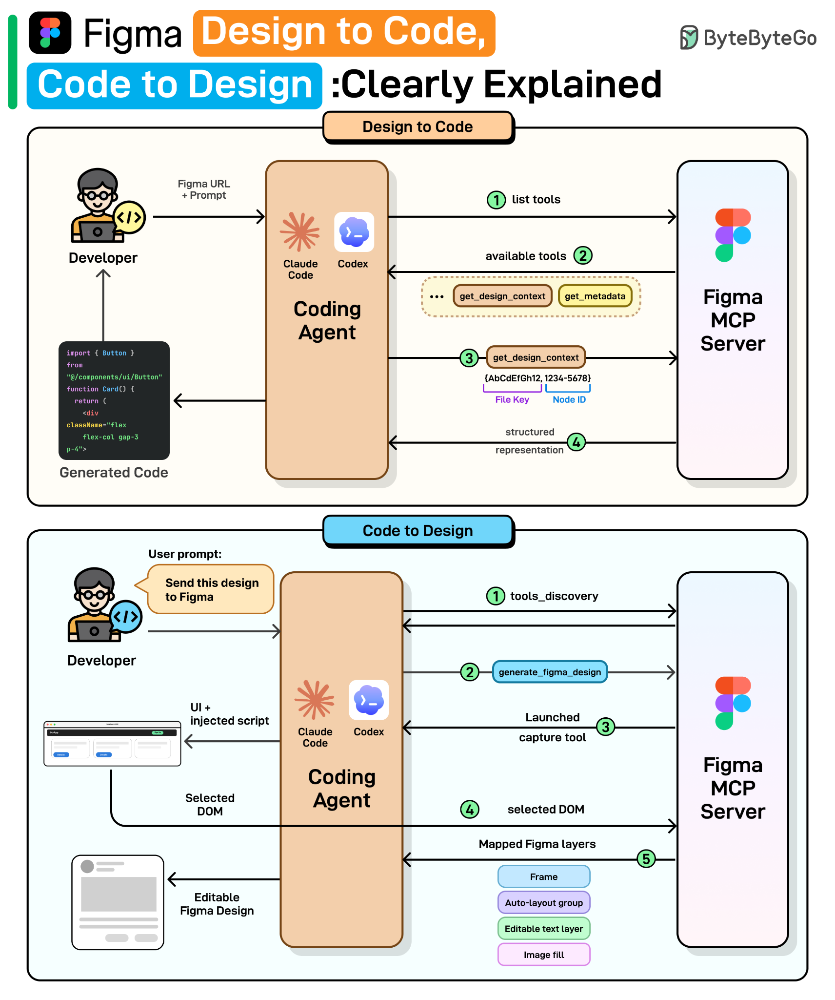
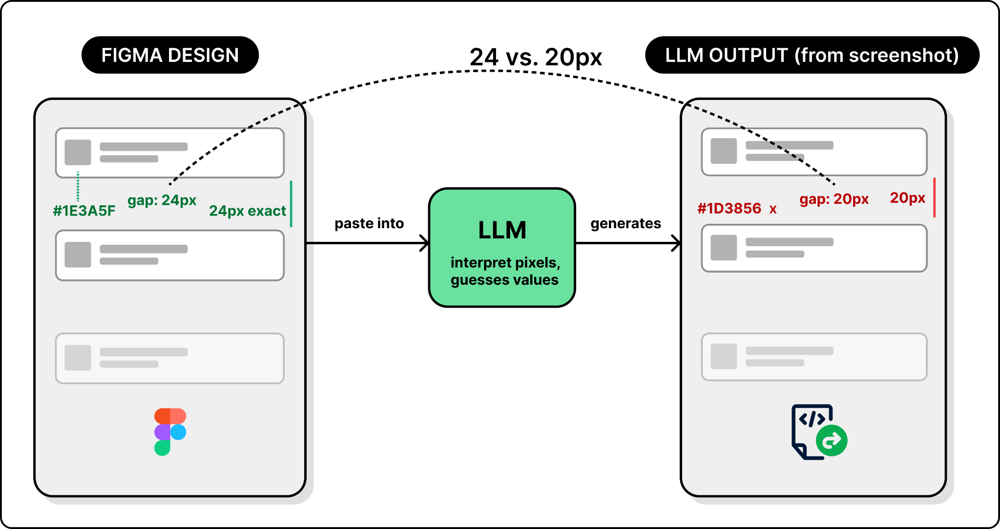
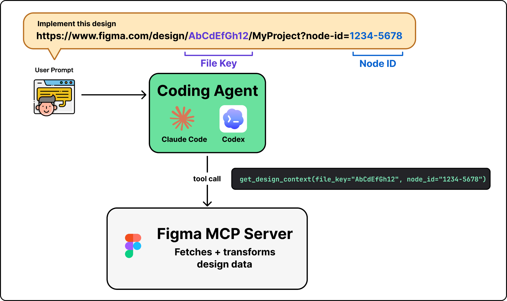
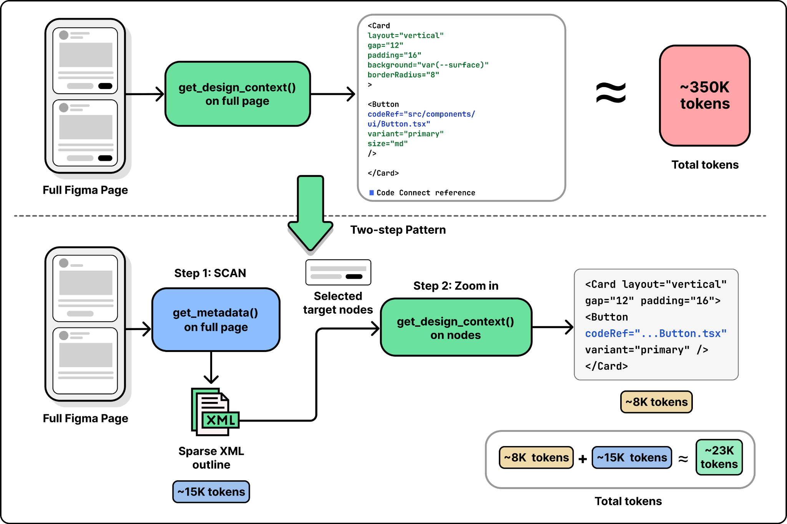
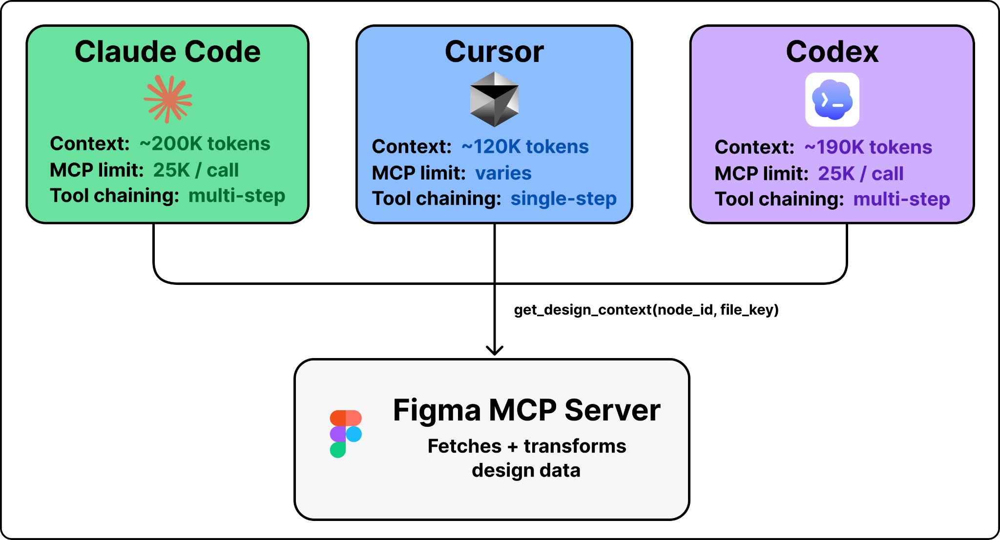

# Figma MCP: Design to Code, Code to Design

## Key Takeaways

- Screenshots lose precision (24px becomes 20px), raw Figma API JSON floods context windows with noise — Figma's MCP server solves this by transforming design data into structured, token-efficient representations
- The MCP server converts pixel positions to layout relationships, hex colors to design tokens, and links Figma components to actual code files via Code Connect mappings
- Code-to-design reverses the flow: DOM walking captures live UI as editable Figma layers (auto-layout, editable text, components) — not flat screenshots
- Each roundtrip is lossy: design→code loses business logic/state; code→design loses invisible implementation; non-visual logic must be re-added each cycle

## The Problem: Screenshots vs API JSON

- **Screenshot approach** — LLM guesses values from pixels; visual similarity but no pixel-perfect accuracy
- **Raw API JSON** — precise values but thousands of lines of noise (coordinates, effects, metadata); exceeds context windows, degrades output quality
- **MCP server** — the middle ground: pixel positions → layout relationships, colors → design tokens, layers flattened to developer perspective

## Design to Code Workflow

1. **Tool discovery** — agent receives available tools (`get_design_context`, `get_screenshot`, `get_metadata`)
2. **Tool invocation** — agent parses file key + node ID from Figma URL, calls `get_design_context`
3. **Backend processing** — MCP server at mcp.figma.com retrieves node trees, component properties, styles, variables
4. **Context transformation** — raw JSON becomes developer-friendly structure; Code Connect maps components to source files (e.g., `src/components/ui/Button.tsx`); defaults to React + Tailwind framing

## Code to Design Workflow

1. **Capture** — `generate_figma_design` opens target URL, injects JavaScript capture script (directly or via Playwright)
2. **DOM reading** — script walks DOM tree extracting computed styles, layout properties, text, images, parent-child hierarchy (no screenshots)
3. **Figma layer creation** — HTML elements → frames/shapes, CSS flexbox/grid → auto-layout groups, text nodes → editable Figma text, images → image fills

Result: fully editable Figma layers, not flat screenshots.

## Engineering Challenges

### Context Window Limits

A complex Figma page exceeds 25K-token MCP limits. Solution: `get_metadata` returns sparse XML outlines first (~15K tokens), then `get_design_context` targets specific nodes (~8K tokens) — "scan first, then zoom."

### Component Mapping

Code Connect creates explicit Figma node ID → code file path mappings. Without them, agents waste time searching or creating duplicates.

### The Lossy Roundtrip

- **Design → Code** loses: business logic, event handlers, state management, API calls
- **Code → Design** loses: React state, API integration, route handling
- Each roundtrip requires re-inference; Code Connect preserves links but non-visual logic must be re-added

### Multi-Agent Serving

The MCP server serves Claude Code (~200K context), Cursor (~120K), Codex (~190K) — each with different tool-calling behaviors and sophistication levels.

---

**Source:** https://blog.bytebytego.com/p/figma-design-to-code-code-to-design
**Date:** 2026-05-29
**Tags:** figma, mcp, design-to-code, code-to-design, design-systems, code-connect, ai-tooling
