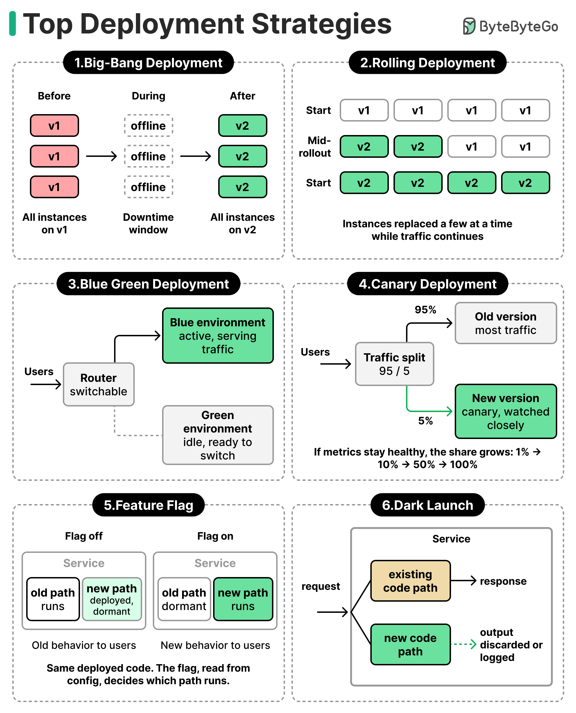

# Deployment Strategies

Six common patterns for rolling new versions into production, ordered roughly from simplest/riskiest to safest/most-controllable.

## Key Takeaways

- The six strategies trade off **downtime, blast radius, infrastructure cost, and rollback speed** — there is no single "right" choice
- **Blue/Green and Canary** are the workhorses for most modern web services — fast rollback, low blast radius, mature tooling
- **Feature Flags** are orthogonal to the others — the binary is already deployed; the flag decides which code path runs at request time
- **Dark Launch** is the only one that lets you exercise new code in production *without* serving its output to users — invaluable for de-risking heavy refactors and infra migrations
- The hardest part of any deployment isn't the rollout — it's the **health signal** that tells you whether to keep going or roll back

## The Six Strategies

### 1. Big-Bang Deployment

Take everything offline, replace v1 → v2 everywhere, bring it back up.

- **Downtime:** yes (the offline window)
- **Blast radius:** 100% — all users hit the new version simultaneously
- **Rollback:** redeploy v1 (slow)
- **Use when:** breaking schema changes that can't coexist, or batch systems with a maintenance window

### 2. Rolling Deployment

Replace instances in waves while traffic continues. e.g. 4 instances on v1 → 2 on v2 + 2 on v1 → all on v2.

- **Downtime:** none (if instances are load-balanced)
- **Blast radius:** grows linearly as the rollout proceeds
- **Rollback:** roll back in waves (medium speed)
- **Use when:** stateless services, when you don't have 2× capacity for blue/green

### 3. Blue/Green Deployment

Keep two full environments. **Blue** serves traffic; **green** is idle. Deploy v2 to green, smoke-test it, then flip the router so green is live. Blue stays idle as instant-rollback.

- **Downtime:** ~zero (router flip)
- **Blast radius:** 100% at flip time, but reversible in seconds
- **Rollback:** flip the router back (instant)
- **Cost:** ~2× infrastructure during the deploy window
- **Use when:** you can afford the parallel environment and need fast rollback

### 4. Canary Deployment

Route a small slice of traffic (often 1% → 5% → 25% → 50% → 100%) to v2 while v1 keeps serving the rest. Watch the canary's health metrics; if they hold, expand.

- **Downtime:** none
- **Blast radius:** bounded by the canary slice
- **Rollback:** route 100% back to v1
- **Use when:** you have real-time metrics good enough to detect regressions on the canary slice. Most modern teams' default
- **Health signal is the make-or-break** — a canary with bad observability is just delayed bigbang

### 5. Feature Flag

The binary is already deployed everywhere. A runtime flag (read from config or a flag service) decides whether `oldPath()` or `newPath()` runs for a given request.

- **Downtime:** none — flag flips are runtime
- **Blast radius:** controlled by the flag's targeting rules (per-user, per-tenant, per-region, %)
- **Rollback:** flip the flag off (instant)
- **Use when:** you want to decouple deployment from release, run A/B experiments, or do progressive rollouts within a single binary
- **Orthogonal to the others** — you can canary-deploy a binary that uses feature flags

### 6. Dark Launch

The new code runs on real production traffic, but its output is **discarded or logged**, never returned to the user. The old code path still serves the response.

- **Downtime:** none
- **Blast radius:** zero user-facing impact
- **Rollback:** stop running the new path
- **Use when:** validating a rewrite or new dependency under real production load before letting users see its output — perfect for heavy refactors, infra migrations, or new ML models being shadow-tested

## Choosing Between Them

| You need... | Pick |
|---|---|
| Fast rollback above all else | **Blue/Green** or **Feature Flag** |
| Smallest possible blast radius | **Canary** or **Dark Launch** |
| Validate under real load with zero user risk | **Dark Launch** |
| Decouple deploy from release | **Feature Flag** |
| Schema-breaking change, batch system | **Big-Bang** with a maintenance window |
| Stateless service, no spare capacity | **Rolling** |

In practice these compose: a typical modern team **canary-deploys a binary that is gated by feature flags**, with blue/green for the underlying infra changes and dark-launch for the heaviest refactors.

---

**Source:** ByteByteGo infographic — https://substackcdn.com/image/fetch/$s_!VACI!,f_auto,q_auto:good,fl_progressive:steep/https%3A%2F%2Fsubstack-post-media.s3.amazonaws.com%2Fpublic%2Fimages%2F5e15c3c2-bc34-4a4a-a698-0372c5c9f238_2484x3068.png
**Date:** 2026-06-12
**Tags:** deployment, blue-green, canary, feature-flags, dark-launch, rolling-deployment, release-engineering, devops, ci-cd
