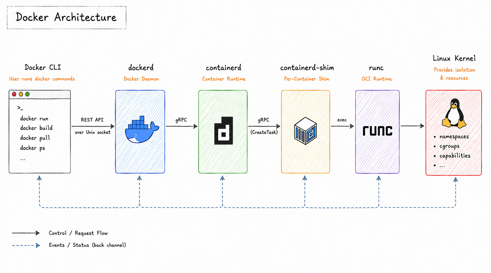
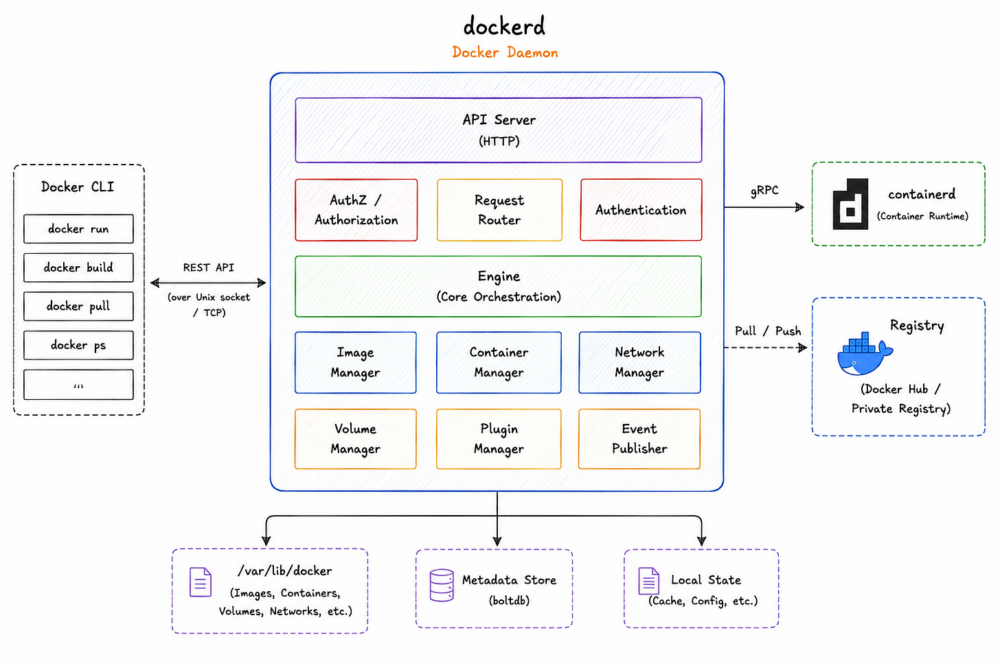
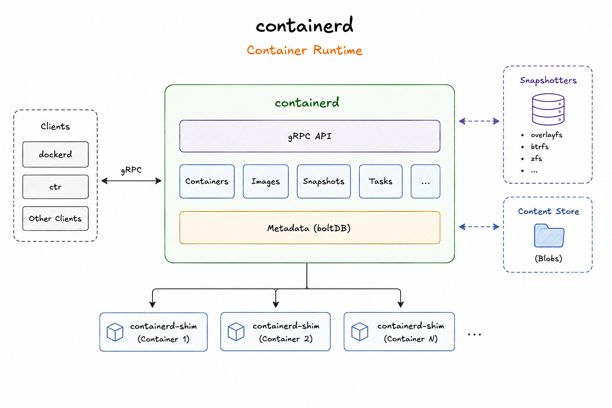
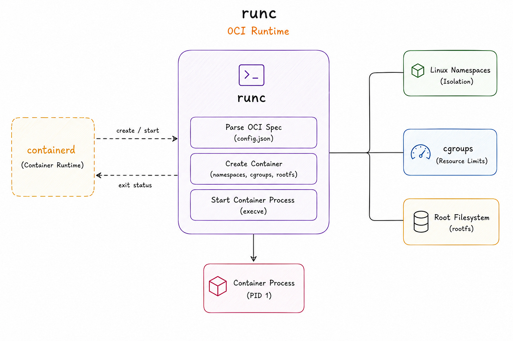
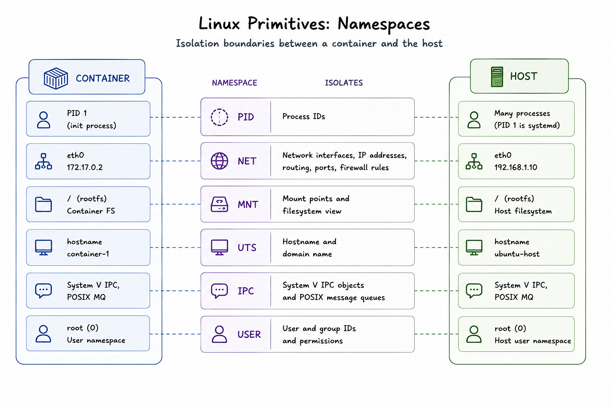
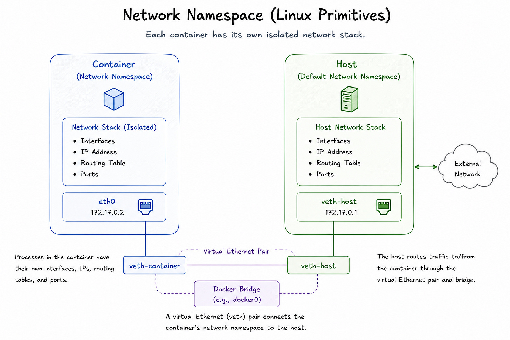

# Docker Internals

Under the hood, Docker is **not one program** — it's a 5-layer cooperating stack on top of Linux kernel primitives (namespaces, cgroups, layered filesystems). Understanding the boundaries is the difference between "I run containers" and "I can debug containers."

## Key Takeaways

- **Docker = stack, not binary.** Five components cooperate: Docker CLI → `dockerd` → `containerd` → `containerd-shim` → `runc` — each with a single responsibility
- **Containers are a Linux feature, not a Docker feature.** They're built from kernel **namespaces** (isolation) + **cgroups** (resource limits) + **layered filesystems** (image layers via OverlayFS)
- **Six namespaces** combine to create container isolation — PID, Network, Mount, UTS, IPC, User. No single namespace is enough on its own
- **OCI standards** decouple images from runtimes — Docker-built images run on containerd, CRI-O, and Podman. Kubernetes dropped Docker as a runtime in favor of containerd in 2017
- **`containerd-shim` is the unsung hero** — it becomes the container process's parent, so containers survive `containerd` or `dockerd` restarts

## The 5-Layer Stack

| Layer | Role | Notes |
|---|---|---|
| **Docker CLI** | Thin client. Sends commands over `/var/run/docker.sock` (Unix socket) or TCP | `docker run`, `docker build`, `docker pull`, `docker ps`, ... |
| **`dockerd` (Docker Daemon)** | High-level orchestration: images, networks, volumes, exposes REST API | Talks to `containerd` over gRPC |
| **`containerd`** | Core container runtime: pulls images, manages snapshots, runs containers via gRPC interface | Donated to CNCF in 2017; the runtime Kubernetes uses directly today |
| **`containerd-shim`** | One shim per container. Becomes the container process's parent. Manages I/O and exit codes. **Survives `containerd` / `dockerd` restarts** | The reason you can restart Docker daemon without killing running containers |
| **`runc`** | OCI runtime. The thing that actually calls kernel syscalls to create namespaces/cgroups, then `exec`s your process, then exits | Tiny, single-purpose; replaceable with any OCI-compliant runtime |

The separation matters: when `dockerd` restarts, the shims keep running, so your workloads don't die.

### dockerd Internals

Inside `dockerd`:
- **API Server** (HTTP) — receives REST calls from the CLI
- **AuthZ / Request Router / Authentication** — request middleware
- **Engine** — core orchestration
- **Managers** — Image, Container, Network, Volume, Plugin, Event Publisher
- **State** — `/var/lib/docker` (images, containers, volumes), `boltdb` (metadata)

### containerd Internals

- **gRPC API** — uniform interface for `dockerd`, `ctr` CLI, Kubernetes CRI, and other clients
- **Subsystems** — Containers, Images, Snapshots, Tasks
- **Snapshotters** — pluggable layer backends (`overlayfs`, `btrfs`, `zfs`)
- **Content Store** — blob storage for image layers
- **One `containerd-shim` per running container**

### runc — The OCI Runtime

`runc`'s job (then it exits):
1. **Parse OCI spec** (`config.json`)
2. **Create container** — set up namespaces, cgroups, rootfs
3. **Start container process** — `execve` the entrypoint, becomes PID 1 in the container

That's it. `runc` doesn't stick around — the shim does.

## OCI: Why You Can Swap Runtimes

The **Open Container Initiative** decouples *images* from *runtimes*:

- An image built by Docker runs unchanged on `containerd`, CRI-O, Podman, or any OCI-compliant runtime
- A runtime implementing the OCI spec is a drop-in replacement
- Kubernetes leverages this — it dropped Docker as a runtime in 2017 in favor of containerd directly. Same images, fewer layers in the stack

## Linux Kernel Primitives

Containers don't exist as a kernel concept. They're an *emergent* property of combining three things:

| Primitive | What it does | What goes wrong without it |
|---|---|---|
| **Namespaces** | Isolate what a process can *see* | Container sees host PIDs, hostnames, mounts, etc. |
| **cgroups** | Limit what a process can *use* | Single container can exhaust host CPU/memory |
| **Layered filesystems** (OverlayFS) | Stack read-only image layers with a thin writable layer on top | No image reuse; every container needs its own full FS |

### The Six Namespaces

| Namespace | Isolates | Practical effect |
|---|---|---|
| **PID** | Process IDs | Container's first process is **PID 1**. Handles signals and orphan reaping like `init` would |
| **Network (NET)** | Interfaces, IPs, routing, ports, firewall rules | Each container gets its own network stack. Multiple containers can all bind port 80 |
| **Mount (MNT)** | Filesystem visibility | Container sees only its own rootfs, not the host's `/` |
| **UTS** | Hostname + domain name | Container can have its own hostname (`container-1` vs `ubuntu-host`) |
| **IPC** | System V IPC + POSIX message queues | Container can't see or interfere with host shared memory |
| **User** | UID/GID mapping | `root` (UID 0) inside container can map to an **unprivileged user** on the host — limits escape blast radius. Enables rootless containers |

**Key insight:** no single namespace makes a container. It's the *combination* of all six that creates the isolation engineers rely on.

### Network Namespace in Detail (veth pairs)

How container networking actually works:
- Container has its own network namespace with isolated interfaces, IPs, routing tables, ports
- A **virtual Ethernet (veth) pair** connects the container's namespace to the host
  - `veth-container` (inside container, often named `eth0` with IP like `172.17.0.2`)
  - `veth-host` (in host namespace, attached to `docker0` bridge)
- The **Docker Bridge** (`docker0`) acts as a virtual switch — multiple containers on the same bridge can talk to each other
- The host routes traffic in/out of the container through the veth pair + bridge

This is also why "Docker networking" feels weird the first time you debug it — it's all Linux bridges and veth pairs underneath.

## See Also

- [docker-vs-kubernetes.md](docker-vs-kubernetes.md) — Docker for single-machine packaging vs Kubernetes for cluster orchestration
- [virtualization-architecture.md](virtualization-architecture.md) — VMs vs containers (hypervisor vs kernel-shared isolation)
- [../system-design/security/zero-trust-and-jit-access.md](../system-design/security/zero-trust-and-jit-access.md) — user namespaces + rootless containers as security primitives

---

**Source:** https://newsletter.systemdesign.one/p/how-do-docker-containers-work
**Date:** 2026-06-14
**Tags:** docker, containers, linux-kernel, namespaces, cgroups, containerd, runc, oci, devops, overlayfs, veth-pairs, docker-architecture, rootless-containers
