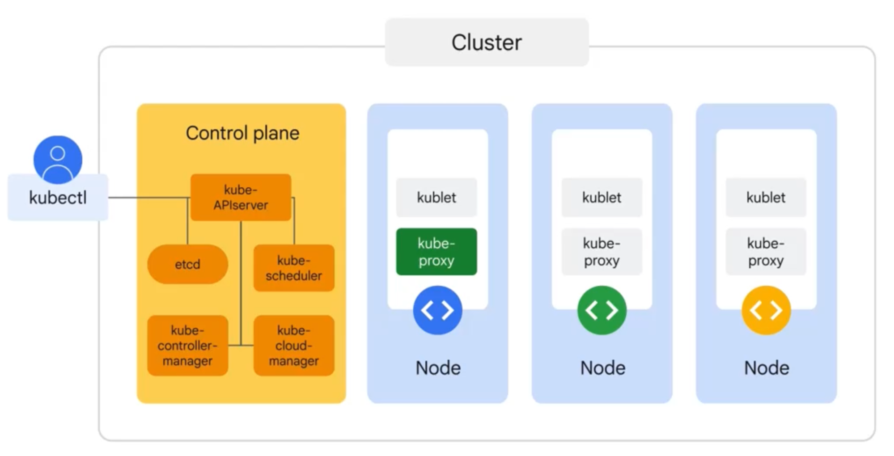

# Docker vs Kubernetes

## Key Takeaways

- Docker and Kubernetes are not competitors — Docker packages and runs containers on a single machine, Kubernetes orchestrates containers across a cluster
- The actual workflow: Docker builds the image → registry stores it → Kubernetes runs and manages it
- Start with Docker alone; reach for Kubernetes only when scaling turns into coordination problems
- Common mistake: adopting Kubernetes too early adds complexity before solving real problems

## Docker — Packaging & Running

Answers: "How do I package and run my app reliably anywhere?"

- **Images** — immutable app blueprints
- **Containers** — running image instances
- **Daemon** — management engine
- **Compose** — multi-container definitions on a single machine

**Best for:** local dev, CI pipelines, small production, single-server apps. Fast setup, predictable, low ops overhead. Limited multi-node scaling and self-healing.

## Kubernetes — Orchestration at Scale

Answers: "How do I run thousands of containers reliably across many machines?"

- **Pod** — smallest deployable unit
- **Control plane** — API server, scheduler, controller manager, etcd
- **Worker nodes** — run kubelet, kube-proxy, container runtime (containerd)
- **Services** — stable endpoints for dynamic pods

**Best for:** multi-service architectures, HA systems, large-scale platforms. Self-healing, autoscaling, rolling updates, service discovery. Steep learning curve and infrastructure overhead.

## Comparison

| Aspect | Docker | Kubernetes |
|---|---|---|
| Core role | Run containers | Orchestrate containers |
| Scope | Single machine | Cluster of machines |
| Unit | Container | Pod |
| Scaling | Manual/limited | Automatic + declarative |
| Updates | Manual | Rolling, controlled |
| Complexity | Low | High |

## When to Use What

**Docker alone:** single server, few services, deploy downtime acceptable, team prioritizes simplicity.

**Kubernetes:** multiple machines, zero-downtime deploys, traffic fluctuates needing autoscale, many services with independent lifecycles.

## Kubernetes Anatomy (Deep Dive)

### Control Plane Components

| Component | Job |
|---|---|
| **kube-apiserver** | The front door — every CRUD call (kubectl, controllers, schedulers) hits this |
| **etcd** | The cluster database — all state lives here (key-value, strongly consistent) |
| **kube-scheduler** | Picks which node a new pod runs on |
| **kube-controller-manager** | Runs the control loops (replication, endpoints, namespace) |
| **kube-cloud-manager** | Cloud-specific integrations (load balancers, storage volumes) |

### Worker Node Components

| Component | Job |
|---|---|
| **kubelet** | Node-local agent that ensures pods on this node are running and healthy |
| **kube-proxy** | Maintains network connectivity among pods (iptables/IPVS rules) |
| **containerd** | The container runtime that actually runs the containers |

### Pods (the smallest deployable unit)

- A pod hosts one or more containers
- **Each pod gets a unique IP address**
- Every container in the pod **shares the network namespace** (same IP + ports)
- Containers in the same pod can talk via **`localhost` / 127.0.0.1**
- A **shared volume** can be mounted by any container in the pod

### The Object Model (Declarative Management)

- **Object spec** — desired state defined by the user in YAML/JSON
- **Object status** — current state of the object
- **The control plane continuously reconciles status → spec** — this is the core K8s loop

### Config Objects

- **Name** — mandatory, alphanumeric, < 256 chars
- **Labels & selectors** — how controllers find their pods
- **Namespaces** — soft multi-tenancy boundary

### Helm

The de facto Kubernetes package manager (apt/yum for K8s). Handles:

- Deployments, Services, ConfigMaps as templated bundles ("charts")
- Versions & rollbacks
- Parameterization per environment

## Adjacent Tools (Not K8s, but the same stack)

| Tool | Purpose |
|---|---|
| **HPA** (Horizontal Pod Autoscaler) | Scales pod replicas based on CPU/memory/custom metrics |
| **Ingress controllers** (NGINX, Traefik) | L7 routing into the cluster from outside |

---

**Source:** https://blog.levelupcoding.com/p/docker-vs-kubernetes
**Source:** /Users/vimittal/Downloads/prep/prep.html (K8s anatomy + control plane + worker nodes + object model + Helm)
**Date:** 2026-05-25, updated 2026-06-13
**Tags:** docker, kubernetes, containers, orchestration, infrastructure, control-plane, etcd, kubelet, kube-proxy, helm, pods, hpa
