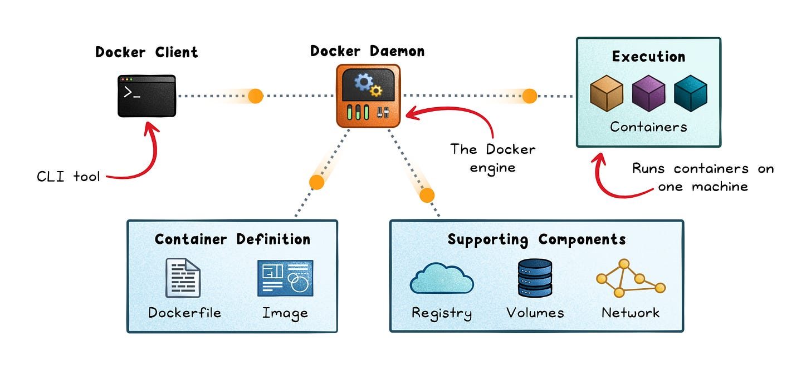
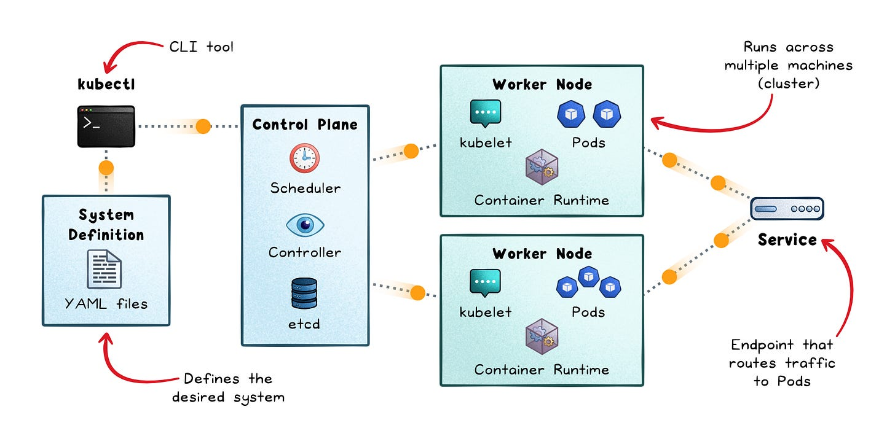
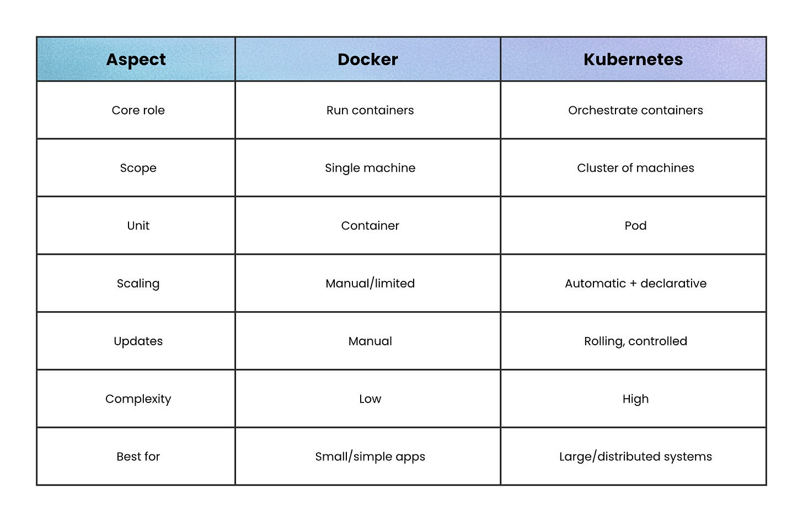

# Docker vs Kubernetes

## Key Takeaways

- Docker and Kubernetes are not competitors — Docker packages and runs containers on a single machine, Kubernetes orchestrates containers across a cluster
- The actual workflow: Docker builds the image → registry stores it → Kubernetes runs and manages it
- Start with Docker alone; reach for Kubernetes only when scaling turns into coordination problems
- Common mistake: adopting Kubernetes too early adds complexity before solving real problems

## Docker — Packaging & Running

Answers: "How do I package and run my app reliably anywhere?"

- **Images** — immutable app blueprints
- **Containers** — running image instances
- **Daemon** — management engine
- **Compose** — multi-container definitions on a single machine

**Best for:** local dev, CI pipelines, small production, single-server apps. Fast setup, predictable, low ops overhead. Limited multi-node scaling and self-healing.

## Kubernetes — Orchestration at Scale

Answers: "How do I run thousands of containers reliably across many machines?"

- **Pod** — smallest deployable unit
- **Control plane** — API server, scheduler, controller manager, etcd
- **Worker nodes** — run kubelet, kube-proxy, container runtime (containerd)
- **Services** — stable endpoints for dynamic pods

**Best for:** multi-service architectures, HA systems, large-scale platforms. Self-healing, autoscaling, rolling updates, service discovery. Steep learning curve and infrastructure overhead.

## Comparison

| Aspect | Docker | Kubernetes |
|---|---|---|
| Core role | Run containers | Orchestrate containers |
| Scope | Single machine | Cluster of machines |
| Unit | Container | Pod |
| Scaling | Manual/limited | Automatic + declarative |
| Updates | Manual | Rolling, controlled |
| Complexity | Low | High |

## When to Use What

**Docker alone:** single server, few services, deploy downtime acceptable, team prioritizes simplicity.

**Kubernetes:** multiple machines, zero-downtime deploys, traffic fluctuates needing autoscale, many services with independent lifecycles.

---

**Source:** https://blog.levelupcoding.com/p/docker-vs-kubernetes
**Date:** 2026-05-25
**Tags:** docker, kubernetes, containers, orchestration, infrastructure
