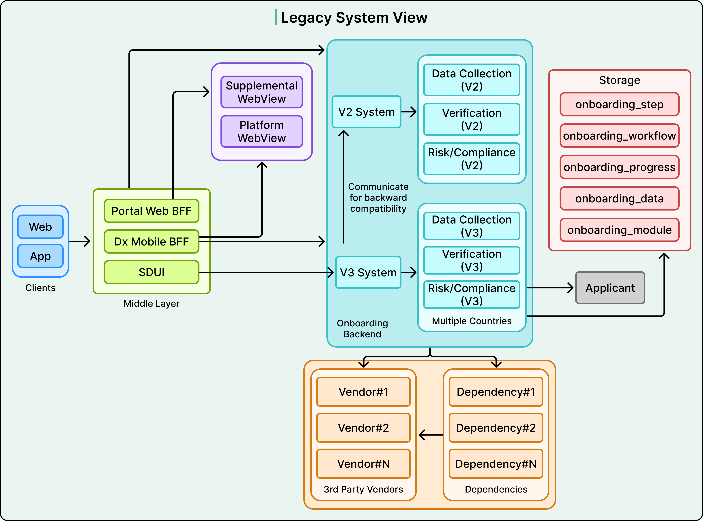
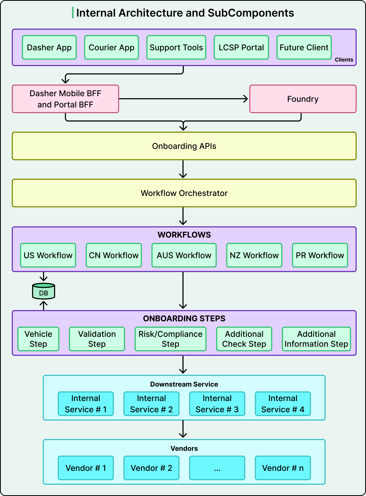
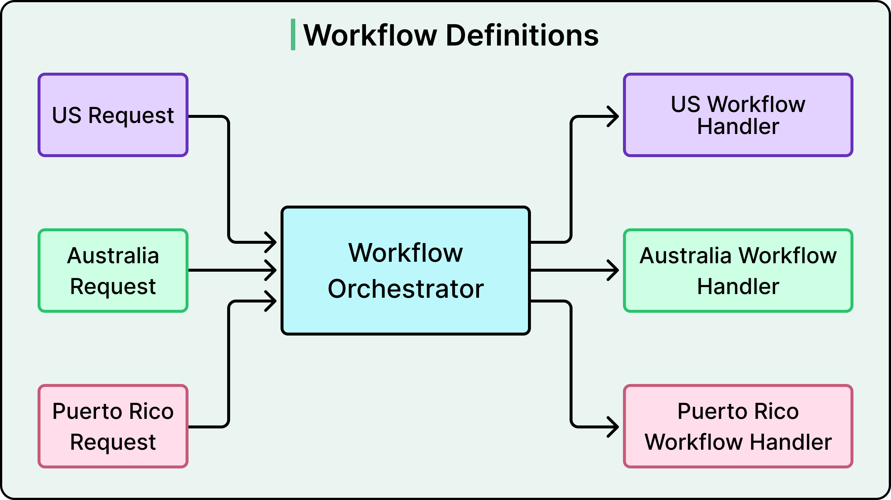
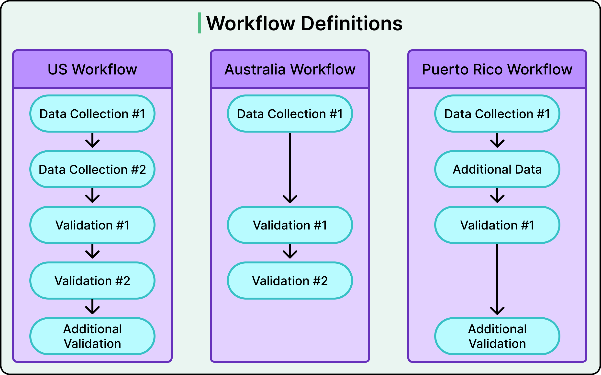
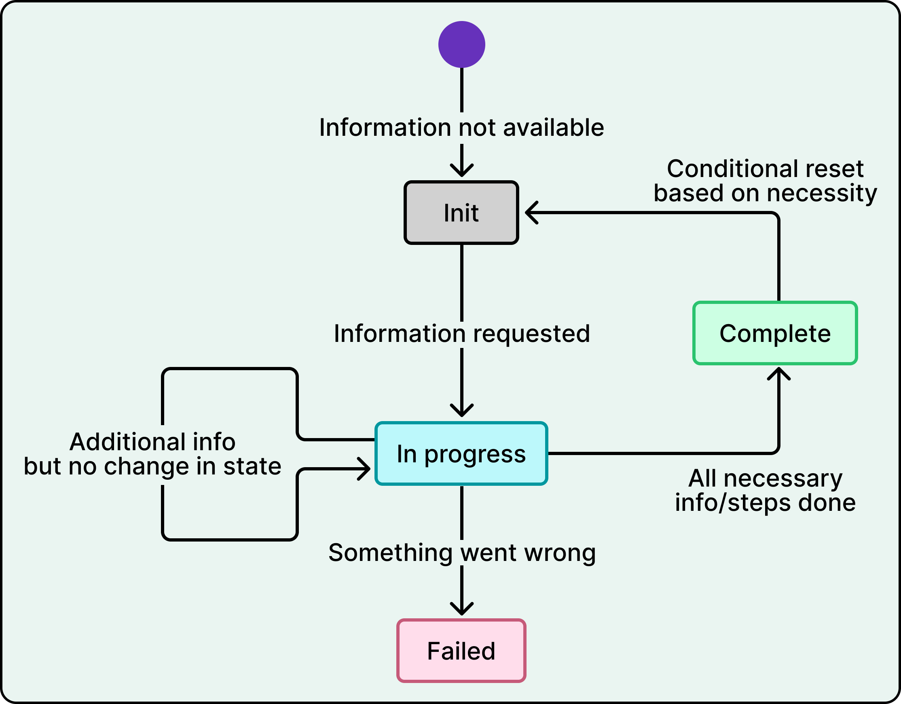

# DoorDash Country Launch Platform

## Key Takeaways

- DoorDash reduced new-country launches from months to one week by replacing a tangled legacy onboarding system with a three-layer modular architecture: orchestrator, workflow definitions, and step modules.
- A unified JSON status map replaced fragmented state spread across multiple database tables, giving each step atomic ownership of its own entry and eliminating synchronization errors.
- Reusable step modules (e.g., address collection) deploy across countries without modification -- country-specific differences are handled by composing different workflow definitions rather than branching inside code.
- The migration ran old and new systems side-by-side with progress synchronization, achieving zero regressions and no user-facing incidents during the US rollout before expanding internationally.

## The Legacy Problem

The previous Dasher onboarding system suffered from compounding complexity as DoorDash expanded internationally:

- **Tangled country logic** -- deep if/else chains based on country, step type, or prior state made changes risky.
- **Multiple coexisting APIs** -- V3 handlers called V2 handlers while writing to V2 tables, creating a web of backward-compatibility hacks.
- **Fragmented state** -- applicant progress was tracked across five separate database tables (`onboarding_step`, `onboarding_workflow`, `onboarding_progress`, `onboarding_data`, `onboarding_module`), requiring multiple queries to determine status.
- **Inconsistent vendor integration** -- no standard pattern for third-party vendor calls.



## New Architecture: Three-Layer Pattern

The redesigned system separates concerns into three distinct layers.



### 1. Orchestrator (Routing Layer)

A lightweight routing layer that examines context (country and market type) and delegates to the correct workflow definition. It deliberately contains zero business logic -- it is pure traffic control.



### 2. Workflow Definitions (Composition Layer)

Each country gets a workflow definition: an ordered sequence of steps. Different countries can skip steps, reorder them, or add country-specific ones without touching the underlying step code. This is the key enabler for fast launches -- Puerto Rico's workflow was assembled from existing steps in one week.



### 3. Step Modules (Execution Layer)

Self-contained modules handling discrete functions like identity verification, data collection, and compliance checks. Each step:

- Implements a standardized interface
- Manages its own business logic and vendor integrations
- Updates only its own state entry
- Remains unaware of which workflow it belongs to

## Status Map: Single Source of Truth

Progress tracking shifted from five database tables to a unified JSON status map. Each step updates only its own entry via atomic JSON merges.

```json
{
  "personal_info": { "status": "DONE", "metadata": { "name": "Jane" } },
  "address": { "status": "DONE", "metadata": { "address_id": "abc123" } }
}
```



This eliminates synchronization errors and provides instant visibility into where any applicant stands in the onboarding journey.

## Composition Patterns

**Composite Steps** -- group granular steps into logical units. One country might collect personal info on a single screen while another splits it across three screens. Both are handled by wrapping atomic steps in a "PersonalDetails" composite, keeping the workflow definition clean.

**Dynamic/Conditional Steps** -- steps can appear conditionally based on market conditions or repeat multiple times within a workflow.

**Reuse in Practice** -- the address collection step, built once, deployed in Australia (with compliance checks), Canada (with validation), and US regional experiments, all without modification.

## Migration Strategy

DoorDash avoided a big-bang cutover:

1. Old and new systems ran side-by-side with temporary synchronization mirroring progress between them.
2. The US launched first (January 2025) as the proving ground for the new architecture.
3. Subsequent markets benefited from battle-tested modules, compressing timelines dramatically.
4. Result: zero regressions, no user-facing incidents, no onboarding downtime.

## Tradeoffs and Limitations

- **Modularity overhead** -- coordination costs rise with decomposition. The pattern pays off when country-specific branching exceeds the cost of maintaining modular boundaries.
- **Conceptual boundaries matter** -- addresses generalize cleanly across markets; compliance requirements often don't and may require new steps.
- **Human coordination required** -- team autonomy demands clear interface contracts, published design principles, and joint KPIs. Architecture alone does not solve organizational complexity.

## Launch Timeline

| Market | Timeline |
|---|---|
| US (migration) | January 2025 |
| Australia | Under 1 month |
| Canada | 2 weeks |
| Puerto Rico | 1 week |

---

**Source:** https://blog.bytebytego.com/p/how-doordash-launches-a-new-country
**Date:** 2026-05-31
**Tags:** doordash, onboarding, modular-architecture, workflow-orchestration, international-expansion, platform-engineering
