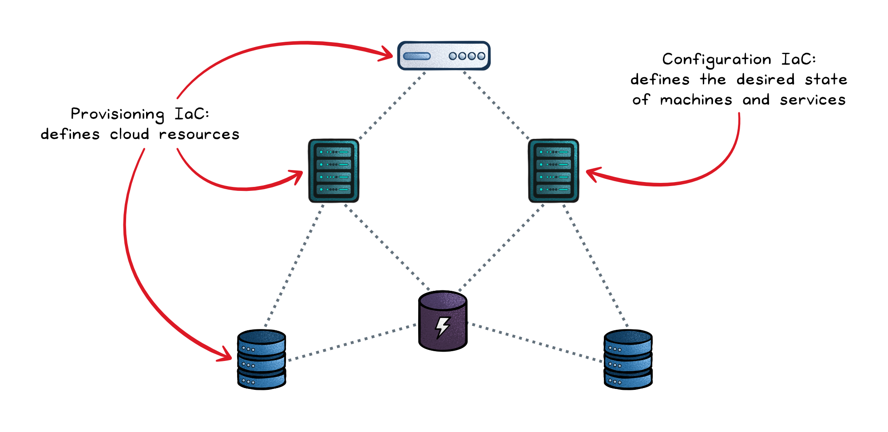
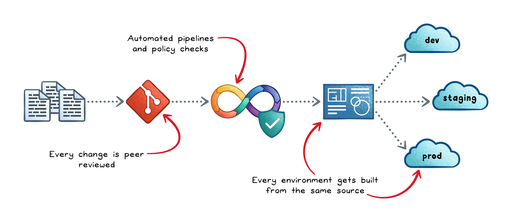
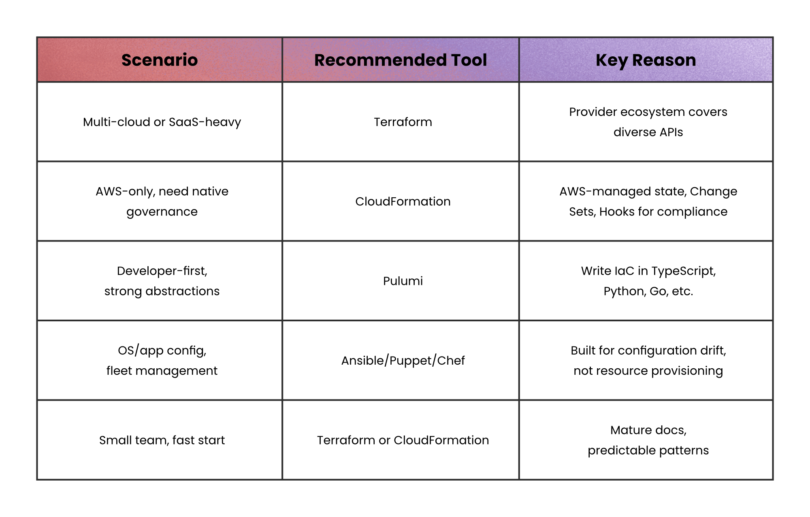

# Infrastructure as Code

## Key Takeaways

- IaC has two disciplines: **provisioning** (cloud resources like networks, IAM, compute) and **configuration** (desired state of machines — packages, files, settings)
- The workflow matters more than the tool: Git → validate → security scan → plan/preview → peer review → apply → drift detection
- Three dominant security risks: secrets exposure, over-privileged CI/CD automation, and supply chain integrity of external modules
- Full automated apply-on-merge requires strong test coverage, observability, and runbooks — start with manual apply for immature teams

## IaC Workflow Pipeline

1. Push IaC to Git
2. CI runs validation (format, syntax, lint, dependencies)
3. Security & policy checks (misconfiguration scanners, policy-as-code)
4. Preview/plan showing exact changes
5. Peer review and approval
6. Apply via deployment pipeline
7. Environment-specific config injected
8. Post-deploy checks
9. Environment rollout (dev → staging → prod)
10. State updated for future runs
11. Continuous drift detection on schedule

## Tool Selection

| Scenario | Tool | Why |
|---|---|---|
| Multi-cloud / SaaS-heavy | Terraform | Provider ecosystem covers diverse APIs |
| AWS-only, native governance | CloudFormation | AWS-managed state, Change Sets, Hooks |
| Developer-first, strong abstractions | Pulumi | Write IaC in TypeScript, Python, Go |
| OS/app config, fleet management | Ansible/Puppet/Chef | Built for configuration drift, not provisioning |
| Small team, fast start | Terraform or CloudFormation | Mature docs, predictable patterns |

## Security Risks

- **Secrets exposure** — sensitive data in code, state files, logs, or pipelines; use secret managers, encrypt state, enforce least-privilege
- **Over-privileged automation** — separate preview roles from apply roles; CI/CD pipelines shouldn't have broad permissions
- **Supply chain integrity** — pin and verify external modules, templates, and dependencies

## Common Pitfalls

- **State mishandling** — use remote backends with locking from day one
- **Configuration drift** — no manual changes without follow-up PRs; run drift detection on schedule
- **Unsafe changes** — small edits can force resource replacement; use preview gates and policy-as-code
- **Skipping validation** — treat IaC like production code: linting and formatting in CI

---

**Source:** https://blog.levelupcoding.com/p/infrastructure-as-code-clearly-explained
**Date:** 2026-05-28
**Tags:** iac, terraform, cloudformation, pulumi, ansible, devops, infrastructure
