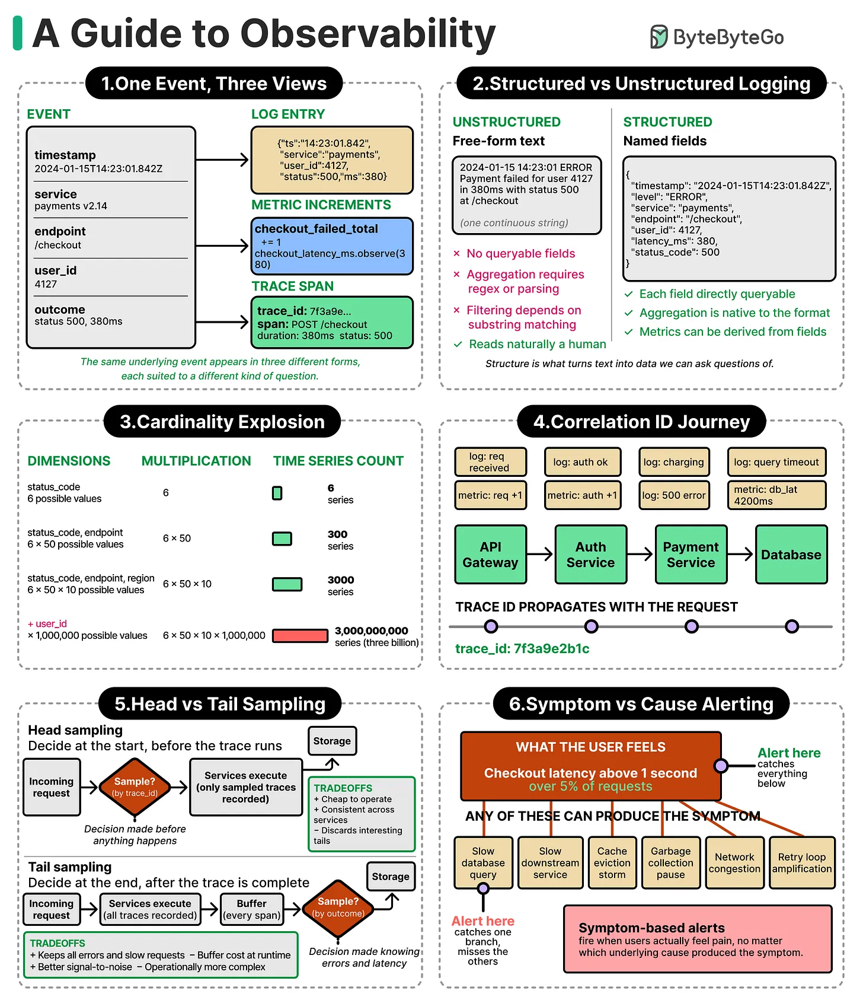

# Observability

## Key Takeaways
- A single event produces three views: a log entry, metric increments, and a trace span — all derived from the same underlying occurrence
- Structured logging (named fields) enables direct querying and aggregation; unstructured free-form text requires regex and is hard to aggregate at scale
- Cardinality explosion: adding high-cardinality dimensions like `user_id` multiplies time-series counts into the billions
- Correlation IDs (trace IDs) propagate with the request across services, enabling end-to-end trace reconstruction
- Tail sampling has better signal-to-noise than head sampling but requires buffering completed traces before making the sampling decision
- Alert on symptoms (what the user feels) rather than causes — one symptom can have many possible root causes

---



---

## 1. One Event, Three Views

The same underlying event manifests as three different telemetry signals:

| Signal | What it captures |
|---|---|
| **Log entry** | Structured or unstructured record of what happened (timestamp, service, status, etc.) |
| **Metric increments** | Counters/histograms updated by the event (e.g., `checkout.errors`, `checkout.latency_obs`) |
| **Trace span** | A timed segment within a distributed trace, linked by `trace_id` |

Example event: a checkout failure with `status 500`, `duration 3001ms`, on `payments-v2.14` for a specific `user_id`.

---

## 2. Structured vs Unstructured Logging

### Unstructured (free-form text)
```
Payment failed for user 4137 after 3001ms with status 500 at checkout
```
- Aggregation requires complex regex
- Filtering depends on pattern matching
- Readable naturally by humans

### Structured (named fields)
```json
{
  "timestamp": "2024-10-15T14:23:04.842",
  "service": "payments",
  "status": "error",
  "user_id": "4137",
  "duration_ms": 3001
}
```
- Each field is directly queryable
- Aggregation is native to the format
- Services can be correlated across fields

---

## 3. Cardinality Explosion

Adding high-cardinality dimensions multiplies the number of time-series stored:

| Dimensions | Possible values | Time-series count |
|---|---|---|
| `status_code` | 6 | 6 |
| `status_code` × `endpoint` | 6 × 50 | 300 |
| + `region` | × 10 | 3,000 |
| + `user_id` | × 1,000,000 | **3,000,000,000** |

**Rule:** Avoid using unbounded dimensions (user IDs, request IDs, session tokens) as metric labels. Reserve high-cardinality identifiers for logs and traces.

---

## 4. Correlation ID / Trace ID Propagation

A `trace_id` is injected at the entry point and propagated through every service call in the request path:

```
API Gateway → Auth Service → Payment Service → Database
  trace_id: 7f3a0e2b1c (same across all hops)
```

Each hop appends its own span to the trace. When a failure occurs (e.g., a DB query timeout), the full trace shows exactly which service originated the error and how latency accumulated across the chain.

---

## 5. Head vs Tail Sampling

Sampling reduces the volume of traces stored. Two strategies:

### Head sampling
- Decision made **before** the trace executes
- Low overhead; no buffering required
- **Tradeoff:** Misses slow requests and rare error paths — the most interesting traces are the least likely to be sampled

### Tail sampling
- Decision made **after** the trace completes
- Buffer stores in-flight traces until the outcome is known
- **Tradeoff:** Better signal-to-noise (can bias toward errors/slow traces); operationally more complex, requires buffering infrastructure

---

## 6. Symptom vs Cause Alerting

**Alert on the symptom** (what the user experiences), not on individual causes.

Example symptom: *checkout latency above 1 second*

Possible causes producing that symptom:
- Slow DB queries (high load)
- Traffic spike (storm)
- CPU saturation
- Network misconfiguration
- Bad deploy / rollout

**Why symptom-based alerts:** A single symptom alert catches all underlying causes automatically. Cause-based alerts require predicting every failure mode in advance and often fire without user impact.

---

**Source:** https://substackcdn.com/image/fetch/$s_!r5Ej!,w_1456,c_limit,f_webp,q_auto:good,fl_progressive:steep/https%3A%2F%2Fsubstack-post-media.s3.amazonaws.com%2Fpublic%2Fimages%2Fefd64dd9-b0a6-4fc8-8e27-2a929a3b5eef_2650x3068.png
**Date:** 2026-06-18
**Tags:** observability, logging, metrics, tracing, structured-logging, cardinality, sampling, alerting, distributed-systems
