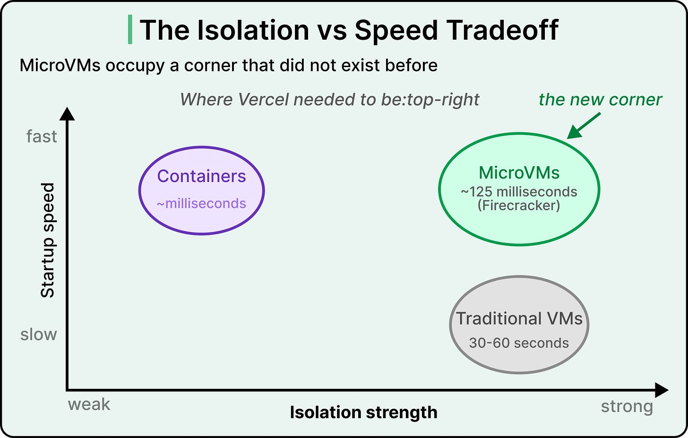
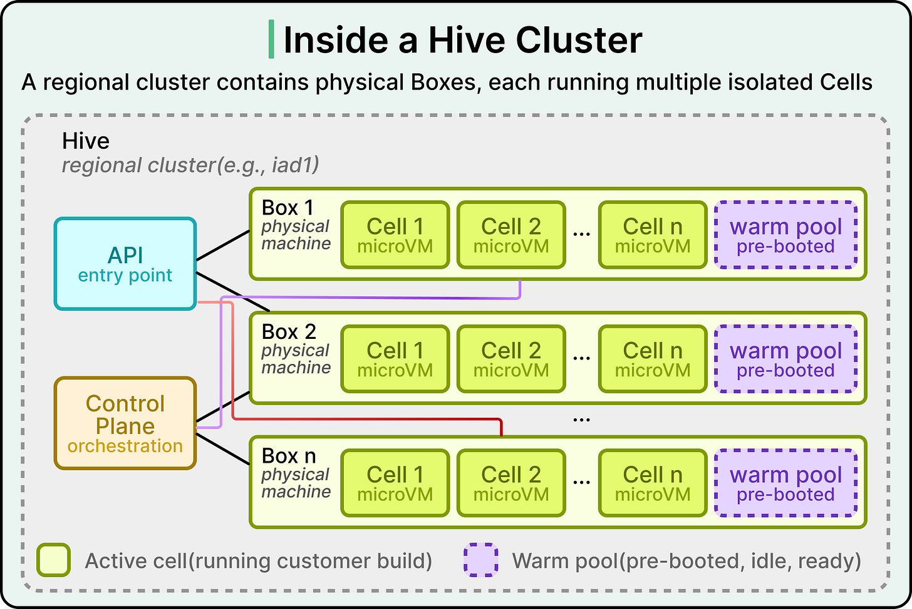
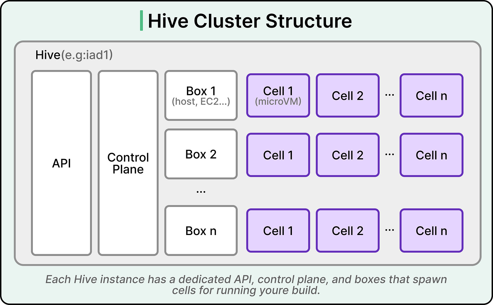

# Vercel Hive: Build Platform Case Study

## What

Vercel shipped Hive (Nov 2023) — an internal build platform using Firecracker microVMs that cut build provisioning from 90 seconds to 5 seconds (18x improvement).

## Why

- **Hostile multi-tenancy** — untrusted customer code runs on shared machines; containers share a kernel, so one exploit compromises all co-tenants
- Standard containers and Kubernetes assume cooperative tenants — insufficient for adversarial isolation
- Existing provisioning was too slow (90s) for the developer experience Vercel targets

## Who

Vercel's infrastructure team, serving all Vercel customers (web app deployments from git repos).

## Where

Regional Hive clusters, each containing physical Boxes running isolated Cells (microVMs).

## How

**Firecracker microVMs** — separate kernels with hardware-enforced CPU boundaries, 125ms boot, minimal memory footprint. Container runs inside the microVM (container handles packaging, microVM enforces isolation).

**Architecture hierarchy:**

- **Hive** — regional cluster
- **Box** — physical machine
- **Cell** — one microVM on a Box, handles one build, destroyed after completion

**Three stacked optimizations (90s → 5s):**

1. **Faster boots** — local caching of container images + block device snapshotting (~45s saved)
2. **Warm pool** (primary win) — pre-booted cells with loaded images wait idle; builds use them instantly, cold path only during spikes
3. **Firecracker baseline** — millisecond boot makes warm pools practical at scale

## When to Apply This Pattern

- Hostile multi-tenancy (untrusted code on shared infra)
- Build/CI systems where provisioning latency matters
- Tradeoff: warm pools require paying for idle compute; building from primitives requires significant engineering investment

**Results:** 30% overall build improvement, 40% cold-path improvement, provisioning 90s → 5s.

**Key lesson:** Threat model drives architecture. Accept the harder security problem first, then layer performance optimizations on that foundation.

---

**Source:** https://blog.bytebytego.com/p/how-vercel-cut-build-wait-times-from
**Date:** 2026-05-25
**Tags:** vercel, firecracker, microvm, build-infrastructure, multi-tenancy, warm-pool
