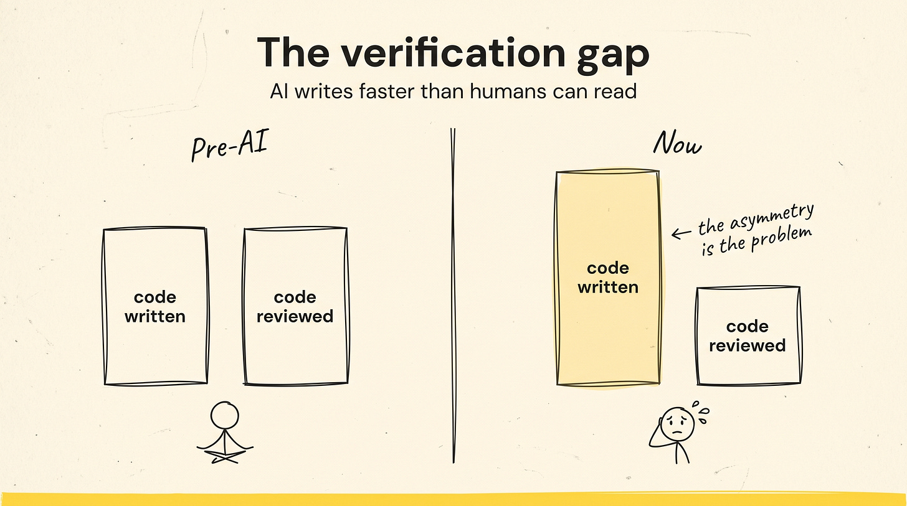
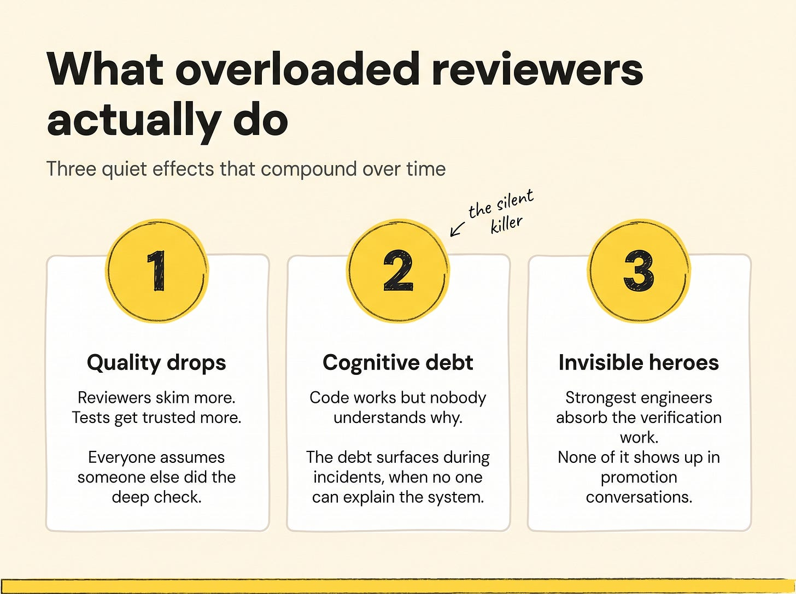
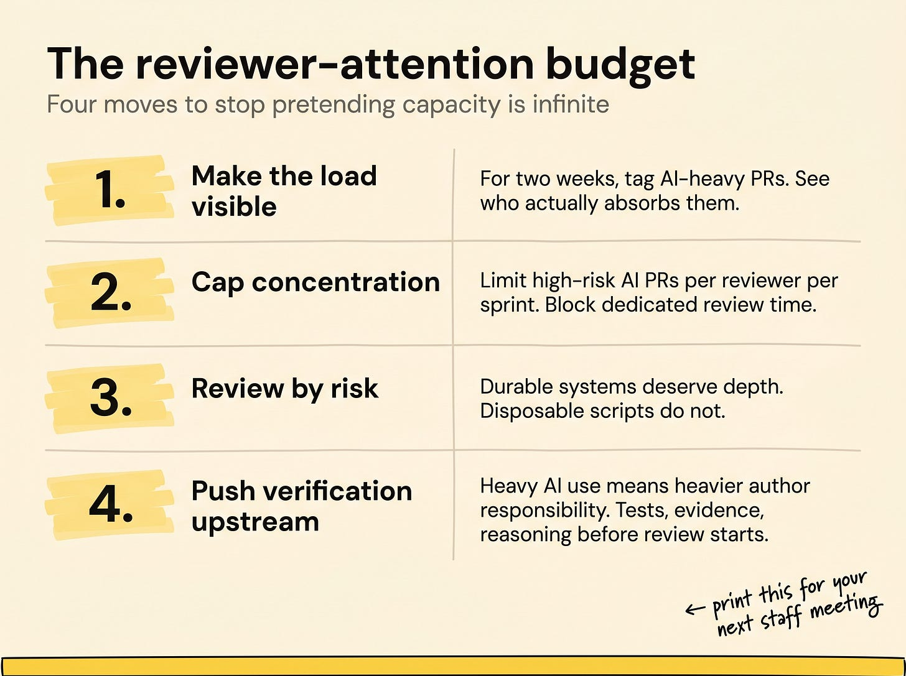

# Code Review Capacity Budgeting

## Key Takeaways

- AI generates code far faster than humans can review it — creating a structural asymmetry where **reviewer attention is now one of the scarcest organizational resources**
- Teams still treat reviewer capacity as unlimited; dashboard throughput looks healthy while **reviewer bandwidth quietly collapses**
- 96% of developers distrust AI code (Sonar survey), but fewer than half verify it before committing — review quality is degrading silently
- Senior engineers absorb most of the hard verification work and become **"invisible infrastructure"** — uncredited in promotion systems
- The real bottleneck has shifted from code *generation* to code *review* (and long-term maintenance burden)

## The Asymmetry of Verification

| Side | Property |
|---|---|
| **Generation** | Fast, parallelizable, machine-driven |
| **Verification** | Slow, human-paced, concentration-bound, sequential |

Code review hasn't gotten faster. AI just made the inbound queue 5–10x longer. The scarcity has flipped.

## Three Cascading Effects of Reviewer Saturation

1. **Review quality drops** — saturated reviewers approve faster, scrutinize less; defects slip through
2. **Cognitive debt accumulates** — teams lose shared mental models of their own codebase because no one has time to actually read it
3. **Senior engineers become invisible infrastructure** — they absorb the hard reviews, get no promotion credit, and eventually leave

> "I spend most of my day trying to decide whether I trust things." — engineer quoted in source

## Actionable Insights

- **Tag AI-generated PRs** and track who reviews them — exposes the 1–2 seniors carrying the load
- **Cap high-risk AI code reviews per sprint** and create dedicated review blocks (protect concentration vs interrupt-driven review)
- **Allocate review depth by risk** — deep scrutiny for auth/critical paths, light-touch for throwaway internal scripts
- **Shift verification upstream** — authors using AI heavily must demonstrate (tests + reasoning + reproducible validation) that code works *before* requesting review
- **Reward reviewing in promotions** — without explicit recognition, strong reviewers exit to less demanding roles

## Risk-Based Review Allocation

Match review depth to blast radius:

| Code surface | Review depth |
|---|---|
| Auth, payments, PII handling | Mandatory deep review by senior |
| Public API contracts | Deep — breaking changes have cross-team cost |
| Production data paths | Deep — silent corruption is hard to detect |
| Internal tooling | Standard review |
| Throwaway scripts, prototypes | Light-touch or skip |

The default of "every PR gets the same review" doesn't scale when generation volume jumps.

## Shifting Verification Upstream

If reviewer attention is the bottleneck, move work to the author:

| Author's responsibility | What this looks like |
|---|---|
| **Demonstrate it works** | Run the tests; paste output in PR |
| **Demonstrate the reasoning** | Write *why* this approach, not just what it does |
| **Reproducible validation** | Provide the scenario/dataset reviewers can rerun |

This is harder for the author than the AI-default workflow (write prompt → ship PR → wait for review to catch problems). That's the point — the cost should land on the author, not the reviewer.

## Why Promotions Are the Hidden Lever

The promotion rubric defines what work the org rewards. If:

- Shipping features → AI-amplified individual ICs win
- Reviewing PRs → uncredited senior engineers carry the org silently

The senior engineers who hold quality together either:

1. Get explicit credit and stay
2. Don't, and leave for roles where their contribution is visible

Either way, the team that depends on them is exposed.

## The Bottleneck Has Shifted

The constraint used to be "we can't generate code fast enough." That problem is solved. The new constraint is "we can't review it fast enough" — and a slower constraint downstream is worse, because output accumulates without being absorbed.

## See Also

- [codebase-drag-and-engineering-slowness.md](codebase-drag-and-engineering-slowness.md) — adjacent: AI accelerates generation but slows maintenance; review is one of the maintenance taxes
- [crediting-maintenance-work.md](crediting-maintenance-work.md) — directly relevant: code review is the canonical "invisible work" left out of performance reviews
- [leading-ai-adoption-in-engineering.md](leading-ai-adoption-in-engineering.md) — broader context: cognitive debt, manager-vs-engineer disconnect on AI as a metric
- [interviewing-engineers-in-ai-era.md](interviewing-engineers-in-ai-era.md) — adjacent: the same reasoning behind hiring for verification habits, not just generation speed
- [../ai-ml-ds/concepts/ai-assisted-code-review.md](../ai-ml-ds/concepts/ai-assisted-code-review.md) — technical complement: how to use LLMs for first-pass review to reduce the burden on humans
- [../ai-ml-ds/agent-teams-harness-eng/ai-native-engineering.md](../ai-ml-ds/agent-teams-harness-eng/ai-native-engineering.md) — the 40/20/40 time allocation puts review at 40% explicitly

---

**Source:** https://www.blog4ems.com/p/budgeting-your-teams-code-review-capacity
**Date:** 2026-06-02
**Tags:** leadership, engineering-management, code-review, ai-assisted-development, capacity-planning, reviewer-burnout, senior-engineer-leverage, technical-debt, promotion-systems
