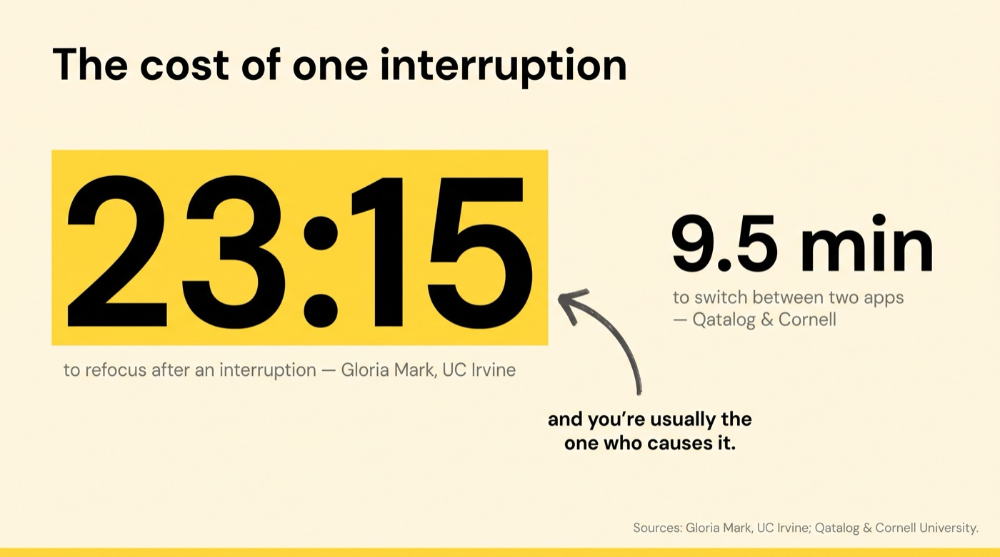
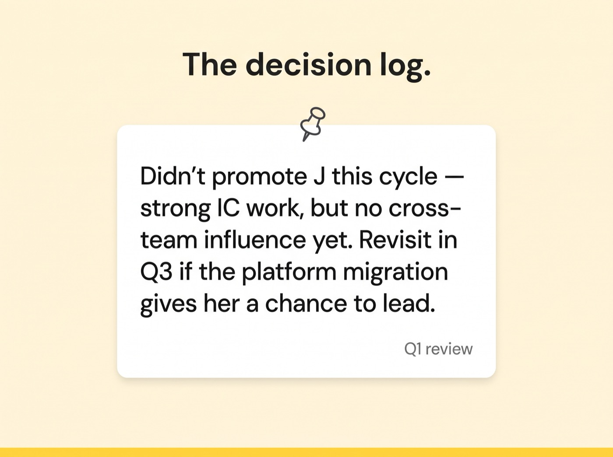

# Habits of an Efficient Engineering Manager

## Key Takeaways

- The habits that made you an efficient *senior engineer* stop working as a *manager* — the job is now about managing other people's context-switching, not protecting your own deep work
- **You are usually the largest source of your team's interruptions.** Every "quick question" or "got a sec?" costs the recipient ~23 minutes of refocus time
- A **decision log** (one line per judgment call: what you decided, why, and what would change your mind) protects you from reconstructing your own reasoning under pressure when reports or skip-levels question a call later
- A weekly **near-miss review** (15 min) surfaces the mistakes you *almost* made and reveals patterns early enough to intervene

> Only 2 of the article's 4 habits were accessible — habits 3 and 4 (interruption-capping rules, including a rule against "got a sec?" meetings) sit behind the source paywall.

## The Cost of an Interruption

- **23 min 15 sec** to fully refocus after a meaningful interruption (Gloria Mark, UC Irvine)
- **~9.5 min** of lost momentum just from switching between two apps (Qatalog + Cornell)
- As a manager, *you're usually the one who causes it* — so treat every interruption you initiate as spending ~23 minutes of someone else's focus.

## Habit 1 — The Decision Log

Add one line the day you make a call: **the decision, the reasoning, and the evidence that would make you reverse it.** It isn't for your team — it's so you're never rebuilding your own reasoning from memory, under pressure, in front of the person questioning it.

Especially worth logging: promotions denied, features descoped under deadline, and progression plans. (Example entry: *"Didn't promote J this cycle — strong IC work, but no cross-team influence yet. Revisit in Q3 if the platform migration gives her a chance to lead."*)

## Habit 2 — The Weekly Near-Miss Review

Book 15 minutes weekly. Fixed prompts: *"Where did I almost mishandle something this week, and what made me catch it in time? Was it luck, or a signal I got right — and can I get that signal earlier next time?"*

Keep the near-miss log next to the decision log and look for patterns (timing, recurring triggers). The author found his near-misses clustered right before 1:1s he was avoiding — a signal to flag a dreaded conversation sooner instead of letting avoidance become the risk. It's pre-mortem thinking applied to managerial judgment: a postmortem for the incident that *almost* happened.

## Actionable Insights

- **Think twice before pinging** — before you send a "quick question," remember it's ~23 minutes of someone's focus; batch it or answer it yourself.
- **Keep a decision log** — one line per judgment call, including what would make you reverse it. Prioritize promotion/descoping/progression decisions.
- **Run a 15-min weekly near-miss review** with a fixed prompt set; log it next to your decisions.
- **Act on the patterns** — when near-misses cluster around a trigger (e.g., avoided conversations), intervene earlier next cycle.

Related: [ic-to-manager-transition.md](ic-to-manager-transition.md) (IC habits that stop working as a manager), [managing-overwhelm.md](managing-overwhelm.md) (focus and load), [people-development-and-coaching.md](people-development-and-coaching.md) (the promotion-decision angle).

---

**Source:** https://www.blog4ems.com/p/the-habits-you-need-to-be-an-efficient
**Date:** 2026-07-26
**Tags:** leadership, engineering-management, productivity, focus, interruptions, decision-making, self-management, deep-work
