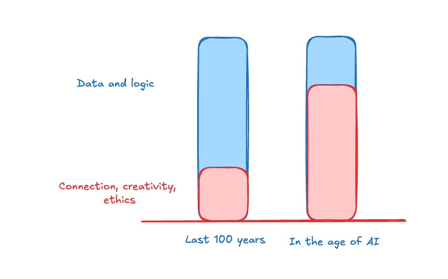

# Feelings Over Logic in Leadership

## Key Takeaways

- As AI democratizes knowledge and analytical capability, leadership differentiation shifts from intellectual horsepower to emotional intelligence, creativity, and ethical judgment
- Leaders must develop three centers of wisdom: Head (logic/analysis -- where AI excels), Heart (connection/creativity/empathy -- uniquely human), and Gut (ethical discernment/intuition -- essential for novel situations)
- Knowledge-based advantage is ending -- AI synthesizes information at scales humans cannot match, making traditional expertise a baseline, not a differentiator
- Humans still outperform AI in true creativity requiring courage, genuine empathy during crises, ethical judgment in unprecedented situations, and building trust across disparate teams
- Key quote: "The most important leadership skill may be knowing when to let feelings override logic"

## Actionable Insights

**Develop heart-centered wisdom:**

- Follow genuine curiosity rather than only what you are already skilled at
- Cultivate emotional awareness in group dynamics -- notice when the room shifts
- Display vulnerability: leadership is courage "in the face of fear, not in the absence of fear"

**Develop gut-centered wisdom:**

- Pause before major decisions to sense physical intuition -- your body often registers danger before your mind rationalizes it
- Notice bodily discomfort that precedes rational explanation
- Reflect on past decisions where your gut was right but you overrode it with data

**Rebalance your leadership toolkit:**

- Recognize that data and logic remain necessary but are no longer sufficient
- Invest time in connection, creativity, and ethics -- these are the growing differentiators
- In AI-augmented teams, the leader who can rally people emotionally will outperform the one who only optimizes analytically

---

**Source:** https://news.theuncommonexecutive.com/p/feelings-over-logic
**Date:** 2026-05-28
**Tags:** leadership, emotional-intelligence, ai-era, empathy, creativity, ethics, decision-making
