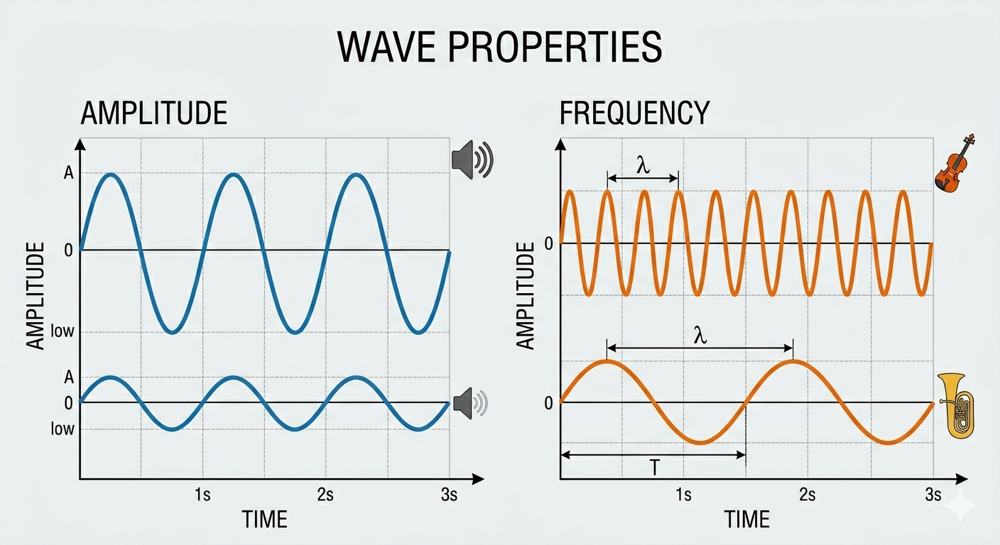

# High-Amplitude Disagreeableness

## Key Takeaways

- Disagreement has two dimensions, modeled on sound waves: **frequency** (how often someone pushes back) and **amplitude** (how intensely/persistently they push back when they do)
- Startup-oriented people typically have **low-to-moderate frequency** but **extraordinarily high amplitude** — they pick their battles, but when they fight, they fight hard and publicly
- These people are most valuable during organizational transitions and platform shifts, but require deliberate leadership accommodation
- **Strong disagreement is a signal of caring and engagement**, not insubordination — punishing it suppresses the exact behavior that drives breakthroughs
- Leaders who appear unwilling to be challenged, or who stay "confidently wrong," lose credibility and earn lasting grudges from high-amplitude people

## The Two Dimensions

| | Low frequency | High frequency |
|---|---|---|
| **Low amplitude** | Quiet contributor; rarely pushes back, never hard | Constant low-grade friction; nit-picker |
| **High amplitude** | **Startup type** — silent for weeks, then nukes you when it matters | Exhausting contrarian; alienates teammates |

The valuable quadrant for high-stakes work is the **bottom-left**: someone who picks battles carefully but goes hard when they do.

## Actionable Insights

- **Build cultures that explicitly permit vigorous, hierarchy-blind debate** — distinguish "necessary disagreement" from "troublemaking"
- **When challenged hard, demonstrate conviction by engaging the argument** — not by pulling rank
- **Correct course decisively and visibly when you've been shown to be wrong** — credibility is preserved by updating, not doubling down
- **Allow people to "step out of their lane"** when their conviction warrants it
- **Audit your own reactions** — do you reward or punish intense professional dissent? The answer determines whether startup talent stays

## Why It's a Startup Trait

- Startups demand **creation, not extraction** — high-amplitude people view work through "what could be built" rather than "what's the rule"
- Most decisions don't matter; the few that do, matter enormously. High-amplitude people optimize for that asymmetry
- High frequency without high amplitude looks like polite alignment — useful in late-stage orgs, fatal in early-stage ones where wrong decisions compound

## The "Confidently Wrong" Failure Mode

The cardinal sin for leading high-amplitude people:

> If you're really wrong, **"they will fucking nuke you from orbit."**

The grudge from being confidently wrong, and not updating, lasts years. The fix is not to avoid being wrong — it's to update visibly when shown to be wrong. Strong disagreement is "a sign someone cares."

## See Also

- [managing-up.md](managing-up.md) — companion piece: how to *do* the high-amplitude push effectively (lead with recommendation, frame strategically)
- [nonverbal-communication-and-eq.md](nonverbal-communication-and-eq.md) — how to receive disagreement without your face shutting it down
- [people-development-and-coaching.md](people-development-and-coaching.md) — when the same complaints keep showing up, the issue is structural not personal

---

**Source:** https://staysaasy.com/startups/2026/04/15/high-amplitude-disagreeableness.html
**Date:** 2026-06-02
**Tags:** leadership, startup-culture, communication-style, disagreement, conviction, team-dynamics, managing-people
