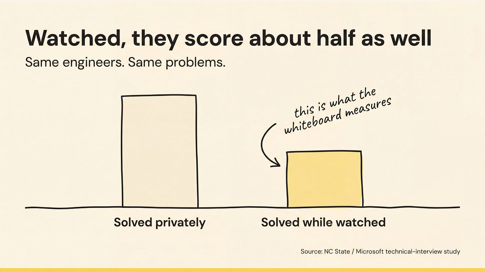
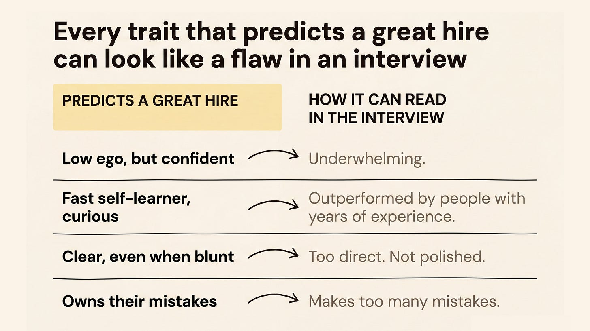

# Hiring People Better Than You

## Key Takeaways

- Organizations only improve (not just expand) when leaders hire people who exceed their own expertise in each domain; if the CEO is the smartest person in every room, hiring has failed.
- You cannot directly evaluate domain expertise you lack, so assess proxies: whether candidates generate actionable ideas specific to your context, whether you learn something new during the interview, and whether their thinking process reveals genuine experience vs. parroting frameworks.
- Great hires elevate the entire organization beyond their silo -- improving communication, decision-making, goal-setting, and people management company-wide.
- False positives (bad hires you keep) are far more damaging than false negatives (good candidates you pass on); address mis-hires quickly because lingering poor fits demoralize your best people.
- Reference checks should skip sanitized endorsements and instead ask targeted questions: "Under what ideal circumstances does this person thrive?", "Where would they struggle?", and "What are their unrecognized natural strengths?"
- Standard interview processes systematically filter out the traits that predict long-term success — each of the four most predictive traits reads as a flaw in interviews (underwhelming, too blunt, makes mistakes, outperformed by pedigreed candidates)
- Research (NC State/Microsoft): engineers score ~2× better on the same problem when unobserved vs. observed — whiteboard interviews measure scrutiny tolerance, not engineering ability
- **Close every interview with real-time feedback** — 15–20% of candidates will successfully correct a misreading and surface signal you almost missed; the rest appreciate the rare transparency

## Actionable Insights

- **Present real company challenges in interviews** -- observe the candidate's thinking process and clarifying questions rather than evaluating specific solutions. Generic answers signal surface-level knowledge.
- **Apply the competitor test** -- if this person joined a competitor, would it genuinely worry you? If not, keep looking.
- **Apply the six-month test** -- would your department measurably improve if this person led it unsupervised for six months?
- **Redesign reference checks** -- replace "Would you hire them again?" with scenario-based questions that reveal fit without forcing referees into uncomfortable binary judgments.
- **Act fast on mis-hires** -- you cannot verify expertise even a year into employment (no counterfactual exists), so trust early signals and correct course quickly rather than waiting for certainty.
- **Test low ego directly:** Push back on a real decision from their work history mid-interview; strong candidates engage the argument, concede where valid, and defend sound reasoning — they neither cave immediately nor get defensive.
- **De-weight pedigree in scorecards:** Build explicit rubrics for the four predictive traits so interviewers assess them directly rather than defaulting to "overall impression," which correlates strongly with credentials rather than performance.

## The Whiteboard Effect: Interview Bias

Research from NC State and Microsoft: engineers score roughly twice as well on the same problem when working privately vs. when observed. Whiteboard interviews measure anxiety response, not engineering ability.

Consequences:
- The same engineer scores wildly differently across standardized mock interviews (interviewing.io data) — noise dominates signal
- Impostor syndrome appears twice as often as overconfidence in candidate self-assessments — high-performers self-select out of pipelines entirely
- Pedigree and interview polish correlate with interview scores but not job performance

## Four Traits That Predict Strong Hires

| Trait | Why it predicts success | How it reads in interviews |
|---|---|---|
| **Low ego, high confidence** | Engages pushback without collapsing or getting defensive | Underwhelming, not impressive |
| **Fast self-learner / curious** | Adapts as problems evolve; doesn't stall on knowledge gaps | Outperformed by more experienced candidates |
| **Clear communicator (even blunt)** | No ambiguity in requirements, feedback, or blockers | Too direct, abrasive |
| **Owns mistakes** | Fixes root causes rather than explaining them away | Makes too many mistakes |

**Testing low ego:** Push back on a real decision from their work history. Strong candidates engage the argument, concede valid points, defend sound reasoning — they don't cave or get defensive.

**Testing mistake ownership:** Flag candidates who select trivial mistakes or craft perfect redemption arcs — they're gaming the question. Look for genuine ownership with no defensiveness.

> "Every trait that predicts a great hire can look like a flaw in an interview."

> "We found that brainteasers are a complete waste of time...They don't predict anything. They serve primarily to make the interviewer feel smart." — Laszlo Bock, former Google People Operations

## Real-Time Feedback as Interview Closing Move

Most interviews are one-directional: the interviewer evaluates, the candidate never learns why they passed or failed. Closing with real-time feedback flips this into a dialogue — and surfaces additional signal.

**Opening script:**
> "I'd like to give you some feedback on what I heard today, so you have the chance to correct anything I may have misinterpreted."

**Principles for delivery:**
- Address capabilities and specific behaviors, never personality traits (feedback targeting character causes defensiveness and is a delivery error)
- Be transparent on both strengths and concerns — vague positivity is useless
- Be specific enough for the candidate to act on it

**How candidates respond (four categories):**

| Response | What it tells you |
|---|---|
| **Clarifies successfully (15–20%)** | Candidate had the depth but didn't surface it — a signal you almost missed |
| **Clarifies but exposes more weakness** | Attempt to fill the gap reveals further gaps through unclear or error-filled explanation |
| **Accepts with gratitude (majority)** | Interview feedback is rare; most candidates are underserved and appreciate it regardless of outcome |
| **Reacts negatively (rare)** | Almost always a delivery error — feedback targeted personality rather than specific behavior |

**Why this works:** Candidates are systemically underserved by opaque interview processes. Transparent, specific feedback — even critical — is appreciated and creates a closing signal you can't get from silence.

---

**Source:** https://longform.asmartbear.com/hire-better-than-you
**Source:** https://www.blog4ems.com/p/4-traits-that-predict-your-best-hires
**Source:** https://mgrebler.substack.com/p/real-time-feedback-my-closing-move
**Date:** 2026-05-28
**Tags:** hiring, leadership, recruiting, talent-assessment, interviewing, interview-bias, whiteboard-effect, behavioral-traits, real-time-feedback, candidate-experience
