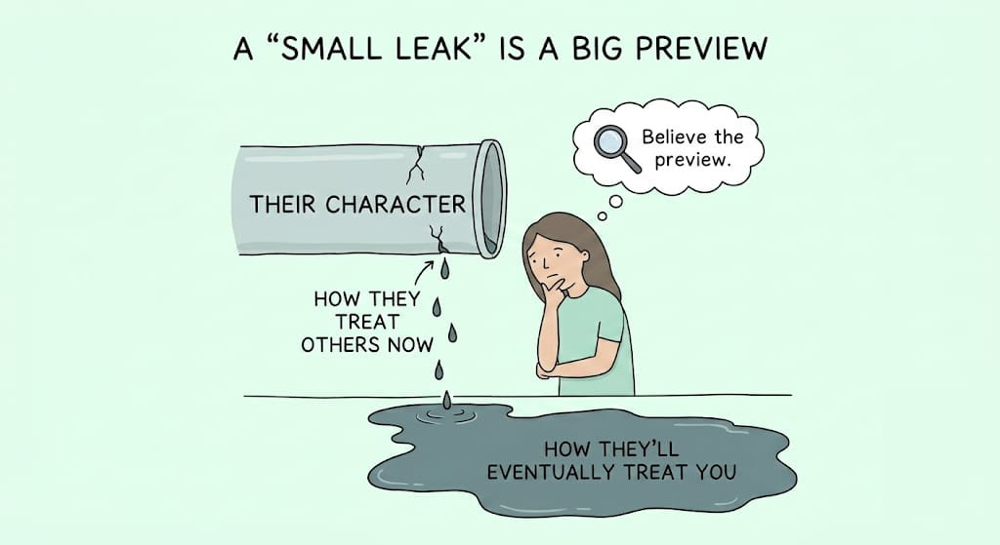
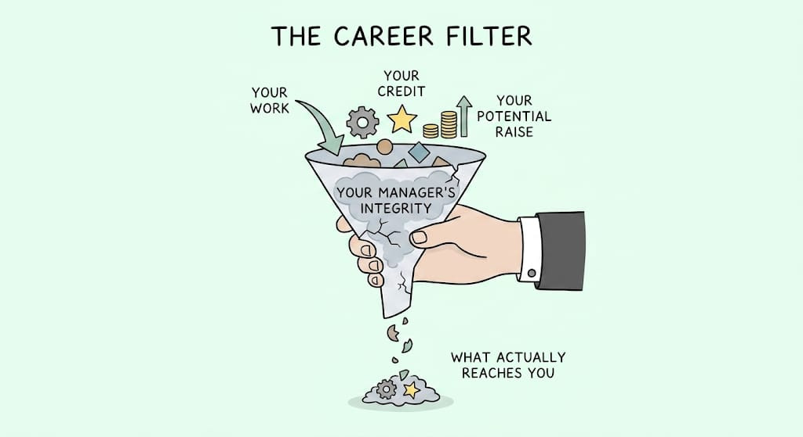
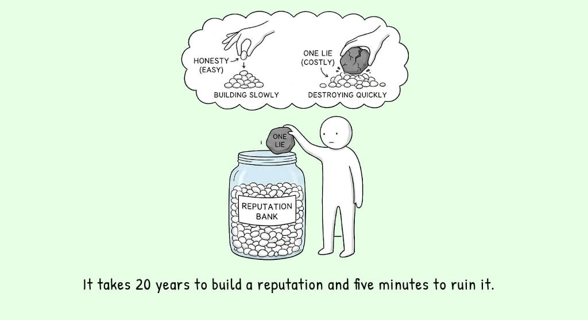
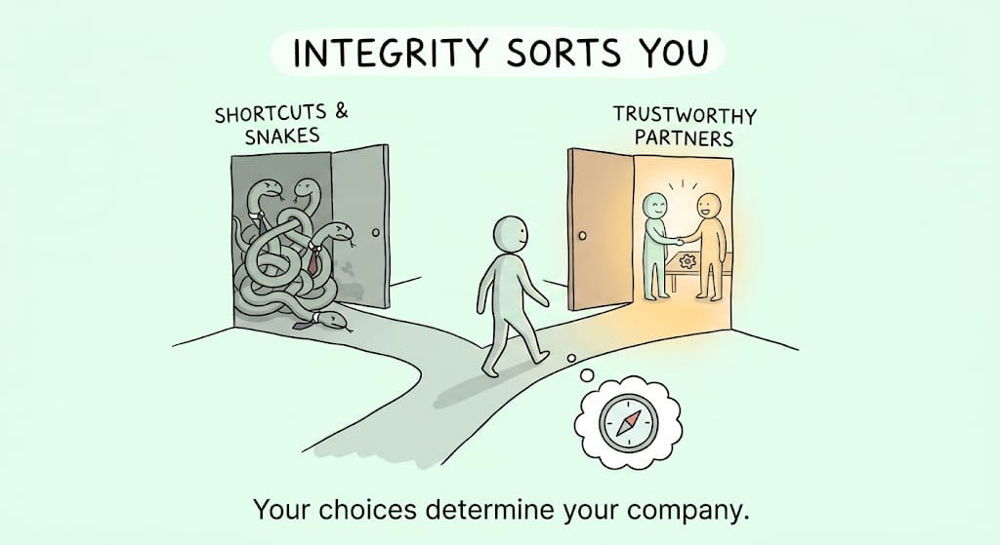

# Integrity as a Career Strategy

## Key Takeaways

- A career is a long series of **bets on people** (which boss, company, client). Integrity is the variable that decides how those bets pay off — "integrity pays" understates it.
- **Character doesn't compartmentalize.** Whoever will lie *for* you will eventually lie *to* you. Every small display of how someone treats others is a preview of how they'll treat you once you're on the wrong side of a decision.
- **Your manager's integrity affects your career more than your own does** — credit, raises, and promotions all pass through their hands. Audition the *boss*, not just the brand and salary.
- Integrity means what you say is *true*; it does **not** mean disclosing everything you know. Confusing "honest" with "naive" (volunteering your bottom number) gets you eaten.
- Reputation is only built by honesty that visibly **costs** you, and the math is asymmetric: one caught lie reprices decades of trust in five minutes.

## Actionable Insights

- **Read the previews.** Watch how people treat you while they still need something (their nicest), and how they treat people who can no longer do anything for them. Trust your gut — you don't need producible evidence to slow down.
- **Audition your manager.** In interviews, listen to *how a prospective boss talks about people who've left*. It predicts your next three years better than the offer letter. A fair boss at an average company beats a "brilliant snake" at a prestigious one.
- **Don't confuse integrity with over-sharing.** Withholding your salary floor is good negotiating, not dishonesty. Keeping your opinion of the CEO to yourself is prudence, not deceit. You don't owe everyone everything you know.
- **Build reputation with costly honesty.** Tell people the bad thing before they find it themselves; give credit accurately when nobody would notice you taking it; keep private things private; help when there's nothing in it for you.
- **Guard the asymmetry.** Assume every unwatched moment becomes suspect the instant one lie is caught. There's no memo when people stop trusting you — they quietly recategorize you and stop bringing opportunities.
- **Use the clarifying question.** "What's the right thing to do?" is not just moral — it lets you sleep, and over time it *sorts* you toward better rooms.

## Character Leaks — Believe the Preview

The salesman who bends the rules to win your deal has shown you his operating system. The colleague who gossips *with* you gossips *about* you elsewhere. It cuts both ways: badmouth your boss in an interview and the interviewer hears how you'll talk about *them*.

## Your Manager's Integrity Is the Real Filter

A fair boss fights for you and gives credit in rooms you're not in. A snake absorbs your credit and trades you away when useful. Flip the usual weighting (brand + salary over manager) — the manager is the filter everything you earn passes through.

## The Reputation Bank

Being honest when it's convenient builds almost nothing. Reputation compounds only through honesty that costs you — and an apology can change future behavior but can't unsee what you did when you thought it didn't count.

## Integrity Sorts You

Trustworthy people can only afford to work with trustworthy people, so integrity sorts you over time toward better company and opportunities. Cutting corners sorts you toward other corner-cutters — "the real punishment for a snake is a career (and life) surrounded by other snakes."

## Related

- [Career bets that compound](career-bets-that-compound.md) — reputation as one of four compounding capitals
- [Managing up](managing-up.md) — the flip side of "audition your manager"
- [Spotting BS](spotting-bs.md) and [career blind spots](career-blind-spots.md) — reading people and questioning what you're told

---

**Source:** Imported from personal notes — "Integrity is a career strategy" (Rohan Mahtani, Coached newsletter)
**Date:** 2026-08-15
**Tags:** integrity, reputation, career-strategy, trust, character-judgment, managing-up
