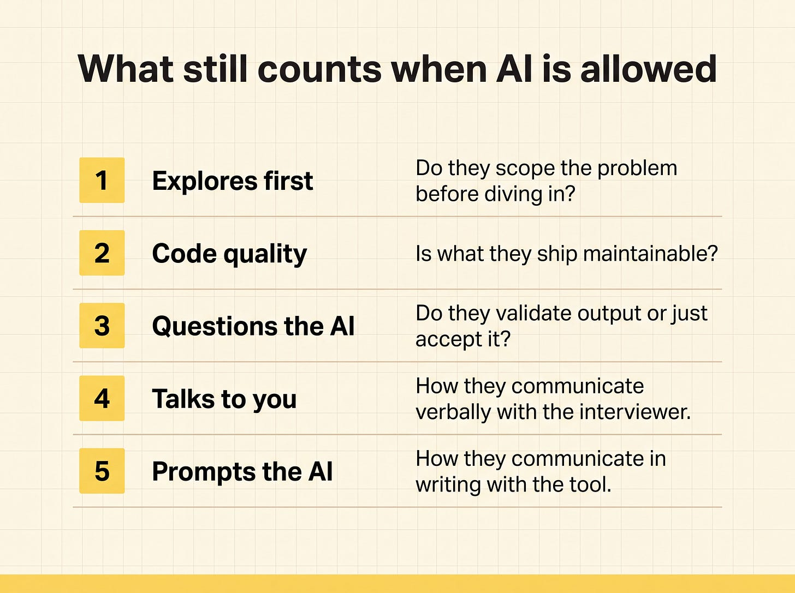

# Interviewing Engineers in the AI Era

## Key Takeaways

- Unauthorized AI use in coding interviews doubled to 35% in late 2025 (48% in technical roles), and **61% of cheaters advanced** — proctoring is the wrong response; interview redesign is the right one
- Leading companies (Google, Canva, Shopify, Meta, Anthropic) already pivoted: less greenfield coding, more reading/debugging/grafting in real codebases, with AI either banned cleanly or embraced cleanly — not awkwardly tolerated
- A **Keep / Kill / Add** framework lets teams modernize each interview stage (recruiter screen → behavioral) without throwing out the whole loop
- Five new signals matter: **problem decomposition, control over AI, verification habits, architectural judgment, and communication under AI use**. Speed-to-answer and syntactic elegance are now "free" outputs and shouldn't be scored
- Junior pipelines need separate loops with **learning-velocity scoring** or risk being squeezed out (54% of eng leaders predict reduced junior hiring)

## Actionable Insights

- **Drop algorithm puzzles and take-homes.** Replace with a 45-min **read-and-fix round** on a real chunk of your codebase
- **Add an AI-assisted live round** where candidates use their own AI tools — score the *direction they give the model*, not the output it produces
- **Add one prompt to every recruiter screen:** *"Tell me about a time AI failed you and what you did."* (Replaces the useless "Do you use AI?" question)
- **Replace LeetCode badges on the CV rubric** with a required 200-word "how I work with AI" statement
- **Add a behavioral question:** *"When did you NOT use AI, and why?"* — surfaces judgment about tool-fit
- **Re-score architecture rounds higher.** System design is AI's weakest area and therefore the most predictive signal of senior judgment
- **Audit your last 20 hires** against the five signals before changing anything — establishes a baseline
- **Run a calibration pass** with internal cross-team "candidates" before going live with the new loop
- **Build a separate junior loop** that explicitly scores learning velocity via teaching moments
- **Pick one row of Keep/Kill/Add and change it this month** — don't redesign the whole loop at once

## The Five Critical Signals

| Signal | What it reveals | Why AI can't fake it |
|---|---|---|
| **Problem decomposition** | Can they break a vague spec into solvable pieces? | AI accepts whatever framing it's given |
| **Control over AI** | Do they direct the model, or take its first answer? | The candidate, not the AI, sets direction |
| **Verification habits** | Do they test, doubt, and double-check outputs? | AI rarely volunteers "I'm not sure" |
| **Architectural judgment** | Can they reason about tradeoffs across systems? | AI is weakest here; needs context AI lacks |
| **Communication under AI use** | Can they narrate what the AI did and why? | Reveals whether they understand or just pasted |

Speed-to-answer and syntactic elegance are now commodity outputs — stop scoring them.

## The Keep / Kill / Add Framework

Apply per interview stage:

| Stage | Keep | Kill | Add |
|---|---|---|---|
| Recruiter screen | Motivation, communication | "Do you use AI?" | "Tell me about a time AI failed you" |
| CV review | Real shipped projects | LeetCode badges, course certificates | 200-word "how I work with AI" statement |
| First technical | Quick reasoning check | Trivia, syntax recall | Reading a small code diff, explaining it |
| Take-home | (kill) | Take-home in general — too easy to outsource | Replace with read-and-fix round |
| Onsite coding | Pair programming on real-ish problems | Algorithm puzzles (DP, graph trickery) | AI-assisted live round with own tools |
| System design | Tradeoff-heavy scenarios | Buzzword bingo | Bias evaluation higher — most predictive signal |
| Behavioral | Conflict, collaboration | Generic "tell me about a time" | "When did you NOT use AI, and why?" |

## The 90-Day Implementation Plan

| Weeks | Activity |
|---|---|
| 1–2 | **Audit** — score last 20 hires against the five signals; identify weakest stages |
| 3–4 | **Redesign** — apply Keep/Kill/Add to those stages |
| 5–6 | **Retrain** — interviewer calibration sessions; rubric updates |
| 7–8 | **Calibrate** — run cross-team "candidates" through the new loop |
| 9–12 | **Launch + measure** — track 90-day performance of new hires vs old loop |

## What Top Companies Are Doing

- **Google, Anthropic** — explicit AI-use rounds (candidate uses AI under observation)
- **Canva, Shopify** — "code grafting" rounds (integrate AI-generated snippets into unfamiliar codebases)
- **Meta** — less greenfield coding, more debugging in production-like code
- All have **stopped tolerating** AI use ambiguously — either fully banned or fully embraced per round

### Case Study: Meta's Full-Codebase + AI-Allowed Rebuild (LDX3 2026)

Danit Nativ Navon (Senior EM, Meta) described Meta's full interview-loop rebuild:

**Setup:**

- Candidates receive a **full codebase**
- **AI assistants allowed** during the interview
- Assessment shifts to skills that are **invariant regardless of tooling**

**Five invariant signals:**

| # | Signal | Diagnostic |
|---|---|---|
| 1 | **Explores first** | Do they scope the problem before diving in? |
| 2 | **Code quality** | Is what they ship maintainable? |
| 3 | **Questions the AI** | Do they validate output or just accept it? |
| 4 | **Talks to you** | Verbal communication with the interviewer |
| 5 | **Prompts the AI** | Written communication with the tool |

**Scale:** ~**9,000 interviews** completed in this format before full rollout in **April 2026**.

**Core finding:** what makes a good hire didn't change. The *evidence-gathering methodology* changed entirely.

**Note** — these 5 invariants overlap heavily with [The Five Critical Signals](#the-five-critical-signals) above. Meta's "two-layer communication" (verbal + written-to-AI) maps to **Communication under AI use**; their "questions the AI" maps to **Verification habits**; "explores first" maps to **Problem decomposition**. Independent convergence on the same signal set is a useful credibility check.

## The Junior Pipeline Risk

- 54% of engineering leaders predict reduced junior hiring
- Without a separate loop scoring **learning velocity** (teaching moments, growth mindset, ability to absorb feedback), junior pipelines get squeezed
- Required adaptation: bias the junior loop toward potential rather than current output

> "If your reaction is 'we need better proctoring', I think that's the wrong instinct."

> "Your interview loop has a redesign deadline, and it's not 'when you have time'. Pick the keep/kill/add row that's hurting you most and change one thing this month."

## See Also

- [hiring-people-better-than-you.md](hiring-people-better-than-you.md) — complementary angle: evaluating candidates whose expertise exceeds your own
- [leading-ai-adoption-in-engineering.md](leading-ai-adoption-in-engineering.md) — same era, manager perspective on AI tool adoption

---

**Source:** https://www.blog4ems.com/p/stop-interviewing-engineers-like-its-2022
**Source:** https://www.blog4ems.com/p/engineering-leadership-lessons-from-ldx3-2026
**Date:** 2026-06-01 (initial), 2026-06-09 (added Meta case study from LDX3 2026)
**Tags:** leadership, hiring, interviewing, technical-interviews, ai-in-hiring, talent-assessment, engineering-management, meta, ldx3
