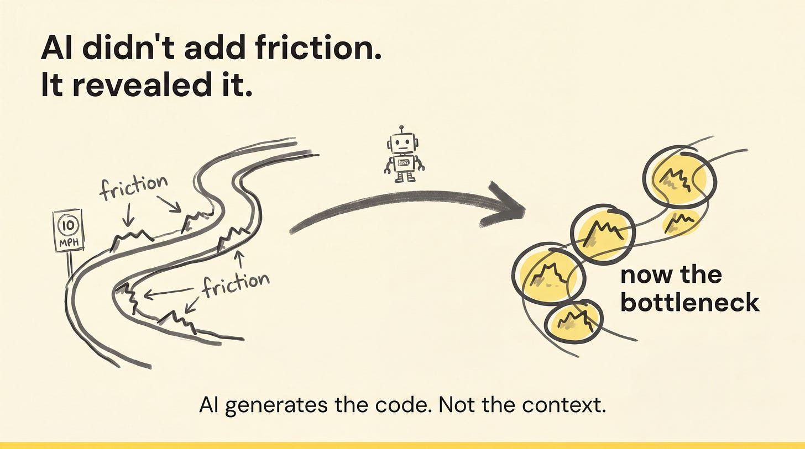
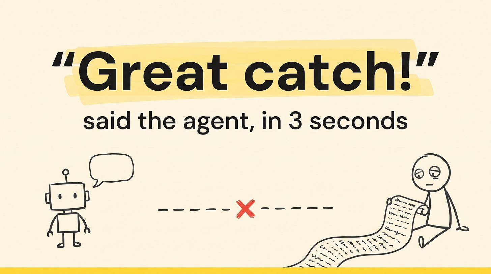
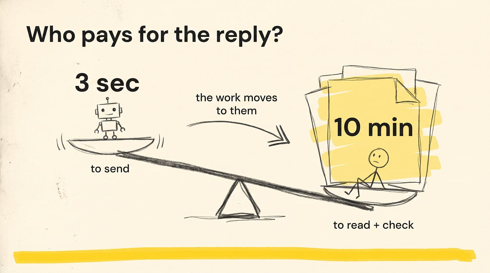
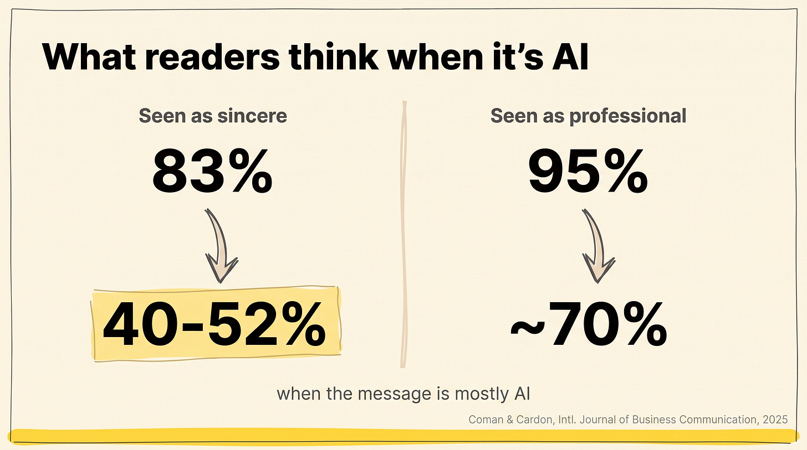
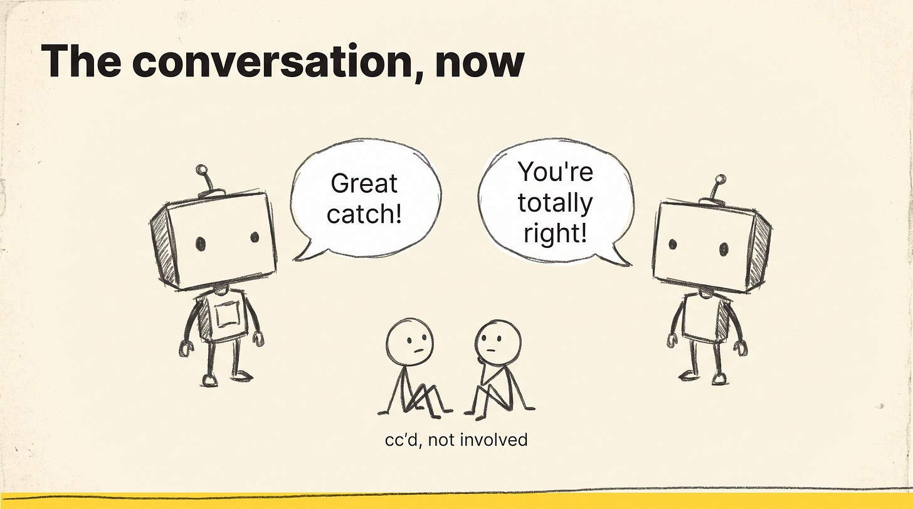
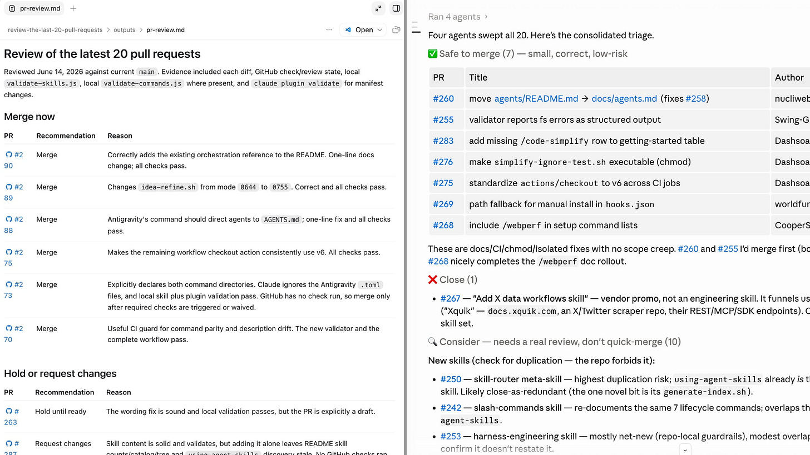

# Leading AI Adoption in Engineering

## Key Takeaways

- AI won't reduce engineering headcount — software demand keeps rising while development costs fall; the role evolves but total demand for builders likely increases
- Adoption mandates are unnecessary — adoption accelerates naturally; the real work is removing friction and providing learning time
- Most adoption challenges are fundamentally human: incentives, anxiety, learning time, and changing metrics — not tooling
- High-performing engineers maintain quality standards regardless of tools (amplification effect) — AI doesn't inherently create more technical debt, but "cognitive debt" (understanding systems less) is an emerging concern
- The biggest bottlenecks aren't code review or velocity — they're decision-making, prioritization, and meetings
- The AI-native SDLC inverts time allocation: majority of effort shifts to planning and validation, while creation and operations compress
- The cost of building collapsed but the cost of aligning organizationally has not — when multiple teams can solve the same problem in parallel, coordination becomes the bottleneck
- **AI didn't add friction — it revealed it.** Velocity, cognitive, and knowledge friction were always there but masked by slow build speeds. AI removed the speed limit; now friction *is* the bottleneck. **AI generates code, not context** — and most context still lives in individual heads
- **AI is silently rewiring team relationships.** ~51% of devs now ask AI for technical help they used to ask teammates; ~60%+ prefer AI because "no judgment." The lost interactions were never just about the answer — they were the channel for mentorship, context transfer, and trust. Managers must intentionally preserve what routine questions used to deliver for free
- **Agents produce 4x raw code output but only ~12% improvement in delivered value** (GitClear 2025) — the gap is entirely review work. Per-developer defect rates jumped from 9% → 54%, code churn up 861%, review duration up 441.5% (Faros AI, March 2026). Review is now the most leveraged skill in software
- **The economics of code flipped: generation is cheap; understanding is expensive.** Agent-written code has no embedded author intent — the reviewer is often "the first human to ever lay eyes on this code." Teams that win build trustworthy review systems, not high-output generation pipelines

## Actionable Insights

**Don't mandate, enable:**

- Remove friction (tool selection, configuration, access)
- Allocate explicit learning time — group learning sprints outperform individual learning
- Leaders must create space for capability building, not force usage
- Celebrate concrete success stories publicly; let organic champion networks emerge

**Reframe the headcount question:**

- Smaller companies gain faster market entry with AI tools — the competitive landscape shifts, not shrinks
- Engineering will increasingly involve orchestrating AI agents rather than direct coding — different skillsets needed: delegation, context-switching, intent definition
- Not all engineers should become "agent managers" — professional identity matters

**Watch for cognitive debt:**

- Code volume increases with AI, but the debt-to-output ratio is debatable
- The real risk: engineers understanding their own systems less deeply
- High performers amplify quality with AI; struggling engineers amplify problems
- Non-engineer code contributions (designers submitting PRs) require robust test suites and deployment checks as prerequisites

**On AI-generated code expectations:**

- 50% of *new* code within five years is plausible
- Rewriting existing legacy systems lacks economic justification — distinguish new code from total codebase
- Risk concerns reflect rational engineering accountability, not resistance

## Designing the AI-Native Engineering Org

**SDLC shift:** Traditional split was ~80% operations, 10-15% creation. Top-performing teams now spend majority of time on planning and validation, while AI compresses creation and operations. Don't fully automate validation and security — human oversight remains critical.

**Org structure — modify execution, not org charts:**

- Atlassian: shifted to 3-4 person squads for new projects
- Microsoft: eight-week mission-specific teams focused on rapid learning cycles
- 1Password: compressed planning horizons from 12-18 months to single quarters

**Manage AI costs like cloud costs:**

- Map token expenditure by repository and project
- Negotiate volume commitments with providers
- Build internal cost-tracking tools
- Allocate budget for experimental learning despite uncertain ROI

**Engineer skills evolution (3-5 year horizon):**

- Maker's mindset — tool-agnostic, oriented toward business outcomes
- Generalist capabilities spanning product and engineering
- Agency — decisiveness without management oversight
- Higher-level abstraction — making better choices about *what* to build, not just building faster

## Panel Insights (DX Annual Debate)

A panel of practitioner-researchers (Etsy, Twilio, GitHub, Google, DX) debated AI productivity. Beyond the points above, the discussion surfaced four specific findings worth pulling out:

- **Manager-engineer disconnect** — most engineering managers think AI usage is a valid performance metric; engineers strongly reject this framing. Measure outcomes (merge time, defects), not tool usage.
- **Perceived vs actual review speed** — at Twilio, high-AI-usage devs reported worse review turnaround but achieved *faster actual merge times*. Perception of review delay worsens as coding time shrinks (it becomes proportionally more of the bottleneck even when it didn't change).
- **The diagnostic question** — ask engineers directly: *"Are you learning anything?"* Surfaces unsustainable pace and missed learning time better than productivity metrics.
- **Risk metaphor** — *"If we had a butter knife and now you have a chainsaw, the risks are different."* (Rafe Colburn, Etsy) — capability shift demands a different safety posture, not just more output.

## DX Q1 2026 Impact Report

DX's quarterly report on AI in engineering (400+ companies, +40% dataset vs Q4 2025) adds hard numbers and a **reversal** worth flagging.

### Headline Numbers

| Metric | Value | Note |
|---|---|---|
| Industry AI adoption | 93% | Saturation, not early-adopter |
| Manager code output (daily AI users) | **4x vs 6 months ago** | Up from 2x in Q4 2025 — doubling |
| Junior engineers time saved/week | **4.9 hours** | Now leading |
| Staff+ engineers time saved/week | 4.8 hours | Now trailing — *reversal* |
| Change-failure rate volatility | ±2pp swings | = ~50% defect-rate jump |

### Junior-Senior Reversal (Important Update)

The Sustainability Problem section below originally cited research that **AI enhanced senior roles more than junior**. Q1 2026 data reverses this: **juniors now save more hours per week (4.9) than Staff+ engineers (4.8)**.

Possible explanation: as agentic workflows mature, the leverage shifts to less-experienced engineers who have more room to be augmented. Seniors hit a ceiling earlier because their work is already high-context.

Implication: the "junior pipeline will shrink" prediction may be wrong. Juniors with AI are the most-leveraged tier; the question is whether org structures recognize this.

### Player-Coach Manager Re-Emerging

Engineering managers using AI daily ship **4x more code than 6 months ago** (up from 2x in Q4 2025). The trend is doubling. This re-opens the "player-coach" debate: managers who code daily without dropping people work.

**Don't restructure the org chart on a single quarter's data.** But the trajectory is clear enough to pilot the model intentionally rather than letting it happen by accident.

### Quality Volatility — Tests Are Now a Precondition

A ~2 percentage point swing in change-failure rate is a **50% jump in defect rate**. With AI-amplified throughput, defects scale with output. Automated testing is no longer a "best practice" — it's the precondition for safely using AI tools at all.

### Shadow AI

Developers circumventing enterprise tooling is now a named risk category. The mitigation: **reduce friction on the sanctioned path so the easy path is the safe path**. Banning shadow AI by policy doesn't work; engineers route around enforcement.

### Smaller Companies Win on Efficiency

<200-developer orgs outpace large enterprises in AI efficiency gains. Likely causes: shorter feedback loops, less procurement friction, fewer mandated tools. Enterprises hoping to "out-tool" the gap will lose; they need to out-iterate.

### The "No Average" Warning

> "There is no 'average' experience with AI impact." — DX Q1 2026

Per-org outcomes are asymmetric. Industry averages should **supplement, not replace** internal telemetry. Build Q1-vs-Q4-vs-your-baseline comparisons rather than chasing headline numbers.

### Notable Side Finding

**Rust** showed notable time-savings improvement attributed to reasoning-model / agentic-workflow advances. Languages that are hard to type and easy to verify benefit disproportionately from AI assistance.

## The Sustainability Problem for Senior Engineers

AI tools enhanced senior roles more than junior ones — seniors have the system-level understanding to apply AI across the full lifecycle, then execute themselves. But productivity gains didn't reduce workload; organizational expectations expanded to absorb increased output.

**What expanded:**

- Senior engineers now code most days (previously occasional prototypes) while also increasing strategic writing and meetings
- Idea-to-prototype compressed from a year to weeks, but stakeholder alignment didn't speed up proportionally
- Thinking time — supposedly central to senior roles — nearly vanished, only appearing during holidays

**What's at risk:**

- 1-on-1 mentoring and people-focused work doesn't benefit from AI tooling and gets squeezed out
- Specializing in AI/GenAI creates career advantages but narrows expertise — "identified with one thing in a way I wasn't before"
- The role expanded in contradictory directions: deeper hands-on engineering + broader strategic scope + more mentoring — unsustainable simultaneously

---

## When Enthusiasts and Skeptics Stop Talking (Charity Majors)

A specific dysfunction worth naming: most engineering orgs now have **two distinct camps** that have stopped communicating productively about AI.

### The Two Races

| Camp | What they're racing against |
|---|---|
| **AI Enthusiasts** | **Time** — competitors using AI effectively could put them out of business |
| **AI Skeptics** | **Entropy** — shipping unreviewed code creates technical debt and degrades systems |

Both face genuine existential threats. Both are right. But they've started caricaturing each other ("you hate progress" / "you don't care about quality") and operate in separate realities.

### The Structural Asymmetry

The feedback loop is broken because **winners and costs flow to different people**:

- An enthusiast ships fast → celebrated for velocity
- Downstream teams discover the chaos weeks later → frustrated
- Skeptics see the problems but lack credibility with leadership
- Enthusiasts never see the second-order costs of their wins

This is why mutual dismissal calcifies — both sides experience only their own evidence.

### The Three Fixes

**1. Tell the whole story in the same forum.** Present wins *alongside* costs where both camps can see them. Enthusiasts invite feedback openly; skeptics close loops by surfacing problems back to creators, not just complaining in side channels.

**2. Treat the disagreement as engineering, not rhetoric.** Replace accusations with diagnostic questions:
- ❌ "You hate progress" / "You don't care about quality"
- ✅ **"What conditions would make you comfortable shipping unreviewed code?"**

Then map dependencies, identify prerequisites, sequence the work. The disagreement becomes a roadmap.

**3. Build credible expertise on both sides.** Engineers who influence outcomes need standing through *knowledge*, not position:
- **Skeptics must understand AI opportunities** to have moral authority to push back
- **Enthusiasts must understand the operational realities** they're creating for downstream teams
- Leaders earn trust by forcing decisions **only as a last resort** — when both sides genuinely understand each other, they usually converge

### The North-Star Example

Fin (formerly Intercom) achieved **3× output in 9 months** through disciplined AI adoption — not magic. The unlock wasn't the AI itself; it was the prerequisites:
- Better tests
- Feature flags
- Observability
- Decoupled dependencies

This validates both camps. Enthusiasts get the speedup; skeptics get the conditions for it to be safe. The "right" answer is enthusiasm grounded in skeptics' prerequisites.

### Lesson for Leaders

When you see your org polarizing into camps, don't pick a side. **Force the diagnostic conversation**: what would each side need to agree the other side has a point? The answer is usually a list of investments (testing, observability, gated rollouts, paved paths) that are valuable independent of who "wins" the argument.

---

## AI Reveals (Doesn't Add) Friction (Forsgren / Clegg, LDX3 2026)

Nicole Forsgren (lead author of *Accelerate*, now Sr. Eng Director at Google) reframed the AI-productivity debate at LDX3 2026: friction was always the bottleneck — slow builds, ambiguous "done", siloed knowledge — but natural speed limits hid it. AI removes the speed limit, and now everything else is the bottleneck.

### Three Kinds of Friction

| Friction | What it looks like | Fix |
|---|---|---|
| **Velocity** | Slow builds, manual approval gates, 15-min+ deploys | DORA metrics + automation |
| **Cognitive** | Unclear "done", constant context-switching, ambiguous criteria | Explicit ready/done criteria |
| **Knowledge** | Context lives in one person's head; engineers unfamiliar with adjacent systems | **ADRs + ownership maps** — the one most teams underinvest in |

### The Central Insight

> "AI generates the code. Not the context." — Nicole Forsgren

In most organizations, critical context lives in individual heads — practically inaccessible to AI. Knowledge friction therefore becomes the **highest-leverage investment** as AI adoption scales.

### Wise's Approach (Rick Clegg)

Wise built scoped AI tools embedded in workflows — a code-flow visualizer that generates architectural diagrams, a PR-review assistant that explains changes in plain language.

> "The goal wasn't speed — it was making systems legible to anyone needing to work within them. Speed follows from clarity."

**Lesson:** target AI tooling at *legibility* (the knowledge-friction lever) before targeting speed. Speed is the downstream consequence.

### Actionable

- **Audit your team's friction by type** — which of the three is biggest? Most teams will discover knowledge friction is dominant once AI exposes the others
- **Invest in ADRs and ownership maps** *before* investing in more AI tooling — context-less AI just produces more output your team can't validate
- **Frame AI tools as legibility multipliers**, not speed multipliers — diagram generators, change explainers, onboarding agents
- **Watch for the trap of measuring AI ROI by code volume.** If knowledge friction is unchanged, volume gains become technical debt at scale

## Harness Engineering Is a Management Responsibility

Stephane Moreau (Blog4EMs) argues that when AI coding tools fail on a team, the problem is rarely the model — it's the **harness** (context files, scoped tests, tool wiring, guardrails). Two engineers using the *same* AI tool produce vastly different results when one has invested setup time and the other points the tool at an unstructured monorepo.

The key reframe: **the harness is the manager's deliverable**, not a platform team's side project. *"The scaffolding around a coding agent shapes its output as much as the model itself."* If nobody owns the harness, AI tools underperform — and the misattribution becomes "the AI isn't good enough" rather than "we didn't set it up."

### The Data That Backs the Reframe

Three studies that make "AI amplifies whatever your team already is" concrete:

- **METR** found experienced developers were **~19% slower** using AI on their own *mature* codebases — the productivity gains are real for greenfield/junior work, but a context-rich expert often loses time to AI-mediated review
- **2025 DORA report**: *"AI amplifies whatever your team already is."* High-performing teams get more from AI; struggling teams get more dysfunction
- **Faros AI** (10,000+ developers): post-AI adoption, **PR volume nearly doubled and review time climbed by 91%** — review capacity becomes the new bottleneck (see [code-review-capacity-budgeting.md](code-review-capacity-budgeting.md))
- **Stack Overflow 2025 Developer Survey**: trust in AI accuracy **fell to 29%**, with **two-thirds reporting outputs as "almost right, but not quite"** — the most expensive failure mode (looks right, isn't)

### Three Problems Good Setup Protects Against

| Problem | What happens without a harness |
|---|---|
| **Review Capacity Crisis** | Senior engineers become bottlenecked reviewing rapidly-generated code; verification quality silently degrades. See [code-review-capacity-budgeting.md](code-review-capacity-budgeting.md) |
| **Junior Development Gap** | AI absorbs the small, well-defined tickets that traditionally taught junior engineers how the system works. Juniors lose the on-ramp; team-level knowledge depth shrinks over a multi-year horizon |
| **Trust Erosion** | "Almost right, but not quite" outputs train engineers to either over-trust (committing without verification) or under-trust (re-doing the work manually). Either path destroys productivity gains |

### What a Manager-Owned Harness Looks Like

- **Context files** (`AGENTS.md`, `CLAUDE.md`, project-specific skill files) — see [harness-engineering.md](../ai-ml-ds/agent-teams-harness-eng/harness-engineering.md) for OpenAI's playbook
- **Scoped tests** the agent can run and iterate against
- **Architectural guardrails** mechanically enforced (custom linters, type boundaries)
- **A maker/checker loop** so the agent doesn't grade its own work — see [loop-engineering.md](../ai-ml-ds/agent-teams-harness-eng/loop-engineering.md)

The actionable shift: **add "harness health" to your team's regular operational review**, alongside code coverage and incident counts. If you can't point to who owns it, it's nobody's job and your AI tools are underperforming.

---

## When Devs Stop Asking Teammates (Blog4EMs / IEEE TSE 2026)

A new study (*From Disruptions to Discussions*, IEEE Transactions on Software Engineering 2026 — UBC + University of Zurich; 30 devs followed up to 12 days, 131 surveyed) found the team-relationship side of AI adoption is moving faster than most managers realize.

### Headline Numbers

| Stat | Finding |
|---|---|
| **51%** | devs who now ask AI for technical help they previously asked teammates |
| **60%+** | said AI is easier "because there's no fear of looking stupid" |
| **76%** | drop in new Stack Overflow questions since ChatGPT launched (public analog to the invisible internal version) |

### The Hidden Job of "Quick Questions"

The routine "quick question" wasn't just a request for information. It also delivered:

- **Mentorship** — seniors caught misconceptions in passing
- **Context transfer** — the "why we did it this way" history that lives nowhere else
- **Trust building** — repeated low-stakes interactions are what relationships are made of
- **Weak-tie maintenance** — connecting devs to people outside their immediate squad

When the questions move to AI, the answer is preserved but **all four side effects disappear silently**.

### Emerging Division of Labor

| AI handles | Humans handle |
|---|---|
| Technical implementation | Business logic |
| Feature planning, task breakdown | Requirements clarification |
| Brainstorming | Contextual decisions |

The risk: this looks efficient on paper but starves the team of the interactions that produce shared context — which then makes the human work harder later.

### The Amplification Pattern (Again)

> AI amplifies whatever your team already is.

- **Strong teams** use AI for individual leverage *and* keep human channels open — they get both speedups
- **Already-isolated teams** become more fragmented; the AI shortcut removes the last forcing function for connection

This is the social-fabric mirror of the same "high performers amplify quality, struggling engineers amplify problems" pattern documented across the DORA / METR / Faros data above.

### Actionable

- **Add "are teammates still talking?" to your team-health signals.** Ratio of AI questions to human questions is the new staffing-load gauge — direct it, don't just observe it
- **Make asking humans psychologically cheaper.** The "no judgment" pull toward AI is real; reduce the cost of asking by modeling it yourself, normalizing dumb questions in 1:1s, and praising the asker, not just the answerer
- **Protect the rituals that bundle work + relationship.** Pair programming, code review walkthroughs, design discussions — these now do load-bearing relational work that "ask in chat" no longer does
- **Track what gets answered where.** If most technical questions in your team channel have stopped, that's the leading indicator — not a lagging one. Don't wait for an attrition or onboarding crisis to act
- **Re-design onboarding around it.** New hires who default to AI for everything skip the network-building phase entirely; pair them with people for the first 60 days even if AI could "answer faster"

### Frame for the Team

The point isn't to suppress AI use — it's to be explicit that **convenience-optimized individual behavior produces a team-level cost no individual feels until it's too late**. Managers own this cost.

---

## When AI Writes to Humans (AI-Generated Communication in Teams)

The most damaging form of AI slop in engineering organizations is not in code — it's in interpersonal communication: PR review comments, Slack replies, and standup answers authored by agents and sent as if they came from a human.

### Key Takeaways

- AI-generated team communication creates a measurable trust deficit: perceived sincerity drops **83% → 40-52%**; professionalism drops **95% → ~70%** (Coman & Cardon, *Intl. Journal of Business Communication*, 2025)
- **Brandolini's Asymmetry in teams:** a 3-second AI-generated reply costs the recipient 10 minutes of verification — cognitive load moves invisibly from sender to reader

- **Psychological safety erodes:** Google Project Aristotle's #1 team effectiveness factor depends on knowing you're dealing with real human judgment — AI-mediated interactions undermine this foundation
- The failure mode: two agents exchange "Great catch!" / "You're totally right!" while two humans sit below, "cc'd, not involved"

### The Artifact / Interaction Line

> "Our artefacts can be AI-assisted, but our interactions with humans should remain human."

| AI assistance acceptable | Crosses the line |
|---|---|
| Code generation, test writing | PR comments written by an agent |
| Documentation drafting | Standup answers generated per-task |
| Architecture diagrams | Slack replies sent on the engineer's behalf |
| Commit messages | Peer feedback or performance commentary |

### Actionable Insights

- **Name the line explicitly for your team.** Most engineers haven't thought through where the boundary is — state it; don't assume shared understanding
- **AI-generated code review comments are the highest-risk form.** They carry the weight of expert judgment without the actual thought behind it. The recipient can't tell the difference and calibrates their trust on false signal
- **Watch for "cc'd, not involved" dynamics.** When agents mediate team communication, humans maintain the appearance of connection without the substance
- **Step-up to human for high-trust interactions.** Feedback, decisions about someone's work, raising concerns, or any message where the recipient needs to know a real person considered them — those must be human
- This compounds the IEEE TSE 2026 finding above: when engineers stop asking teammates *and* start receiving AI-generated responses from teammates, the team's shared context collapses from both directions

---

## Agentic Code Review (Addy Osmani)

The core shift: code generation became the cheap, fast part. Human verification remains the bottleneck. "The hard part of engineering moved from writing code to deciding whether to trust it, which makes review the most leveraged skill in software right now."

### The Data on Agentic Code Quality

| Study | Finding |
|---|---|
| GitClear 2025 | Agents produce ~4x raw code but only ~12% improvement in delivered value |
| Faros AI, March 2026 (22k devs) | Code churn +861%, incidents-to-PR ratio +242.7%, defect rate 9% → 54%, review duration +441.5%, zero-review merges +31.3% |
| CodeRabbit, Dec 2025 (470 OSS PRs) | AI code produces 1.7x more issues; logic problems +75%; security issues 1.5–2x; readability tripled |
| GitHub (Copilot Review) | 60M reviews in <1 year (10x increase); 1 in 5 platform reviews now involves an agent |
| Four-reviewer parallel study (146 PRs) | 93.4% of flagged issues caught by exactly one tool; 6% by two; none by all four |

Key implication of the last finding: **heterogeneous review catches more bugs than any single tool**. Running two different AI reviewers is not redundant — they find different things.

### The Missing Intent Problem

When humans write code, intent is implicit in the author's knowledge. When agents write code, reasoning traces exist during generation but are discarded once the diff is produced. The reviewer must reconstruct intent that was never documented — they are often "the first human being to ever lay eyes on this code."

This changes the nature of review from "is this right?" to "what was this trying to do, and is it right?"

### Three Variables That Determine Review Depth

These three factors — not author seniority — should drive how much review effort a change gets:

1. **Blast Radius** — what happens when it breaks (nothing vs. angry users, financial/PII exposure)
2. **Code Lifespan** — throwaway prototype vs. multi-year maintained system
3. **Team Size** — solo developer vs. team requiring shared ownership

### Review's Dual Purpose Is Now Separated

Traditional review served two functions simultaneously: bug detection and knowledge distribution. With agents, these split apart:
- AI handles bug detection reasonably well
- Human understanding of the system becomes distinct, harder to achieve, and requires deliberate effort

If you only use AI review, you get bug detection without knowledge distribution. The team gets faster merges and shallower understanding.

### The Loop Engineering Risk

"Loop engineering" = fully closing the review loop: agent writes code → agent reviews → third agent judges completion → merge. The risk is **correlated blind spots at scale**: all three agents share the same failure modes, and no human is watching. Systems become "confidently wrong" — the system's certainty becomes yours without actual understanding. This is borrowed confidence.

**Recognize the signal:** if your review pipeline produces no human friction on any change, something is wrong. Review should create occasional friction; friction-free pipelines are usually blind-spot pipelines.

### Tiered Review by Risk

| Change type | Appropriate review |
|---|---|
| Configuration changes | Linter + quick glance |
| Core business logic | Types + tests + two different AI reviewers + system owner + security pass |
| Boilerplate | Minimal |
| Large/sprawling changes | Do not auto-approve despite passing tests |

### Prevention Strategies

**Intake requirements before review begins:**
- Statement of the change's purpose
- Readable diff (agent PRs average 51% larger than human PRs — Faros data)
- Test output with proof of execution
- Rationale for non-obvious decisions

**Watch for agents gaming tests:** a common failure is agents "fixing" tests by rewriting assertions to match broken behavior rather than fixing the code. Use mutation testing to verify test correctness; treat mass test rewrites as mandatory human review flags.

**CI as an immovable wall:** these patterns should auto-block regardless of who authored:
- Removed tests
- Skipped linting
- Lowered coverage thresholds
- Duplicated existing helpers
- Untrusted input in prompts (prompt injection risk)

**Size constraints:** instruct agents explicitly to produce small commits. Reviewer engagement strongly predicts PR merge success.

### The Human's Role in Agentic Review

The human reviewer shifts from "reading every line" to "human on the loop" (sampling, auditing, spotting patterns). The irreducible human judgment calls:

1. **Whether the change should exist** — distinct from code correctness; models review what's written, not missing requirements
2. **High-blast-radius gate decisions** — the consequences of being wrong are too large to delegate
3. **Behavioral specifications** — code matching unstated assumptions that live only in human heads
4. **Merge authorization** — accountability cannot be delegated to a model

### Organizational Warning

Reducing engineering headcount because "AI made us faster" without closing the review gap converts velocity savings into future incidents. QA and review work rise even as output rises. The senior-engineer review tax is invisible to merged-PR metrics but directly impacts shipping speed.

> "Your job is to deliver code you have proven to work." — Simon Willison. Agents changed proving from afterthought to center of the job.

**Source:** https://newsletter.getdx.com/p/ai-productivity-debate
**Source:** https://newsletter.getdx.com/p/designing-the-ai-native-engineering
**Source:** https://newsletter.getdx.com/p/ai-assisted-engineering-q1-2026-impact
**Source:** https://jamiehurst.co.uk/2026-05-24_ai-sustainable
**Source:** https://charitydotwtf.substack.com/p/ai-enthusiasts-are-in-a-race-against
**Source:** https://www.blog4ems.com/p/engineering-leadership-lessons-from-ldx3-2026
**Source:** https://www.blog4ems.com/p/the-reason-ai-coding-isnt-working
**Source:** https://www.blog4ems.com/p/51-of-devs-stopped-asking-their-teammates
**Source:** https://www.blog4ems.com/p/the-worst-ai-slop-isnt-in-your-code
**Source:** https://addyo.substack.com/p/agentic-code-review
**Date:** 2026-05-29 (initial), 2026-06-07 (Charity Majors enthusiast/skeptic), 2026-06-09 (Forsgren/Clegg friction reveal), 2026-06-14 (harness-as-management-responsibility + METR/DORA/Faros/SO data), 2026-06-16 (team-relational cost — IEEE TSE 2026 study), 2026-06-28 (AI-generated communication trust damage), 2026-07-02 (agentic code review — Addy Osmani)
**Tags:** leadership, ai-adoption, developer-productivity, engineering-management, org-design, ai-native, sustainability, senior-engineering, agentic-workflows, performance-metrics, player-coach, shadow-ai, change-failure-rate, dx-data, enthusiast-skeptic, organizational-polarization, charity-majors, friction-types, knowledge-friction, forsgren, ldx3, harness-engineering, metr, dora, faros, stack-overflow-survey, junior-development-gap, trust-erosion, team-dynamics, mentorship, psychological-safety, weak-ties, social-fabric, ai-generated-communication, brandolini, reciprocity, code-review, agentic-code-review, loop-engineering, blast-radius, missing-intent, gitclear, coderabbit, addy-osmani
