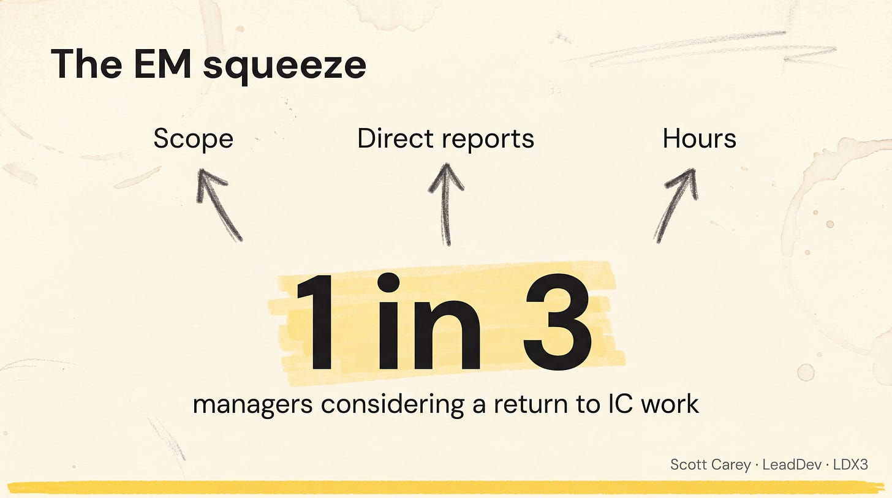

# Managing Overwhelm as a Leader

## Key Takeaways

- When a leader is "barely treading water," the warning signs are visible to everyone except themselves — stale to-do lists, unnecessary complexity, constant apologies, and people stopping to volunteer help
- Senior leaders inspire teams toward impossible goals while delegating execution; failing leaders try the same motivational technique on themselves
- The first step is admitting failure — counterintuitive because leaders internalize the myth of perfection
- If fewer than two-thirds of your items move to the "impossible" list during honest prioritization, someone isn't being honest
- **Burnout isn't personal — it's systemic.** Industry-wide, EM scope/reports/hours are all rising while headcount budget shifts to GPUs. Mid-level managers report the highest burnout rate; 1 in 3 actively consider returning to IC. When managers burn out, their teams follow

## Actionable Insights

**Six warning signs you're failing at prioritization:**

1. Creating to-dos to fix to-dos; stale task lists
2. Adding unnecessary complexity to everything
3. Increasing complex problems appearing
4. Constant apologies and invented deadlines
5. People stop volunteering help
6. Questions become critiques

**Three fixes:**

1. **Prioritize with a trusted other** — Walk through every critical item honestly with someone who will tell you hard truths. Two questions: "Is this important?" (No → cut) and "Can I complete this reasonably?" (No → delegate)

2. **Delegate aggressively** — Delegate despite believing people "aren't ready." They lack experience, but the current alternative is nothing. Delegation provides learning, coaching opportunities, and demonstrates trust. Something beats nothing.

3. **Say no explicitly** — Remaining items after prioritizing and delegating require a clear "No." This forces stakeholders to develop alternative plans rather than waiting indefinitely. When pushback occurs, reprioritize and say no elsewhere.

**The result should feel unimpressively short.** That's the point — new work will emerge. The goal isn't eliminating work, it's demonstrating capability by managing priorities effectively.

## The Industry-Wide EM Squeeze (LDX3 2026)

Scott Carey (LeadDev) and Dominika Rogala (ex-VPE) framed manager burnout as a *systemic* condition, not a personal failing.

**Three vectors squeezing managers simultaneously:**

- **Scope** is expanding
- **Direct reports** are increasing
- **Hours** are lengthening

**Why it's happening:** headcount budget previously allocated to people is being redirected to GPU infrastructure. The "player-manager" phenomenon — coding *and* managing — re-emerges as teams shrink.

**The data:**

- **1 in 3** managers actively consider returning to IC work
- **Mid-level managers** report the highest burnout rate across all tech roles
- Burnout cascades: a burnt-out manager pulls their team into burnout

> "Burnout isn't an individual failure. It's a system problem. We shape the environment our teams work in, and the environment shapes the outcome." — Dominika Rogala

### Implications

- If you feel squeezed, you're not failing — the role itself shifted underneath you. Personal prioritization still matters (above), but it won't compensate for headcount that's gone to GPUs
- Make the structural reality legible to *your* manager — "this is a player-manager role now, here's what I'm dropping" — instead of absorbing it silently
- Watch for the player-coach trap: AI productivity gains for managers (see [leading-ai-adoption-in-engineering.md](leading-ai-adoption-in-engineering.md) Q1 2026 data: managers' code output **4x in 6 months**) create pressure to code more without dropping people work

---

**Source:** https://randsinrepose.com/archives/barely-treading-water
**Source:** https://www.blog4ems.com/p/engineering-leadership-lessons-from-ldx3-2026
**Date:** 2026-05-24 (initial), 2026-06-09 (added LDX3 2026 EM-squeeze framing)
**Tags:** leadership, prioritization, delegation, burnout, management, em-squeeze, player-manager, ldx3
