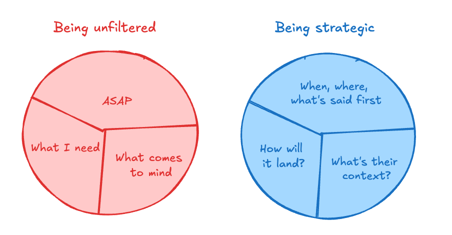

# Managing Up

## Key Takeaways

- Managing up is not political maneuvering — it means being a competent operator who follows through, communicates appropriately, and drives toward business goals
- Lead with the punchline (recommendation first, context second) and use information hierarchy so busy managers can act quickly
- Strategic communication is empathy-driven professionalism — being thoughtful about framing, timing, and context is communication excellence, not manipulation
- What feels like micromanagement is often a trust deficit caused by poor communication — increase transparency and proactive updates to earn autonomy
- Frame instructions positively ("Do this") not negatively ("Don't do that") — recipients must mentally reverse negatives, adding cognitive load and triggering defensiveness
- Make every message answerable from a phone — do the thinking on your side and hand the reader a decision, not work

## Core Principles

- **Structure every update as: recommendation, reasoning, next steps** — show your thought process so managers can course-correct early instead of discovering surprises late
- **Close the loop explicitly** — say what you will do, do it, report progress, confirm completion; fastest way to build trust and reduce check-ins
- **Anticipate your manager's questions before they ask** — address likely objections and provide supporting data upfront
- **Be explicit about what you need** — specify whether you want strategic input, emotional support, detailed feedback, or a quick approval; vague requests get vague responses
- **Calibrate communication frequency to task maturity** — new/risky work needs more updates; established routines need fewer
- **Know when to leave** — managing up cannot fix a fundamentally toxic relationship; if your manager actively undermines your work, exit rather than endlessly adapt

## Strategic Framing

**Three-point framework:**

1. **Understand current beliefs** — map what the person already believes, not what data says they should believe; identify friction before the conversation
2. **Anticipate emotional triggers** — discussions about performance, strategy, or change carry emotional weight; name the emotion before it derails the message
3. **Plan your opening** — the first 30 seconds set the frame; decide what to address first based on audience readiness

**Reframe before you recommend** — ask for their perspective on the problem space first. When people feel heard, they become receptive. (A client's improvement proposal was rejected with data-first, but approved when she first asked her manager's perspective on cross-team dynamics.)

## Affirmative Framing

- **Audit messages before sending:** scan for "don't," "stop," "avoid" and reframe as positive instructions
- **Apply to feedback:** instead of "Don't flex your feet," say "Point your toes" — give people the target behavior, not the anti-pattern
- **Pair negatives with positives:** when a "don't" is necessary for context, immediately follow with the desired behavior
- **Drop unnecessary qualifiers:** remove "only," "just," and other hedging words that undercut confidence

## Self-Check Before Difficult Messages

Ask three questions: (1) What is their current context? (2) How will this land? (3) What should be said first? If you're only thinking about "what I need" and "ASAP," you're being unfiltered, not direct.

## Write Emails People Can Answer From Their Phone

Do the thinking on *your* side, so all that's left on theirs is a decision. "Thoughts on this?" hands them work — they have to figure out what you're really asking, form a view, and compose an answer. "I'd go with Option B because it's faster to ship — good to proceed?" hands them a choice: one thumb, done, from anywhere.

Almost every message can pass this test:

- **Status update** → lead with the one line they care about, not the journey
- **Need an intro** → include the forwardable blurb so they don't have to write one
- **Flagging a problem** → attach your suggested fix and ask "any objection?"

Why it works: less friction, more replies (senior people basically live on their phones), and you stop being the person sending the 8th "just following up on this!" email.

---

**Source:** https://newsletter.weskao.com/p/15-principles-for-managing-up
**Source:** https://news.theuncommonexecutive.com/p/how-to-be-direct-and-strategic
**Source:** https://newsletter.weskao.com/p/speak-in-the-affirmative-do-this
**Source:** Coached newsletter (Rohan Mahtani) — "The 20-Second Career Tactic"
**Date:** 2026-05-31
**Tags:** leadership, managing-up, communication, strategic-communication, framing, executive-presence, stakeholder-management, async-communication
