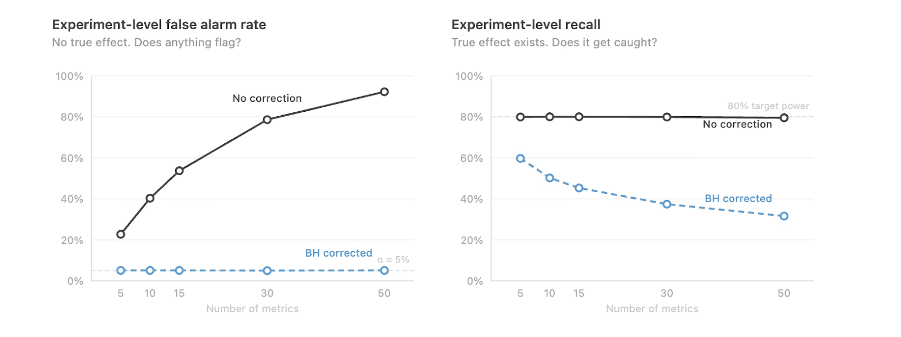
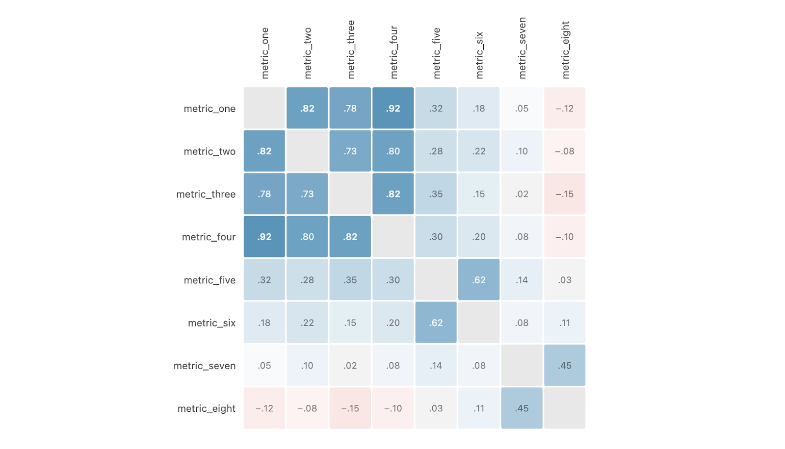
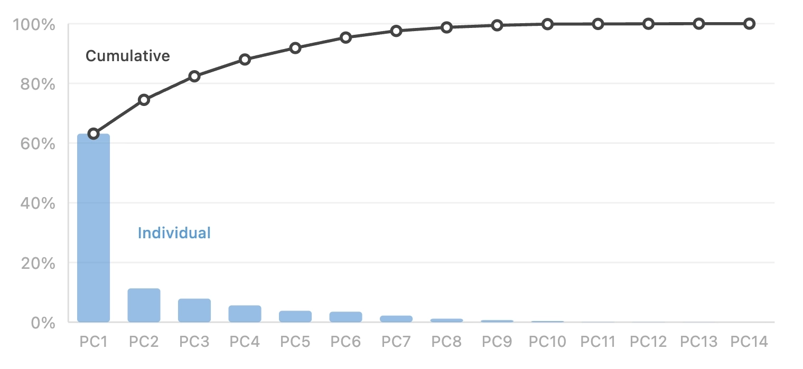
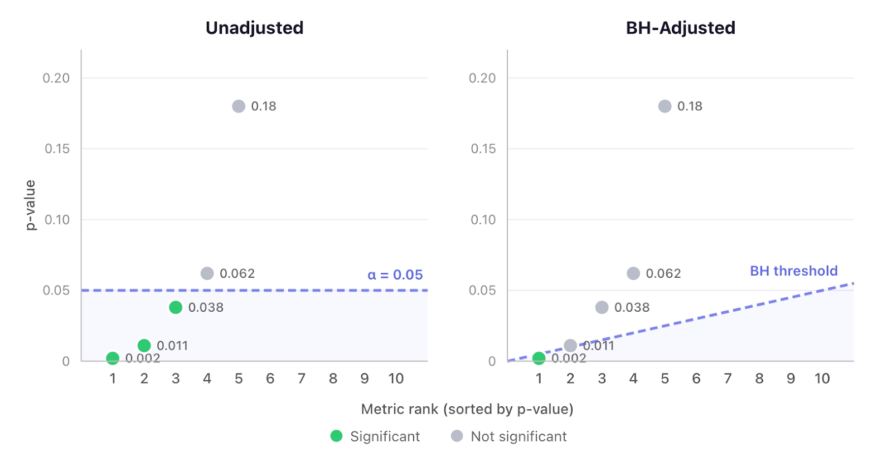

# Metrics Strategy for Leaders

## Key Takeaways

- Numbers alone don't drive action — character-driven narratives release oxytocin, fostering trust and cooperation; a slide showing a 12-point retention drop does not
- More metrics means worse detection: each addition forces stricter p-value corrections, suppressing genuine signals — Discord saw recall drop from 60% to 30% as metrics grew from 5 to 50
- The person who controls a metric's narrative frame controls the team's response — framing a retention drop as "technical failure" vs. "customer relationship problem" activates different responses
- Correlation analysis and PCA reveal most engagement metrics measure the same underlying concept — Discord found 7 principal components captured ~95% of variance across all metrics

## Storytelling with Data

**Use the Story Frame** — three sentences before presenting any metric:

1. **The Before:** What was expected ("We planned for 80% retention through month 6")
2. **The Reveal:** What actually happened ("We're at 62%, with the steepest drop at month 3")
3. **The So What:** Why it matters ("Month-3 is where customers finish onboarding — we're losing them at the value-delivery moment")

**Read metrics as relationship stories:**

- Week 1 drops → onboarding failure (first impression)
- Month 3-6 fade → insufficient value delivery (engagement)
- Month 12 cliffs → renewal/relationship breakdown (trust)

Each pattern has a hero (customer), villain (friction point), and guide (product/team).

## Metric Reduction

- **Audit for redundancy:** run correlation analysis — metrics moving in lockstep are candidates for consolidation
- **Use PCA to quantify dimensionality:** if first few components explain 90%+ of variance, you have far more metrics than distinct concepts
- **Set a hard ceiling:** Discord's rule was ~15 default metrics; fewer = more statistical power per metric
- **Standardize lookback windows:** Discord consolidated mixed 1/7/28-day windows into standard 7-day, eliminating time-horizon variants
- **Involve metric owners in cuts:** correlation surfaces candidates, but owners validate unique business value
- **Resist "just one more metric":** every addition triggers stricter corrections across all metrics

---

**Source:** https://mikefisher.substack.com/p/from-metrics-to-meaning
**Source:** https://discord.com/blog/measure-less-to-learn-more-using-fewer-higher-quality-metrics-to-capture-what-matters
**Date:** 2026-05-28
**Tags:** leadership, metrics, storytelling, experimentation, a-b-testing, dashboards, statistical-methods
