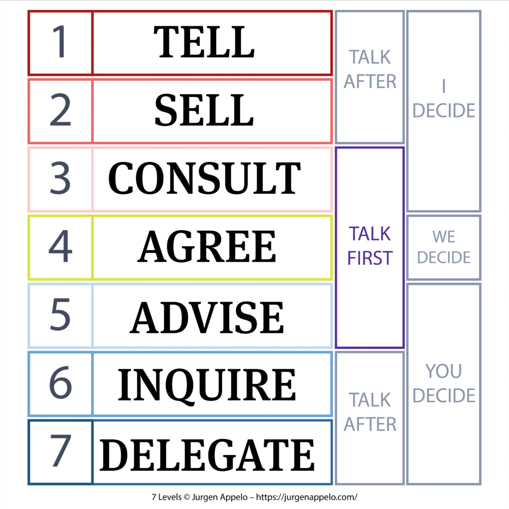

# Seven Levels of Delegation

## Key Takeaways

- Delegation isn't binary (do it yourself vs. hand it off) — 7 levels from Tell to full Delegate let you calibrate authority to context
- Level 3 (Consult) is the default for most situations — leader retains authority but gathers input first
- Levels 4-7 require explicit scope, constraints, and success criteria upfront — most delegation failures come from leaders assuming shared understanding where none exists
- Overruling a Level 4-7 decision after the fact is "delegation theater" and breaks trust — better to stay at Levels 1-3 than to delegate then override

## The Seven Levels

| Level | Name | Who Decides | When to Use |
|---|---|---|---|
| 1 | **Tell** | Leader decides, communicates | Extreme urgency, hard-to-reverse stakes, unshared responsibility |
| 2 | **Sell** | Leader decides, explains reasoning | High stakes but time to explain; build understanding |
| 3 | **Consult** | Leader decides after gathering input | Default for most situations; leader retains authority |
| 4 | **Agree** | Collective decision, shared authority | Full buy-in essential for durability (team norms, shared agreements) |
| 5 | **Advise** | Delegatee decides after seeking advice | Broad consultation benefits outcomes but consensus shouldn't bottleneck |
| 6 | **Inquire** | Delegatee decides; leader asks about reasoning after | Scope clear, expertise proven, positive autonomy track record |
| 7 | **Delegate** | Full authority, report outcomes only | High trust, proven competence, oversight costs exceed value |

## Actionable Insights

**For Levels 1-3 (I Decide):**

- **Tell:** communicate with clarity, confidence, and accountability — not harshness
- **Sell:** make your decision path visible — options considered, trade-offs weighed, deciding factors
- **Consult:** lead with curiosity, summarize what you heard, then communicate the decision using Sell approach

**For Levels 4-7 (We/You Decide):**

Three pillars replace approval:
- **Scope** — which decisions are included and out of bounds
- **Constraints** — boundaries that cannot be crossed (budget, legal, safety, strategic)
- **Success criteria** — what "good" looks like; how outcomes will be measured

**Level 4 (Agree):** use sparingly; compensate for lack of single decision-maker with explicit facilitation

**Level 5 (Advise):** set explicit scope and name required advisors; great for growth opportunities

**Level 6 (Inquire):** ask to understand assumptions and tradeoffs, not to approve; avoid leading questions that imply veto

**Level 7 (Delegate):** be clear upfront on scope/outcomes/constraints, then stay out of the way

---

**Source:** https://www.humanizingwork.com/when-and-how-to-use-the-seven-levels-of-delegation-well/
**Date:** 2026-05-29
**Tags:** leadership, delegation, autonomy, decision-making, management
