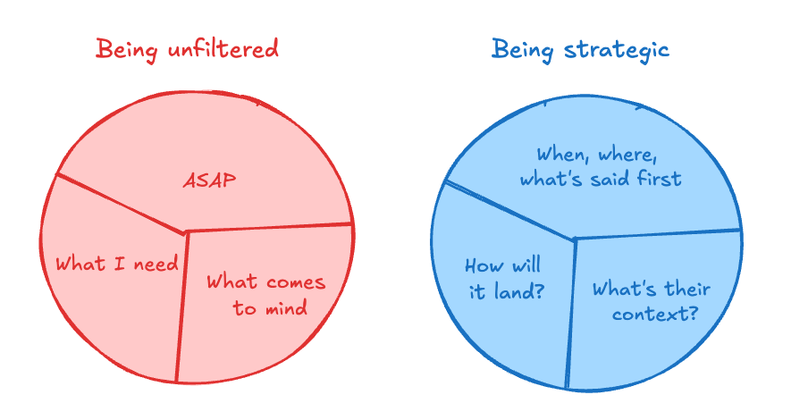

# Strategic Communication

## Key Takeaways

- Strategic communication is empathy-driven professionalism, not manipulation — being thoughtful about framing, timing, and context is communication excellence
- Authenticity means your message is true; unfiltered means you dump it without considering impact — these are not the same thing
- Frame instructions positively ("Do this") not negatively ("Don't do that") — recipients must mentally reverse negatives, adding cognitive load and triggering defensiveness
- The same recommendation gets shut down or approved depending on how you sequence the conversation and acknowledge existing concerns
- When you must state what not to do, always follow with the positive alternative

## Three-Point Strategic Framework

1. **Understand current beliefs** — map what the person already believes, not what data says they should believe; identify friction before the conversation
2. **Anticipate emotional triggers** — discussions about performance, strategy, or change carry emotional weight; name the emotion before it derails the message
3. **Plan your opening** — the first 30 seconds set the frame; decide what to address first based on audience readiness

**Reframe before you recommend** — ask for their perspective on the problem space first. When people feel heard, they become receptive. (A client's improvement proposal was rejected with data-first, but approved when she first asked her manager's perspective on cross-team dynamics.)

## Affirmative Framing

- **Audit messages before sending:** scan for "don't," "stop," "avoid" and reframe as positive instructions
- **Apply to feedback:** instead of "Don't flex your feet," say "Point your toes" — give people the target behavior, not the anti-pattern
- **Pair negatives with positives:** when a "don't" is necessary for context, immediately follow with the desired behavior
- **Drop unnecessary qualifiers:** remove "only," "just," and other hedging words that undercut confidence

## Self-Check Before Difficult Messages

Ask three questions: (1) What is their current context? (2) How will this land? (3) What should be said first? If you're only thinking about "what I need" and "ASAP," you're being unfiltered, not direct.

---

**Source:** https://news.theuncommonexecutive.com/p/how-to-be-direct-and-strategic
**Source:** https://newsletter.weskao.com/p/speak-in-the-affirmative-do-this
**Date:** 2026-05-28
**Tags:** leadership, communication, strategic-communication, framing, feedback, executive-presence, influence
