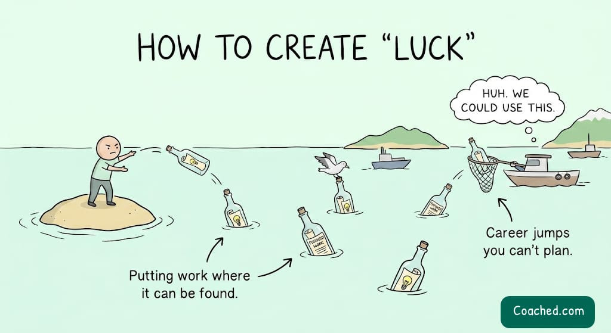
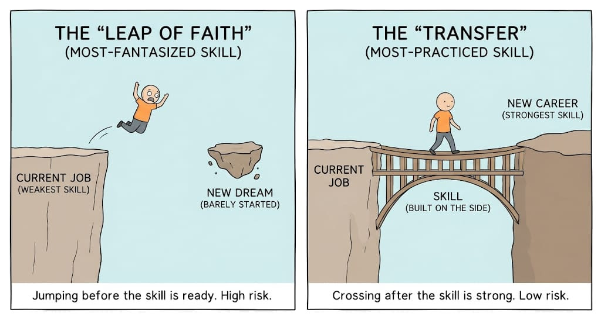

# Creating Career Luck

## Key Takeaways

- Careers are non-linear — flat stretches punctuated by sudden jumps that happen when the right person stumbles onto your work. You can't schedule the jump, only maximize how much finished work is publicly discoverable.
- **Quitting well is a transfer, not a leap.** Move *into* your most-practiced skill (quietly built on the side for years), not your most-fantasized one. Build the skill until it's your strongest, *then* quit.
- The trait you were mocked for or told to "sand off" is often your **signature** — recognizability is why work spreads. Ask "where would this be useful?" instead of "how do I fix this?"
- You can compress *learning* (especially with AI), but you **cannot compress *being known*** — trust and track record grow slowly, so start shipping work early.

## The Tems Example

Tems taught herself music production on YouTube, released her first song ~6 months after quitting her marketing job, went global with "Essence" ~2 years later, and won a Grammy ~4 years in. The "miracle" was mostly machinery: bet on a 15-year skill, ship repeatedly in an unmistakable voice, until the right person found one.

## Put Finished Work Where It Can Be Found

Tems's debut single was, by her own account, "the worst song on my laptop that I could release comfortably" — she shipped it *because* she wasn't precious about it, and word-of-mouth got radio stations reaching out. Most people keep their best work invisible (a laptop demo that dies in one manager's inbox).

**Habit to steal:** regularly put finished work in front of people who didn't ask for it — the wider team, or online for personal projects. Your first public thing doesn't need to be a masterpiece; it needs to exist where luck can find it.

## The Transfer, Not the Leap of Faith

Tems had sung and written since childhood — a decade-plus — while the marketing job she hated was only months old. Quitting moved her *out of her weakest skill into her strongest*. That's not a leap of faith; it's a transfer.

Most would-be quitters have it backwards: leaving a years-long career to chase a barely-started dream. The fix is **order, not courage** — build the new skill on the side until it's your strongest, then switch.

**Test before any switch:** Is the thing you're moving toward your *most-practiced* skill or your *most-fantasized* one?

## Your "Flaw" Is Often Your Signature

Tems was teased as a kid for a deep voice ("you sound like a boy"); that voice now makes her identifiable within seconds. Recognizability drives spread — people follow a creator for their distinct vibe.

Fix *genuine* flaws. But for criticism you've heard **more than twice** (too blunt, too cautious, too detailed, too much humor), don't ask "how do I fix this?" — ask **"where would this be useful?"** The point others want sanded off is often the point that makes your work spread.

## You Can't Compress Being Known

AI compresses *learning* — competence that took months of YouTube in 2018 comes fast now. But **getting known hasn't sped up at all.** Trust and a track record are built in layered years of consistent, unmistakable output. Start early, because the slow part can't be rushed.

## Related

- [Career insider trading](career-insider-trading.md) — the timing companion: acting on private career signals before they go public
- [Mid-career satisfaction](mid-career-satisfaction.md) — applying product-thinking to your own career
- [Career bets that compound](../leadership/career-bets-that-compound.md) — skill, network, and reputation as compounding capital ("you can't compress being known")

---

**Source:** Imported from personal notes — "What Tems's rise taught me about careers" (Coached newsletter)
**Date:** 2026-08-15
**Tags:** career-strategy, personal-growth, career-transition, differentiation, skill-building, luck
