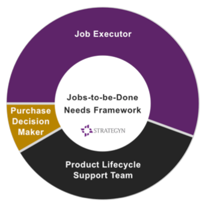
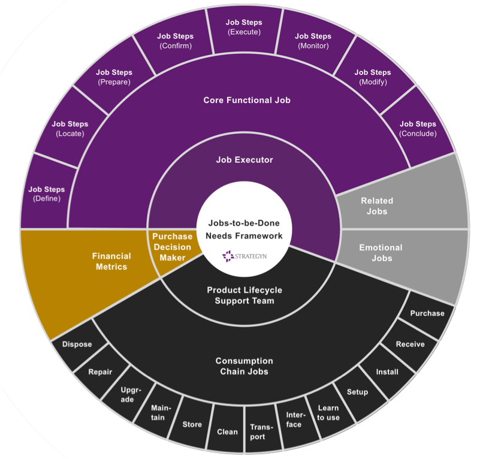
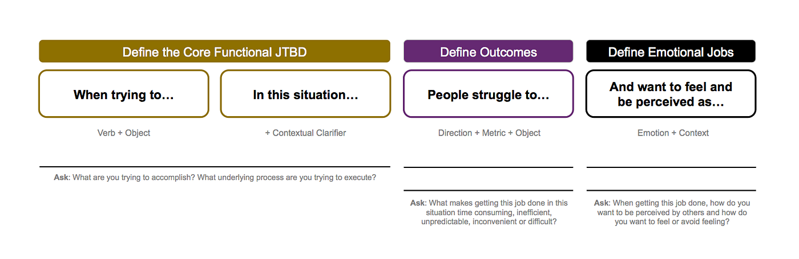
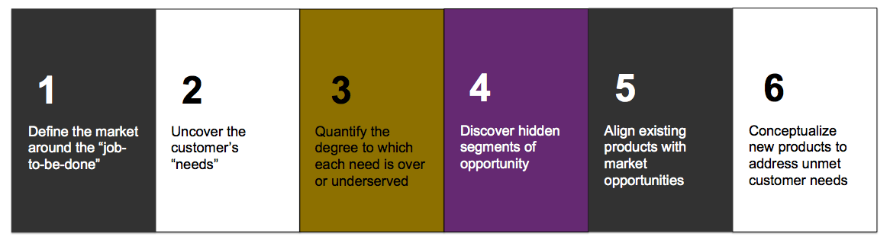

# Jobs-to-be-Done Framework

## Key Takeaways

- JTBD is a *lens* — it shifts the unit of analysis from product or customer to the core functional **job**, so markets, segments, and competitors become defined by what people are trying to accomplish, not by product categories
- Innovation becomes predictable because jobs (and the desired outcomes derived from them) stay stable for years — addressing the fact that 95% of product teams can't even agree on what a customer "need" is
- Three customer types (**Job Executor**, **Product Lifecycle Support Team**, **Buyer**) each carry distinct jobs across five categories: Core Functional, Related, Emotional, Consumption Chain, and Purchase Decision
- Jobs are written as `[verb] + [object] + [contextual clarifier]` (e.g., "pass on life lessons to children"); each job decomposes into process steps measured by **desired outcomes** — solution-free, stable, measurable statements (typically 50–150 per core job)
- **Outcome-Driven Innovation (ODI)** operationalizes JTBD as a 6-step process: define market → gather outcomes → quantify under/overserved → segment → generate concepts → validate concepts *before* development. First documented success: Cordis 1993 (1% → 20%+ angioplasty share)

## The Foundational Insight

> "People don't want to buy a quarter-inch drill. They want a quarter-inch hole!" — Theodore Levitt

> "People buy products and services to get a job done." — Clayton Christensen

Most product failures trace to misalignment with customer needs. The deeper problem: teams can't agree on what a "need" is in the first place, so the conversation devolves into opinion. JTBD replaces that with a structured framework for *defining, categorizing, capturing, and organizing* every customer need.

With this knowledge, product teams can:

- Identify unmet needs
- Discover customer segments with unique unmet needs
- Systematically conceptualize breakthrough products
- Predict which concepts will succeed
- Align marketing, development, and R&D around the same picture

## JTBD as a Lens — Reframing Business Concepts

JTBD is "a perspective — a lens through which you can observe markets, customers, needs, competitors, and customer segments differently." Through this lens, traditional concepts shift:

| Concept | Traditional view | JTBD view |
|---|---|---|
| **Unit of analysis** | Customer or product | Core functional job |
| **Market definition** | Product category | Groups of people trying to do the same job |
| **Customer role** | Buyer | Job executor |
| **Customer needs** | Vague, latent desires | Stable, measurable success metrics |
| **Competitors** | Similar products | Any solution being used to get the job done |
| **Segmentation** | Demographics / psychographics | Different struggles within the same job |

Because jobs are stable, this lens gives the company a "stable unit of analysis" — the foundation that makes the rest of the process possible.

## Nine Tenets of JTBD Theory

1. People purchase products and services to accomplish a **job**
2. Jobs have **functional, emotional, and social** dimensions
3. Jobs remain **stable across time**
4. Jobs exist **independently of any specific solution**
5. Success requires treating the **job** as the primary unit of analysis
6. Deep job understanding **increases marketing effectiveness and innovation predictability**
7. Customers seek solutions that help them accomplish jobs **better or more affordably**
8. Customers **prefer single-platform solutions** that enable complete job execution
9. Job-tied customer needs **create predictability in innovation**

## Who Are Your Customers?

Three external customer types — each with a different need set:

| Customer Type | Role | B2C example (toothbrush) | B2B example (surgical instruments) |
|---|---|---|---|
| **Job Executor** | Performs the core functional task | Consumer (all three roles collapse) | Surgeon |
| **Product Lifecycle Support Team** | Installs, maintains, repairs, disposes | Consumer | Nurses, biomedical technicians |
| **Buyer** | Makes the purchase decision | Consumer | Hospital administration |

Treating these as one undifferentiated "customer" is the source of most product-strategy confusion.

## The Five Job Categories

### Jobs for the Job Executor

**1. Core Functional Job** — the underlying process the executor performs. Defines the market. Examples: "repair a rotator cuff," "pass on life lessons to children," "protect against cyber attacks." Products win by accomplishing this job better and more economically than competing solutions.

**2. Related Jobs** — additional functional tasks done before, during, or after the core job. Capturing underserved related jobs lets a product solve multiple problems with one offering.

**3. Emotional Jobs** — how the executor wants to feel or be perceived while doing the core job, including social dimensions. Combining functional + emotional value creates propositions that resonate strongly.

### Jobs for the Product Lifecycle Support Team

**4. Consumption Chain Jobs** — installation, setup, storage, transportation, maintenance, repair, cleaning, upgrade, disposal. The category set varies by product type (hardware, software, service, consumable). Friction here erodes the customer experience even when the core job is well-served.

### Jobs for the Buyer

**5. Purchase Decision Job** — decision-makers use financial + performance metrics to choose. These are the "**financial desired outcomes**" — what the buyer measures to justify the spend.

## Writing a Job Statement

A well-formed job statement uses precise grammar so the same job means the same thing to every team member:

| Statement Type | Format | Diagnostic question |
|---|---|---|
| **Core functional job** | `[verb] + [object of the verb] + [contextual clarifier]` — *"When trying to ... in this situation ..."* | What are you trying to accomplish? What underlying process are you trying to execute? |
| **Desired outcome** | `[direction of improvement] + [metric] + [object]` — *"People struggle to ..."* | What makes getting this job done time-consuming, inefficient, unpredictable, inconvenient, or difficult? |
| **Emotional job** | `[emotion] + [context]` — *"And want to feel and be perceived as ..."* | How do you want to be perceived by others, and how do you want to feel or avoid feeling? |

Jobs function as **processes** that decompose into sequential steps — and each step has its own measurable success criteria (desired outcomes).

## Desired Outcomes — Making Jobs Measurable

Knowing the customer's job-to-be-done is the *anchor*, but it's not specific enough to guide product decisions. Knowing someone struggles to "manage monthly spending" doesn't tell you *where* they struggle.

**Job mapping** breaks the core functional job into process steps. At each step, identify the metrics customers use to judge success — these are **desired outcomes**.

A well-formed desired outcome statement is:

- **Solution-free** — describes the outcome, not how to achieve it
- **Stable** — doesn't change as technology changes
- **Measurable** — can be quantified
- **Controllable** — the customer (or product) can influence it
- **Structured** — formatted for quantitative survey prioritization
- **Tied to the process** — anchored to a specific step in the job

### Typical Scale

| Job Category | Typical # of Desired Outcomes |
|---|---|
| Core functional job | 50–150 |
| Consumption chain jobs | 10–30 per relevant category |

This is what makes "needs captured in days, valid for years" possible — the outcome list is large but bounded, and because outcomes are solution-free, they don't expire when technology shifts.

## Historical Origin

The first documented corporate success was in **1993** when **Cordis Corporation** applied this thinking to its angioplasty balloon business, taking market share from **1% to over 20%**. The case was published in the 2002 HBR article *"Turn Customer Input into Innovation."* Strategyn formalized the methodology starting in 1991 and refined it across hundreds of Fortune 500 implementations.

## Outcome-Driven Innovation (ODI) Process

ODI is the operational process for applying JTBD theory — turning the framework into a repeatable sequence:

| Step | Activity | Output |
|---|---|---|
| 1 | **Market discovery & definition** | Target job identified and bounded |
| 2 | **Outcome gathering** | Desired outcomes captured for every step of the job |
| 3 | **Outcome prioritization** | Quantified map of which needs are over- or underserved |
| 4 | **Segmentation** | Customer groups identified by distinct unmet-need patterns |
| 5 | **Concept generation** | Solutions designed against prioritized outcomes |
| 6 | **Concept testing** | Concepts validated against desired outcomes *before* development |

The decisive property: a concept can be proven to win in the market *before* engineering investment is committed. That's how the framework reduces innovation risk.

> "To win at innovation a company must know what a customer need is, what the customer's needs are, which are unmet and if segments of customers exist with unique sets of unmet needs. With the target well defined, creating a winning solution becomes far more likely."

## Four Applications of JTBD

| Application | Who uses it | What they do |
|---|---|---|
| **Market selection** | Entrepreneurs, GMs | Identify attractive jobs done frequently by many people with significant underserved needs (Strategyn's market evaluation tool uses 42 criteria) |
| **Product planning** | Product, marketing, innovation managers | Apply ODI to craft value propositions, improve products, or build adjacent offerings |
| **Product development** | Developers, UX/UI designers | Use job outcomes (especially consumption-chain jobs like learning the product) to drive design; the "Job/Outcome Story" format communicates prioritized outcomes |
| **Buying process** | Marketing teams | Treat the customer purchase journey as its own job — research, evaluate, compare, transact — and improve each step |

## Why the Framework Matters

Without structured customer-need capture, innovation is chance-based — teams guess at the best path forward. With it, product organizations can:

- Conceive, test, build, market, and sell against a shared map of need
- Distinguish unmet needs from already-served ones
- Find segments competitors are missing
- Align R&D, product, and marketing on the same target

The framework turns innovation from intuition into a repeatable process.

## Related Notes

- [Getting to Specifics in Product Strategy](../leadership/getting-to-specifics-product-strategy.md) — complement: JTBD gives the structure for "specific customer knowledge"; this note explains why teams flee from it
- [Product validation with agents](../ai-ml-ds/agents/product-validation-with-agents.md) — modern application: using LLM agents to surface unmet needs

---

**Source:** https://jobs-to-be-done.com/jobs-to-be-done-a-framework-for-customer-needs-c883cbf61c90
**Source:** https://jobs-to-be-done.com/what-is-jobs-to-be-done-fea59c8e39eb
**Date:** 2026-06-08
**Tags:** jtbd, jobs-to-be-done, product-discovery, customer-needs, product-strategy, ulwick, innovation-framework, desired-outcomes, odi, outcome-driven-innovation, job-statement, cordis
