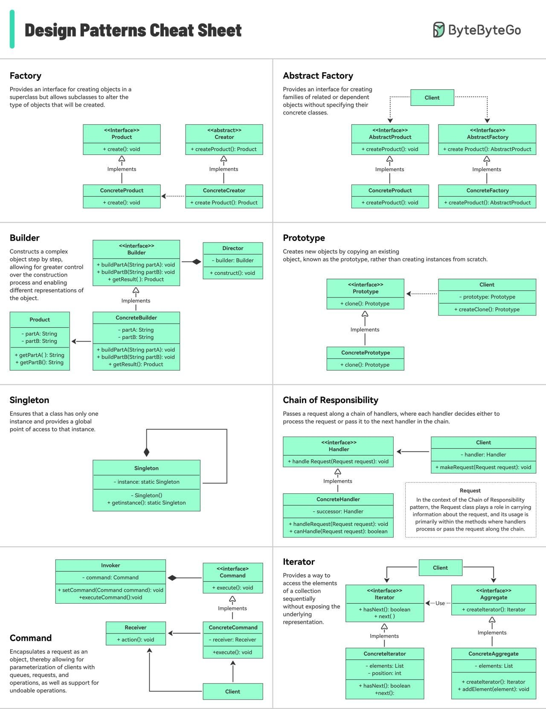
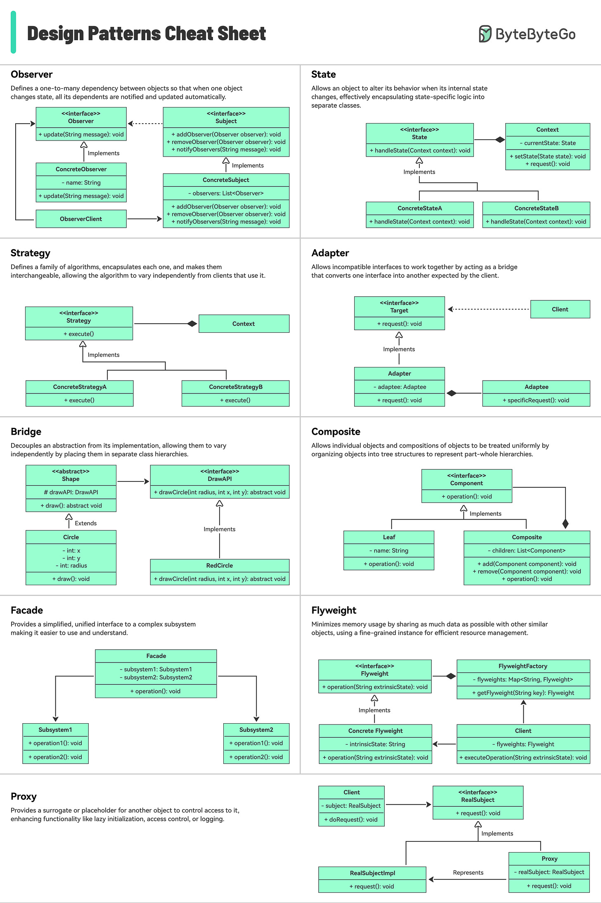

# Class Design Patterns (Gang of Four)

The 23 classic Gang-of-Four object-oriented design patterns, organized into three families. Quick-reference table form — use this to recognize patterns in code review and pick names when designing.

## Key Takeaways

- **Three families** organize the GoF patterns: **Creational** (how objects are made), **Structural** (how objects compose), **Behavioral** (how objects interact)
- The patterns are **vocabulary**, not prescriptions — knowing the names lets you talk about design without 10-line explanations
- Most modern frameworks bake several patterns into their core (Spring = Singleton + Factory + Proxy + Strategy + Template Method) — knowing the names helps you read framework code
- **Singleton** and **Visitor** are the two most-abused — Singleton becomes a global, Visitor pays the double-dispatch cost without needing it
- **Pattern over-engineering** is a real anti-pattern: don't reach for Abstract Factory when a function would do

## Visual Reference

## Creational — How Objects Are Made

| Pattern | One-liner | Common Use Cases |
|---|---|---|
| **Singleton** | Ensures only one instance of a class exists | Config, logger, DB connection pool |
| **Factory Method** | Creates objects via a common interface | UI components, payment processors |
| **Abstract Factory** | Creates families of related objects | Cross-platform UI, theming |
| **Builder** | Builds complex objects step-by-step | Immutable objects, request builders |
| **Prototype** | Creates objects by cloning existing ones | Object copying, performance optimization |

## Structural — How Objects Compose

| Pattern | One-liner | Common Use Cases |
|---|---|---|
| **Adapter** | Makes incompatible interfaces work together | Legacy integration, API wrappers |
| **Bridge** | Separates abstraction from implementation | Platform-independent code |
| **Composite** | Treats individual objects and groups uniformly | File systems, UI trees |
| **Decorator** | Adds behavior dynamically without inheritance | Logging, caching, authorization |
| **Facade** | Provides a simplified interface to a complex system | SDKs, service layers |
| **Flyweight** | Shares objects to reduce memory usage | Text rendering, game objects |
| **Proxy** | Controls access to another object | Lazy loading, security, caching |

## Behavioral — How Objects Interact

| Pattern | One-liner | Common Use Cases |
|---|---|---|
| **Chain of Responsibility** | Passes requests along a chain of handlers | Middleware, event handling |
| **Command** | Encapsulates a request as an object | Undo/redo, job queues |
| **Interpreter** | Defines grammar and evaluates expressions | Rule engines, DSLs |
| **Iterator** | Traverses a collection without exposing structure | Collections, streams |
| **Mediator** | Centralizes complex communication | Chat systems, UI coordination |
| **Memento** | Captures and restores object state | Undo/rollback |
| **Observer** | Notifies dependents of state changes | Event systems, pub-sub |
| **State** | Changes behavior based on internal state | Workflow engines, UI states |
| **Strategy** | Switches algorithms at runtime | Sorting, pricing strategies |
| **Template Method** | Defines algorithm skeleton, subclasses fill steps | Framework hooks |
| **Visitor** | Adds operations without changing object structure | AST processing, reporting |

## Picking the Right Pattern

- **Conditional construction of related objects** → Factory Method or Abstract Factory
- **Many constructor args / optional config** → Builder
- **Wrapping a service to add cross-cutting behavior** → Decorator or Proxy
- **Stable algorithm skeleton, varying steps** → Template Method
- **Swappable algorithms at runtime** → Strategy
- **Tree of heterogeneous objects, recursive operations** → Composite + Visitor
- **One-to-many notification** → Observer
- **Need to undo / replay** → Command (or Memento for state snapshots)

## See Also

- [oop-concepts.md](oop-concepts.md) — the OO fundamentals these patterns build on
- [../system-design/microservices.md](../system-design/microservices.md) — architectural patterns (a different abstraction level)

---

**Source:** /Users/vimittal/Downloads/prep/prep.html
**Source:** https://blog.bytebytego.com/i/203732633/design-patterns-cheat-sheet
**Date:** 2026-06-13, updated 2026-06-28
**Tags:** design-patterns, gang-of-four, oop, creational, structural, behavioral, software-architecture
