# Data Structures & Algorithmic Patterns

Reference index of the **20 algorithmic patterns** that cover the vast majority of coding-interview and competitive-programming problems, paired with the **data structures** they typically operate on. Use this as a diagnostic: when you see a problem, recognize which pattern fits before writing code.

## Key Takeaways

- Most "hard" interview problems are **one of ~20 recurring patterns** in disguise — recognize the pattern, the solution is half-written
- The 20 patterns cluster into 4 families: **traversal/scan** (two pointers, sliding window, prefix sum), **graph/tree** (BFS, DFS, traversal, shortest path), **search/structure** (binary search, monotonic stack, trie, top-K), and **decision/optimization** (greedy, DP, backtracking, intervals)
- The right **data structure** narrows the pattern: hashmaps unlock frequency counting; heaps unlock top-K; tries unlock prefix problems; bitmaps unlock state-set problems
- **Pattern recognition beats memorization** — knowing 20 patterns × understanding when to apply them outperforms grinding hundreds of problems
- Reference link: [DSA Was HARD Until I Learned These 20 Patterns (AlgoMaster)](https://blog.algomaster.io/p/20-dsa-patterns)

## Data Structure Cheat Sheet

The structures you reach for, and what each is best at:

| Structure | When to reach for it | Patterns it enables |
|---|---|---|
| **Array** | Sequential or random access by index | Two pointers, sliding window, sorting, prefix sum |
| **Linked List** | Insert/delete-heavy with no random access | Reverse, cycle detection (Floyd's), merge |
| **Stack** | LIFO; need to "undo" or remember last | Monotonic stack, evaluate RPN, parentheses matching, DFS-iterative |
| **Queue** | FIFO; level-order processing | BFS, sliding window max, task scheduling |
| **HashMap / HashSet** | O(1) lookup by key | Frequency counting, dedup, two-sum |
| **Heap (Priority Queue)** | Top-K, "always know the smallest/largest" | Top-K elements, merge K sorted lists, Dijkstra |
| **Tree (binary, BST, AVL)** | Hierarchical / ordered data | Tree traversal, BST search, range queries |
| **Trie** | Prefix-shared string keys | Autocomplete, spell-check, longest prefix match |
| **Graph (adjacency list)** | Arbitrary node-edge relationships | BFS, DFS, shortest path, topological sort |
| **Bitmap** | Compact set-membership for dense IDs | User retention, set operations, state flags ([see Redis bitmap](../system-design/database/redis.md)) |
| **ZSet (sorted set)** | Score-ordered membership with O(log N) updates | Leaderboards, ranking, priority queues ([see Redis zset](../system-design/database/redis.md)) |

## The 20 Algorithmic Patterns

### Scan / Window / Pointer Patterns

#### Prefix Sum

![Prefix sum array — cumulative totals from `[1,2,3,4,5,6]` → `[1,3,6,10,15,21]`](../images/20260615-0808-dsa-prefix-sum.png)

**Use when:** multiple sum-of-subarray queries, finding subarrays with a target sum, calculating cumulative totals.

#### Two Pointers

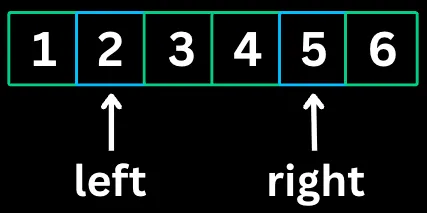

**Use when:** finding pairs in sorted arrays, comparing elements from both ends, partitioning arrays, palindrome checks, 3-sum, trapping rain water.

#### Sliding Window

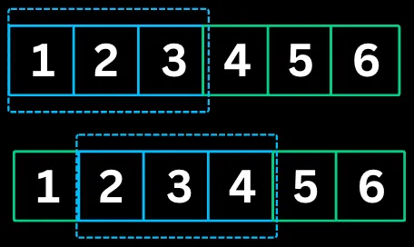

**Use when:** contiguous subarray/substring problems; finding max/min in a window of size k; longest/shortest substring with certain properties; consecutive-element problems.

#### Fast & Slow Pointers (Floyd's Tortoise and Hare)

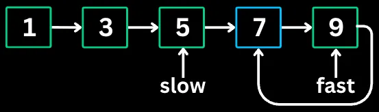

**Use when:** detecting cycles in linked lists or arrays; finding the middle of a linked list; finding the start of a cycle.

#### LinkedList In-Place Reversal

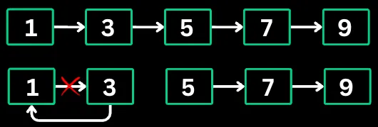

**Use when:** reversing a linked list or portion of it; reversing nodes in groups; checking for palindromes in linked lists.

#### Frequency Counting

**Use when:** finding duplicates or unique elements; checking if two collections have the same elements; finding elements that appear k times; anagram problems. **Tool of choice:** HashMap.

#### Monotonic Stack

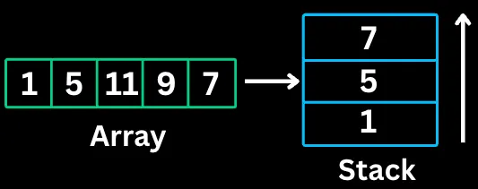

**Use when:** finding the next/previous greater or smaller element; problems involving spans or ranges; histogram problems (largest rectangle).

#### Bit Manipulation

**Use when:** finding unique numbers (XOR); checking if a number is a power of 2; counting bits; generating subsets using bit masks; space optimization. **Operators:** AND, OR, XOR, NOT, shifts.

### Heap / Search Patterns

#### Top 'K' Elements

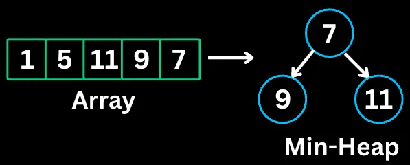

**Use when:** finding k largest/smallest elements; finding kth largest/smallest; finding k most/least frequent; merging k sorted lists. **Tool:** min/max heap (priority queue).

#### Overlapping Intervals

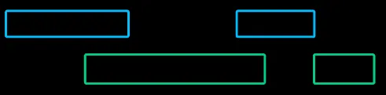

**Use when:** merging overlapping intervals; finding interval intersections; meeting-room scheduling; inserting into sorted intervals.

#### Modified Binary Search

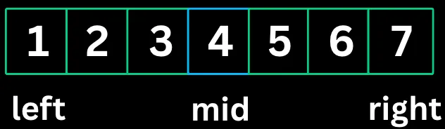

**Use when:** searching in rotated sorted arrays; finding the first/last occurrence of an element; finding minimum/maximum satisfying a condition; peak finding.

### Tree / Graph Patterns

#### Binary Tree Traversal

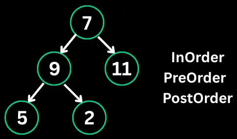

**Use when:** processing tree nodes in a specific order; building trees from traversals; BST operations (inorder gives sorted order); tree serialization/deserialization.

#### Depth-First Search (DFS)

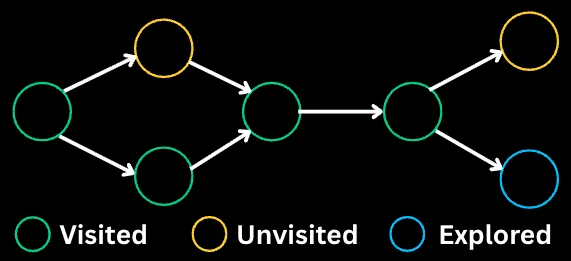

**Use when:** exploring all paths in a tree/graph; finding connected components; detecting cycles; topological sorting; path finding when all paths matter.

#### Breadth-First Search (BFS)

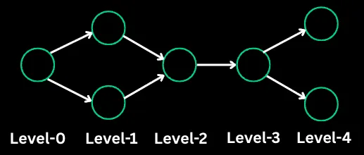

**Use when:** finding shortest path (unweighted); level-order traversal; finding all nodes at distance k; spreading problems (rotting oranges, walls and gates).

#### Shortest Path

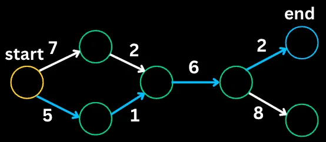

**Use when:** finding minimum cost/distance paths; network routing; weighted graph traversal; problems with varying edge costs.

#### Matrix Traversal

**Use when:** grid-based problems (islands, regions); flood fill; finding connected components in 2D; path finding in mazes. **Tool:** usually DFS or BFS on `(row, col)` coordinates.

### Decision / Optimization Patterns

#### Backtracking

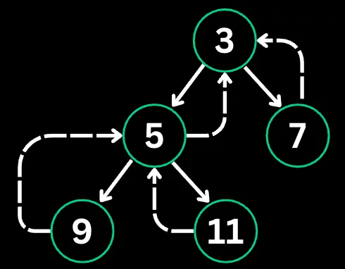

**Use when:** generating all permutations/combinations/subsets; constraint satisfaction (N-Queens, Sudoku); finding all paths meeting criteria; string partitioning.

#### Prefix Search (Trie)

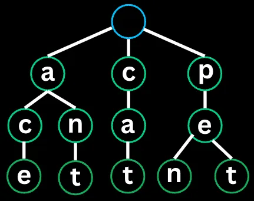

**Use when:** autocomplete and search suggestions; spell checking; IP routing (longest prefix match); word games (finding valid words).

#### Greedy

**Use when:** optimization problems with the greedy choice property; interval scheduling; Huffman coding; activity selection. **Diagnostic:** the local optimum is the global optimum (proof by exchange argument works).

#### Dynamic Programming

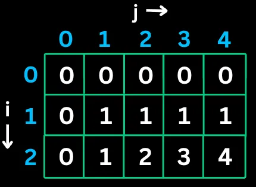

**Use when:** problems with overlapping subproblems; optimization (min/max); counting problems (number of ways); decision problems (can we achieve X?). **Two flavors:** top-down (memoization) or bottom-up (tabulation).

## Pattern Recognition — A Diagnostic Flow

When you see a problem, walk through this fast:

1. **Is the input sorted (or can it be cheaply)?** → Two Pointers, Binary Search, Sliding Window
2. **Is the problem about contiguous subarrays/substrings?** → Sliding Window or Prefix Sum
3. **"Find top/kth ..."?** → Heap (Top-K)
4. **"Find shortest/minimum/maximum cost path..."?** → BFS (unweighted) or Dijkstra (weighted)
5. **Linked list with cycle questions?** → Fast & Slow Pointers
6. **"Find all combinations/permutations/subsets..."?** → Backtracking
7. **"Number of ways..." / "max value of X..." with overlapping subproblems?** → Dynamic Programming
8. **String prefix problems?** → Trie
9. **"Next greater/smaller element..."?** → Monotonic Stack
10. **Interval merging / scheduling?** → Sort + Overlapping Intervals

## See Also

- [oop-concepts.md](oop-concepts.md) — OO fundamentals
- [design-patterns.md](design-patterns.md) — GoF object-oriented design patterns (different abstraction layer from algorithmic patterns)
- [concurrency-fundamentals.md](concurrency-fundamentals.md) — concurrency primitives (often paired with DSA in system design)
- [../system-design/database/database-categories.md](../system-design/database/database-categories.md) — the data structures inside each database category (B+ trees, LSM, HNSW, etc.)
- [../system-design/database/redis.md](../system-design/database/redis.md) — Redis data structures (Bitmap, ZSet, hash, list) with concrete CLI examples
- [../system-design/database/indexing.md](../system-design/database/indexing.md) — index data structures (B-tree, LSM, inverted index)
- [../system-design/ranking-and-scoring-algorithms.md](../system-design/ranking-and-scoring-algorithms.md) — BM25, cosine similarity, PageRank, LTR

---

**Source:** /Users/vimittal/Downloads/data-structures/data-structures.html (imported personal notes)
**Source:** [DSA Was HARD Until I Learned These 20 Patterns — AlgoMaster](https://blog.algomaster.io/p/20-dsa-patterns)
**Date:** 2026-06-15
**Tags:** dsa, algorithms, data-structures, interview-prep, algorithmic-patterns, two-pointers, sliding-window, bfs, dfs, dynamic-programming, backtracking, monotonic-stack, trie, heap, prefix-sum, binary-search
