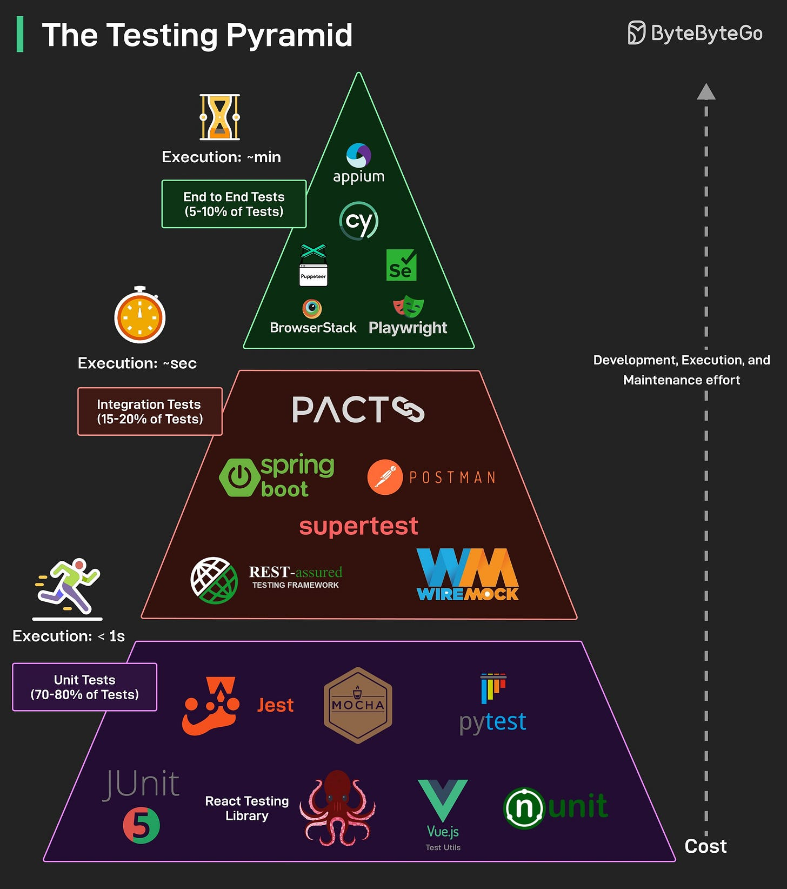

# Testing Pyramid

## Key Takeaways

- The Testing Pyramid is a three-layer model: unit tests at the base, integration tests in the middle, E2E tests at the top — the shape signals the recommended investment ratio
- Unit tests are fast, isolated, and cheap — they test individual functions, methods, or components and should form the bulk of a healthy test suite
- Integration tests validate interactions between components (APIs, databases, external services) — essential for catching interface bugs that unit tests miss
- E2E tests simulate real user flows across the full system — slowest and most expensive, so they should be reserved for critical paths only
- Cost of development, execution, and maintenance scales upward with each layer; the pyramid shape itself conveys the tradeoff

## The Three Layers

### Unit Tests (Base)

- **Scope:** individual functions, methods, or components in isolation
- **Speed:** very fast (milliseconds)
- **Cost:** low — easy to write, easy to maintain
- **When failures happen:** point directly to the code under test
- **Recommended share:** ~70% of the test suite

What unit tests catch: logic bugs, edge cases in individual functions, incorrect return values, exception handling.

What unit tests miss: interface mismatches between components, integration assumptions, behavior under real network/DB conditions.

### Integration Tests (Middle)

- **Scope:** interactions between components — APIs talking to databases, services calling external dependencies
- **Speed:** moderate (seconds)
- **Cost:** medium — require more setup, slower feedback loop
- **Recommended share:** ~20% of the test suite

What integration tests catch: bugs at the interface between units — wrong HTTP verbs, schema mismatches, database query errors, service contract violations.

What integration tests miss: full user journeys, cross-system state, UI flows.

### End-to-End Tests (Top)

- **Scope:** full user flow through the complete system, start to finish
- **Speed:** slow (seconds to minutes)
- **Cost:** high — expensive to write, brittle, slow to run
- **Recommended share:** ~10% of the test suite, critical paths only

What E2E tests catch: cross-system integration bugs, user journey failures, deployment configuration errors.

Highest confidence that the system works as users experience it — at the cost of slow feedback loops and brittle test maintenance.

## Layer Comparison

| Layer | Scope | Speed | Cost | Recommended Share |
|---|---|---|---|---|
| **Unit** | Single function/component | Very fast | Low | ~70% |
| **Integration** | Component interactions | Moderate | Medium | ~20% |
| **E2E** | Full user flow | Slow | High | ~10% |

## The Anti-Pattern: Ice Cream Cone

The "ice cream cone" is the inverted pyramid — too many E2E tests, too few unit tests. Symptoms:

- Test suite takes 30+ minutes to run
- A single code change breaks 20 E2E tests
- Teams skip running tests locally before pushing
- CI is perpetually red

The fix: push coverage down the pyramid. A passing E2E test should be backed by passing integration tests; a passing integration test should be backed by passing unit tests.

## The Core Rule

> As you move up the pyramid, the cost of test development, execution, and maintenance increases.

The pyramid shape is the prescription: invest most in the bottom, least in the top.

## See Also

- [design-patterns.md](design-patterns.md) — patterns that make code testable (Strategy, Decorator, Factory)
- [oop-concepts.md](oop-concepts.md) — encapsulation and interfaces are what make unit testing possible

---

**Source:** https://blog.bytebytego.com/i/203732633/the-testing-pyramid
**Date:** 2026-06-28
**Tags:** testing, testing-pyramid, unit-tests, integration-tests, e2e-tests, test-strategy, software-quality, tdd
