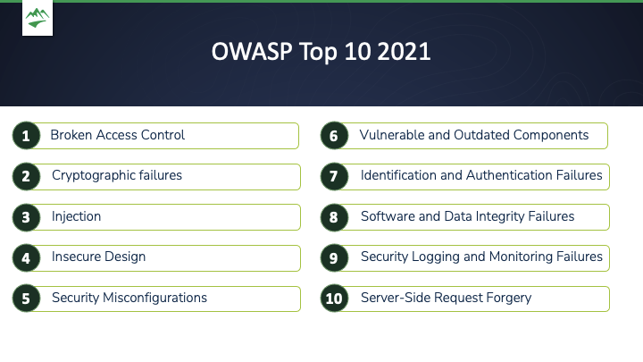
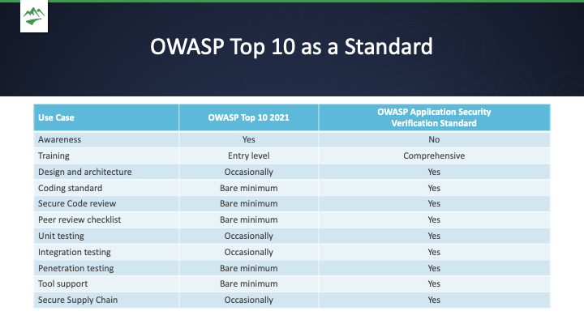

# OWASP Top 10

## Key Takeaways

- The OWASP Top 10 is an **awareness document**, not a standard — use the OWASP Application Security Verification Standard (ASVS) when you need a coding or testing standard
- Broken Access Control is the #1 threat (2021 edition); injection dropped to #3 and server-side request forgery was added at #10 by community vote
- Defense in depth applies to every category: multiple independent controls (server-side enforcement, rate limiting, deny-by-default) are more resilient than a single gate
- Your biggest leverage points: deny-by-default access control, modern cryptography (AES-256, Argon2), ORMs + safe-list validation, MFA, and automated component scanning
- Insecure design (#4) is the root cause behind many other entries — get threat modeling into the SDLC early

---

## OWASP Top 10 as an Awareness Document vs. ASVS

The OWASP Top 10 is intentionally broad. For rigorous use cases, pair it with the **Application Security Verification Standard (ASVS)**.

| Use Case | OWASP Top 10 2021 | OWASP ASVS |
|---|---|---|
| Awareness | Yes | No |
| Training | Entry level | Comprehensive |
| Design and architecture | Occasionally | Yes |
| Coding standard | Bare minimum | Yes |
| Secure code review | Bare minimum | Yes |
| Penetration testing | Bare minimum | Yes |
| Unit / integration testing | Occasionally | Yes |
| Tool support | Bare minimum | Yes |
| Secure supply chain | Occasionally | Yes |

---

## #1 — Broken Access Control

Access control limits access to functionality, sensitive data, or system components. When broken, attackers reach data or actions they are not authorized to perform.

**Example:** An attacker sends a DELETE request directly to an API endpoint and receives `200 OK` because URL-level authorization was never checked.

### Risks
- **Unauthorized information disclosure** — health, financial, or business data exposed
- **Modification or destruction of data** — including logs, which lets attackers erase their own traces
- **Privilege escalation** — attacker gains admin-level access they were never granted

### Mitigations
- **Server-side enforcement only** — client-side checks can be bypassed with a web proxy
- **Single access control mechanism** — multiple scattered controls multiply failure points
- **Deny by default** — failed authorization checks should close the door, not leave it open
- **Rate-limit API/controller access** — makes brute-force bypass impractical
- **Invalidate sessions server-side on logout** — prevents session-replay attacks

---

## #2 — Cryptographic Failures

Forgetting to encrypt data, or using weak/outdated algorithms, leaves sensitive data exposed in transit or at rest.

**Example:** Storing passwords with MD5 hashes instead of a modern memory-hard algorithm like Argon2.

### Risks
Exposed passwords, personal information, credit card numbers, health records, and financial data whenever storage or transport is inadequately protected.

### Mitigations
- **Classify data by sensitivity** — apply cryptographic controls proportional to the value of the data
- **Discard unnecessary data** — data you don't retain can't be stolen; reduce the attack surface
- **Use current algorithms** — AES-256 for encryption; Argon2 for password hashing; never roll your own
- **Disable caching of sensitive data** — cached sensitive data extends the attack surface unnecessarily
- **Use authenticated encryption** — combines encryption with a Message Authentication Code (MAC) so both confidentiality and integrity are guaranteed

---

## #3 — Injection

Injection attacks occur when untrusted data is sent to an interpreter as part of a command or query. The 2021 edition merged cross-site scripting (XSS) into this category.

**Attack types:**
- **SQL injection** — malformed SQL manipulates a database to extract, delete, or grant unauthorized access
- **XSS (cross-site scripting)** — injected JavaScript stored in the database or reflected to users; can steal sessions or redirect to malicious sites
- **OS command injection** — attacker executes operating system commands (e.g., read `/etc/passwd`, trigger a DoS)
- **XML injection** — malformed XML that gets deserialized/serialized improperly can execute commands

### Risks
- **Authentication bypass** — manipulate a SQL login query to return `true` regardless of credentials
- **Malicious code execution** — attacker gains remote execution capability
- **Data exfiltration** — dump entire database tables through a legitimate-looking query interface

### Mitigations
- **Use an ORM or FRM** — object-relational mappers abstract away raw SQL concatenation, eliminating the primary injection vector
- **Server-side safe-list input validation** — restrict inputs to known-good values; safe-list is stricter and safer than block-listing
- **Escape special characters** — neutralize characters that have meaning to interpreters before passing them through
- **Limit database queries** — cap concurrent queries so bulk-dump attacks can't run freely

---

## #4 — Insecure Design

Even correctly implemented controls fail if they are placed in the wrong architectural location. Insecure design creates the conditions that allow every other OWASP threat to be exploited.

**Example:** Input validation implemented only on the client side can be trivially bypassed by intercepting traffic with a web proxy. The control is correct; the architecture is wrong.

### Risks
Acts as a multiplier — insecure architecture makes every other item on the Top 10 easier to exploit.

### Mitigations
- **Secure Development Lifecycle (SDLC)** — bake security reviews into every phase, not just pre-release
- **Threat modeling** — identify threats early, build in mitigations, and treat the model as a living document
- **Security unit and integration tests** — validate that controls actually function in the deployed configuration
- **Tier/tenant segregation** — compartmentalize so a breach in one area doesn't grant access to everything
- **Resource consumption limits** — design in rate limits and hardware boundaries to prevent denial-of-service from architectural oversights

---

## #5 — Security Misconfiguration

Well-built features fail when misconfigured. This includes unnecessary features enabled by default, overly permissive settings, and credentials that were never changed from defaults.

**Example:** An attacker logs in with `admin` / `admin` because default credentials were never rotated.

### Risks
- Sensitive data exposure from improperly hardened systems
- Unauthorized access via default credentials or permissive configurations

### Mitigations
- **Repeatable hardening process** — identical build and configuration process across every deployment eliminates drift
- **Minimal platform** — enable only features actually needed; every unused feature is attack surface
- **Automated configuration verification** — validate configurations on every build to catch unexpected changes over time

---

## #6 — Vulnerable and Outdated Components

Third-party libraries carry their vulnerabilities directly into your application. Known CVEs are publicly searchable, making outdated components easy targets.

### Risks
- **Vulnerability persistence** — a component's CVEs become your application's CVEs
- **Easy discovery** — attackers can identify your stack and cross-reference known vulnerabilities in seconds
- **Vulnerability chaining** — multiple low-severity issues across packages can combine into a high-severity exploit

### Mitigations
- **Software Composition Analysis (SCA)** — automated scanning to identify packages with known vulnerabilities or outdated versions
- **SBOM (Software Bill of Materials)** — maintain an inventory of all third-party and open-source components
- **Version pinning and deliberate updates** — pin versions so updates are intentional; schedule regular reviews to retire unmaintained packages

---

## #7 — Identification and Authentication Failures

Authentication establishes *who* a user is before authorization can check *what* they are allowed to do. Failures here let attackers impersonate legitimate users.

**Common failure modes:**
- Brute-force attacks not rate-limited or blocked
- Weak or easily guessable passwords permitted
- Insecure account recovery (e.g., security questions answerable from public social media data)

### Risks
- **System access** — attackers act as legitimate users; actions may go untracked
- **Elevated access** — compromised admin accounts or hijacked sessions grant broad privileges

### Mitigations
- **Multi-Factor Authentication (MFA)** — a stolen password alone is insufficient when a second factor (something you have, are, or know elsewhere) is required
- **No default credentials** — never ship or deploy with default usernames or passwords
- **Weak password prevention** — block passwords that are short, common, or easily cracked

---

## #8–10 — Remaining Threats (Overview)

| # | Threat | Summary |
|---|---|---|
| 8 | Software and Data Integrity Failures | Untrusted plugins, libraries, or update pipelines without integrity verification; includes insecure deserialization |
| 9 | Security Logging and Monitoring Failures | Insufficient logging and alerting means breaches go undetected and attackers cover their tracks |
| 10 | Server-Side Request Forgery (SSRF) | Application fetches a remote resource based on user-supplied URL; attacker can reach internal services not exposed externally |

> Items 8–10 are not detailed in current training notes.

---

**Source:** Imported from `vm-security-training` personal training notes (owasp-top-10-part-1.md, owasp-top-10-part-2.md, owasp-top-10-2021.pdf, owasp-top-10-as-a-standard.pdf)
**Date:** 2026-06-21
**Tags:** security, owasp, web application security, injection, access control, cryptography, authentication, threat modeling
