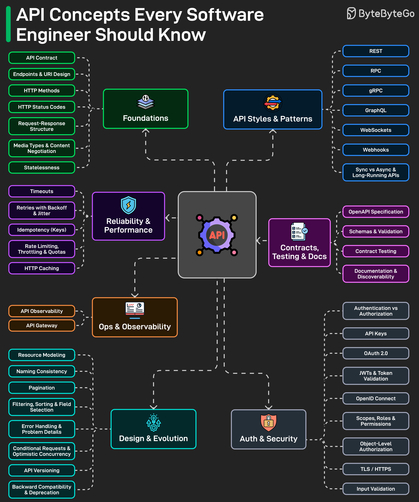

# API Concepts Every Software Engineer Should Know

> **This is the index.** Each section below lists topics; deep-dives live in sibling files. Drill into:
>
> - **[REST vs GraphQL vs gRPC](rest-vs-graphql-vs-grpc.md)** — when to pick which style
> - **[Real-time communication](real-time-communication.md)** — polling, long polling, SSE, webhooks
> - **[Retries](retries.md)** — exponential backoff, jitter, idempotency, retry budgets, circuit breakers

## Key Takeaways

- API design spans six interconnected dimensions: foundations, styles/patterns, reliability, security, design/evolution, and observability
- Getting HTTP basics wrong (methods, status codes, content negotiation) makes the entire API feel broken regardless of architecture choice
- Security (OAuth, JWTs, scopes) and reliability (idempotency, rate limits, retries) are often afterthoughts but cause the most costly production issues
- Design decisions like naming, pagination, versioning, and backward compatibility determine long-term maintainability
- Documentation, OpenAPI specs, and contract testing are what let other teams confidently integrate with your API



## Foundations

The HTTP basics that determine whether an API feels intuitive or confusing:

- **API Contract** -- the agreement between client and server on request/response shape
- **Endpoints & URI Design** -- resource-oriented URL structure
- **HTTP Methods** -- GET, POST, PUT, PATCH, DELETE and their semantics
- **HTTP Status Codes** -- proper use of 2xx, 4xx, 5xx ranges
- **Request-Response Structure** -- headers, body, query params
- **Media Types & Content Negotiation** -- Accept/Content-Type headers
- **Statelessness** -- each request carries all context needed

## API Styles & Patterns

Different architectural approaches suited to different situations:

- **REST** -- resource-oriented, HTTP-native, most common → see [rest-vs-graphql-vs-grpc.md](rest-vs-graphql-vs-grpc.md)
- **RPC** -- action-oriented remote procedure calls
- **gRPC** -- high-performance binary protocol (Protocol Buffers) → see [rest-vs-graphql-vs-grpc.md](rest-vs-graphql-vs-grpc.md)
- **GraphQL** -- client-specified queries, single endpoint → see [rest-vs-graphql-vs-grpc.md](rest-vs-graphql-vs-grpc.md)
- **WebSockets** -- full-duplex persistent connections
- **Webhooks** -- server-to-client push notifications → see [real-time-communication.md](real-time-communication.md)
- **SSE / Polling / Long Polling** -- server-to-client update patterns → see [real-time-communication.md](real-time-communication.md)
- **Sync vs Async & Long-Running APIs** -- request/response vs event-driven patterns

## Design & Evolution

Naming, structure, and versioning decisions that affect long-term usability:

- **Resource Modeling** -- mapping domain objects to API resources
- **Naming Consistency** -- predictable, intuitive endpoint names
- **Pagination** -- cursor-based vs offset-based for large collections
- **Filtering, Sorting & Field Selection** -- query flexibility
- **Error Handling & Problem Details** -- structured error responses (RFC 7807)
- **Conditional Requests & Optimistic Concurrency** -- ETags, If-Match headers
- **API Versioning** -- URL path, header, or query param strategies
- **Backward Compatibility & Deprecation** -- evolving without breaking clients

## Auth & Security

Getting authentication and authorization right to avoid costly mistakes:

- **Authentication vs Authorization** -- identity vs permissions
- **API Keys** -- simple but limited access tokens
- **OAuth 2.0** -- delegated authorization framework
- **JWTs & Token Validation** -- stateless token verification
- **OpenID Connect** -- identity layer on top of OAuth
- **Scopes, Roles & Permissions** -- fine-grained access control
- **Object-Level Authorization** -- per-resource access checks
- **TLS / HTTPS** -- transport-layer encryption
- **Input Validation** -- sanitizing and validating all inputs

## Reliability & Performance

Easy to ignore until the system is under pressure:

- **Timeouts** -- preventing hung connections → see [retries.md](retries.md)
- **Retries with Backoff & Jitter** -- graceful failure recovery → see [retries.md](retries.md)
- **Idempotency (Keys)** -- safe retries without duplicate side effects → see [retries.md](retries.md)
- **Circuit Breakers** -- stop calling sustained-failing dependencies → see [retries.md](retries.md) and [../circuit-breakers.md](../circuit-breakers.md)
- **Rate Limiting, Throttling & Quotas** -- protecting against abuse → see [../rate-limiting.md](../rate-limiting.md)
- **HTTP Caching** -- Cache-Control, ETags, conditional requests

## Contracts, Testing & Docs

Infrastructure that enables teams to confidently integrate:

- **OpenAPI Specification** -- machine-readable API definition
- **Schemas & Validation** -- request/response schema enforcement
- **Contract Testing** -- verifying provider-consumer agreements
- **Documentation & Discoverability** -- developer experience

## Ops & Observability

Monitoring and managing APIs in production:

- **API Observability** -- metrics, logging, tracing
- **API Gateway** -- centralized routing, auth, rate limiting

---

## REST's Six Architectural Constraints (Fielding, 2000)

The original REST dissertation defines REST through six constraints that explain *why* RESTful APIs scale and stay debuggable, not just what they look like:

1. **Client-server separation** — clear interface boundary
2. **Statelessness** — every request carries everything needed; servers don't track session state
3. **Cacheability** — responses must declare cacheability; intermediaries (CDNs, proxies) can store them
4. **Uniform interface** — identification of resources, manipulation through representations, self-descriptive messages, HATEOAS
5. **Layered system** — clients can't tell whether they're talking to the origin or a proxy/cache/gateway
6. **Code-on-demand** (optional) — servers can transfer executable code (rarely used)

Most "REST" APIs in practice satisfy constraints 1-3 and partially satisfy 4 (usually skipping HATEOAS). The constraints, more than the URL conventions, are what make REST work at internet scale.

### REST's Real Weaknesses

The honest list:
- **Over-fetching / under-fetching** — fixed resource shapes force clients to take more or less than they need
- **Multiple round-trips** — fetching a list-then-details often requires N+1 requests
- **Loose JSON contracts** — no protocol-level enforcement (vs gRPC's proto)
- **Versioning friction** — `/v2/...` is a workaround, not a solution
- **Real-time gaps** — REST is request/response only; live updates need [SSE or WebSockets](real-time-communication.md)

REST is the **path of least resistance** for resource-centric domains, not universally optimal. See [rest-vs-graphql-vs-grpc.md](rest-vs-graphql-vs-grpc.md) for the layered choice.

## API Style Comparison (Full Reference)

The full menu of API styles, when each one wins, and what it costs:

| Style | Transport | Key Features | Trade-offs | Best For |
|---|---|---|---|---|
| **SOAP** | XML over HTTP/S, SMTP, TCP | Strong typing via WSDL, enterprise security, standardized error handling | Heavy XML, verbose, slower, hard to debug | Banking, finance, government, regulated systems |
| **REST** | JSON over HTTP | Simple, universal, cacheable, wide mobile/browser support, resource-oriented | Over/under fetching, many endpoints, loose standards | Public APIs, CRUD, web/mobile backends |
| **GraphQL** | JSON over HTTP (POST), WebSockets for subscriptions | Client requests exactly what it needs, single endpoint, strong schema, great for microservices composition | Hard to cache, server complexity, risk of expensive queries | Mobile/web apps, BFF, complex entity relationships |
| **RPC** | JSON/XML over HTTP | Call remote function like local one, lightweight | Tight coupling, poor discoverability, versioning challenges | Internal service calls, legacy microservices |
| **gRPC** | Protobuf over HTTP/2 | Fast binary, auto codegen, bi-directional streaming, strong typing | Hard to debug binary, browser needs proxy, learning curve | High-perf microservices, real-time streaming, IoT |
| **Webhooks** | JSON over HTTP (server → client callback) | Event-driven, instant push, no polling | Requires public endpoint, retries needed, signature validation | Payment callbacks, CI triggers, Slack/GitHub integrations |
| **WebSockets** | Full-duplex TCP (upgrade from HTTP) | True real-time, bi-directional, low latency | Stateful (harder to scale), complex infra, overkill for sporadic events | Chat, gaming, collaborative editing, real-time dashboards |
| **SSE (Server-Sent Events)** | Streaming text/event data over HTTP | One-way server → client, lighter than WebSockets, auto-reconnect built-in | One-direction only, no client-to-server, limited legacy browser support | Notifications, live feed updates, stock prices, telemetry |
| **MQTT** | Message Queuing Telemetry Transport | Publish/subscribe via broker, tiny footprint | Requires broker | IoT, sensor networks |

### Endpoint Conventions (URL Anatomy)

A canonical REST URL: `<protocol>://<sub-domain>.example.com/<version>/<endpoint>?<filtering>&<pagination>`

Example: `https://api.example.com/v1/users?age=25&gender=male&page=2&limit=10`

Standard verb + path patterns:

```
GET    /events              # List all events
GET    /events/{id}         # Get a specific event
GET    /events/{id}/tickets # Get available tickets for an event
POST   /events/{id}/bookings # Create a new booking for an event
GET    /bookings/{id}       # Get a specific booking
POST   /events/123/bookings?notify=true  # Side-effect via query param
```

### HTTP Status Codes (Cheat Sheet)

| Range | Class | Common codes |
|---|---|---|
| **1xx** | Informational | 100 Continue |
| **2xx** | Success | **200 OK**, **201 Created**, **204 No Content** |
| **3xx** | Redirection | 301 Moved Permanently, 302 Found |
| **4xx** | Client Error | **400 Bad Request**, **401 Unauthorized**, **403 Forbidden**, **404 Not Found**, 409 Conflict, 422 Unprocessable Entity, 429 Too Many Requests |
| **5xx** | Server Error | **500 Internal Server Error**, 501 Not Implemented, **502 Bad Gateway**, **503 Service Unavailable**, **504 Gateway Timeout** |

### API Performance Checklist

The standard levers for making an API faster:

- **Pagination** — never return unbounded lists
- **Async logging** — don't block the response on log I/O
- **Caching (server-side)** — Redis / CDN for hot reads
- **Caching (client-side)** — `Cache-Control` and `ETag` headers
- **Offload compute to client** — reduce server CPU for things the client can do
- **Payload compression** — gzip/brotli, especially for large JSON
- **DB connection pool** — never open a connection per request
- **Stateless architecture** — every node can serve any request, enables horizontal scaling
- **Rate limiting** — protect downstream resources from overload (see [../rate-limiting.md](../rate-limiting.md))
- **Load balancing** — distribute across instances
- **Asynchronous API** — return 202 Accepted + a job ID for long-running work

---

**Source:** https://blog.bytebytego.com/i/195380781/api-concepts-every-software-engineer-should-know
**Source:** https://blog.levelupcoding.com/p/rest-apis-properly-explained
**Source:** /Users/vimittal/Downloads/prep/prep.html (API style comparison, endpoint conventions, status codes, performance checklist)
**Date:** 2026-05-31 (initial), 2026-06-05 (REST six constraints), 2026-06-13 (API style comparison + endpoints + status codes + perf)
**Tags:** api, api-design, rest, graphql, grpc, security, system-design, fielding-constraints, hateoas, soap, rpc, webhooks, websockets, sse, mqtt, http-status-codes, api-performance
