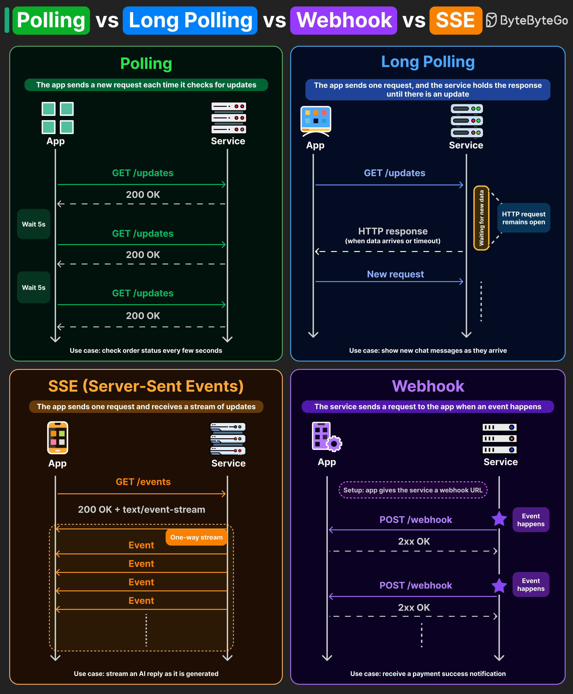

# Polling vs Long Polling vs Webhooks vs SSE

## Key Takeaways

- Four primary patterns exist for receiving server updates, each with distinct tradeoffs in simplicity, efficiency, and latency
- Polling is simplest but wasteful -- most responses are empty; use it only when minor delays are acceptable (e.g., order status)
- Long Polling reduces empty responses by holding connections open, but adds connection management complexity
- SSE provides efficient unidirectional streaming over standard HTTP -- ideal for AI token-by-token responses and live feeds
- Webhooks invert the model entirely (server pushes to client), eliminating polling overhead but requiring the client to expose an endpoint

## Polling

The client sends a new request each time it checks for updates. The server responds immediately regardless of whether new data exists.

- **Flow:** Client sends `GET /updates` every few seconds; server returns `200 OK` with data or empty response
- **Tradeoff:** Simplest to implement, but creates many wasteful empty responses
- **Use case:** Check order status every few seconds where minor delays are acceptable

## Long Polling

The client sends one request, and the service holds the response until there is an update.

- **Flow:** Client sends `GET /updates`; server keeps the HTTP connection open until new data arrives or a timeout occurs, then responds; client immediately sends a new request
- **Tradeoff:** Fewer wasted requests than polling, but connection management overhead adds complexity
- **Use case:** Chat applications showing new messages as they arrive in near-real-time

## Server-Sent Events (SSE)

The client sends one request and receives a stream of updates over a persistent HTTP connection.

- **Flow:** Client sends `GET /events`; server responds with `200 OK + text/event-stream` content type; server pushes events continuously over a one-way stream
- **Tradeoff:** Lightweight and efficient for streaming, but unidirectional -- client cannot send data back through the same connection
- **Use case:** AI responses that appear token by token (e.g., ChatGPT-style streaming), live dashboards, news feeds

## Webhooks

The service sends a request to the client when an event happens. The direction is reversed compared to the other three patterns.

- **Flow:** Client registers a callback URL with the service; when an event occurs, service sends `POST /webhook` to the client's URL; client responds with `2xx OK`
- **Tradeoff:** Most efficient for event-driven systems (no polling, no open connections), but requires client to expose a publicly accessible endpoint
- **Use case:** Payment success notifications (Stripe), repository events (GitHub)

## Choosing the Right Pattern

| Pattern | Direction | Latency | Complexity | Best For |
|---------|-----------|---------|------------|----------|
| Polling | Client -> Server | High (interval-bound) | Low | Simple status checks |
| Long Polling | Client -> Server | Medium | Medium | Near-real-time messaging |
| SSE | Server -> Client | Low | Low-Medium | Streaming/live feeds |
| Webhooks | Server -> Client | Low (event-driven) | Medium | Event notifications |

Production systems typically combine multiple patterns rather than relying on a single approach.

---

**Source:** https://blog.bytebytego.com/i/195380781/polling-vs-long-polling-vs-webhooks-vs-sse
**Date:** 2026-05-31
**Tags:** polling, long-polling, webhooks, sse, server-sent-events, real-time, api, system-design
