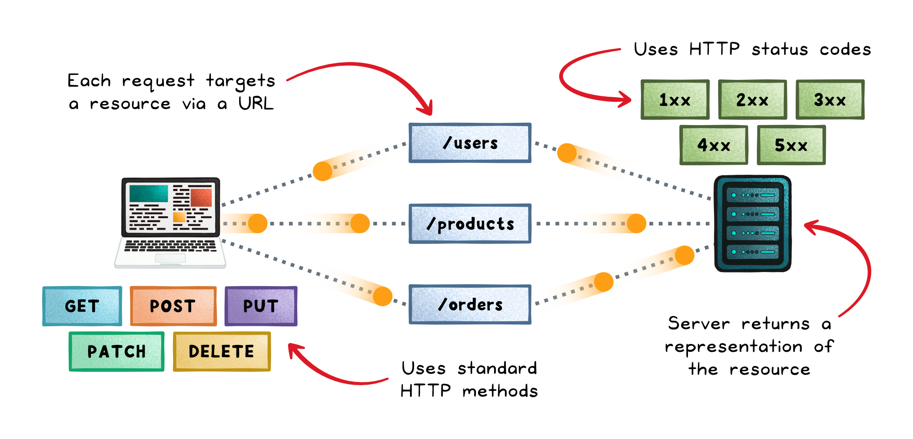
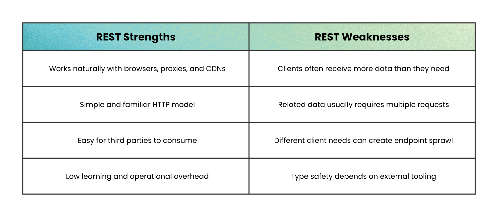
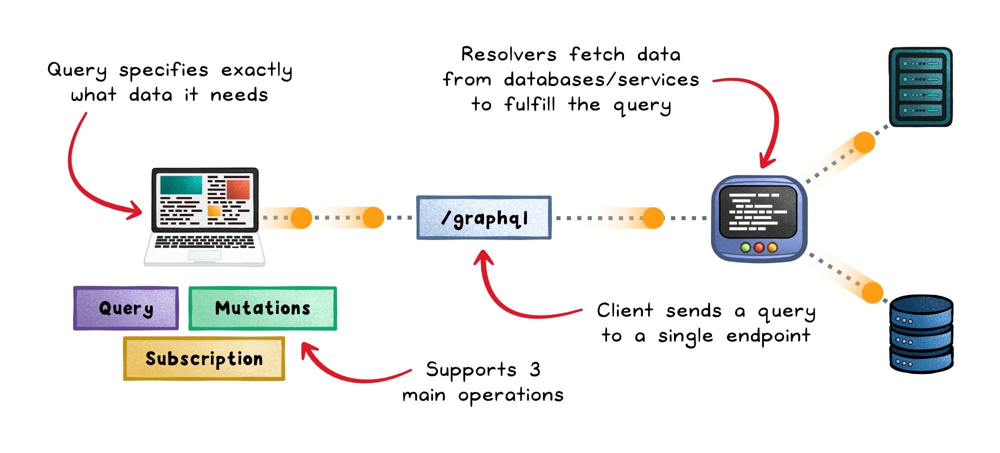
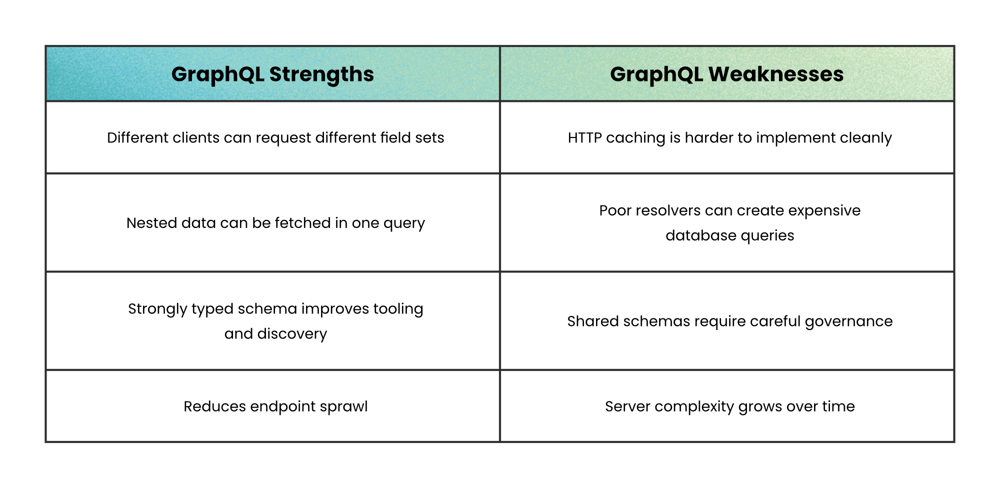
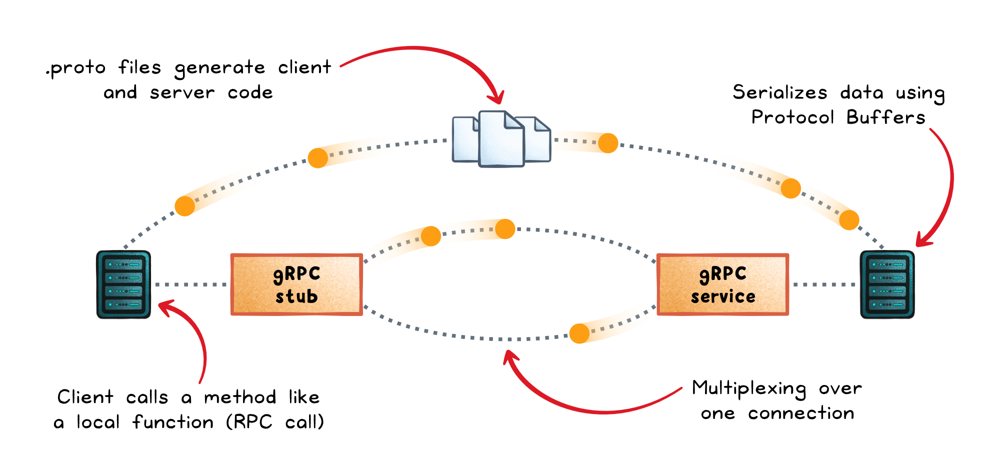
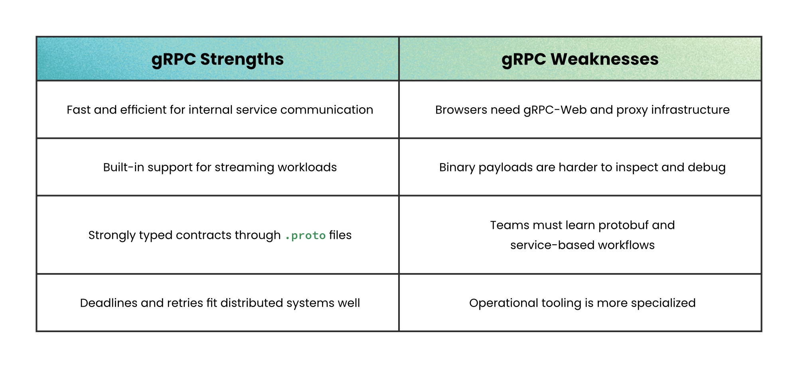
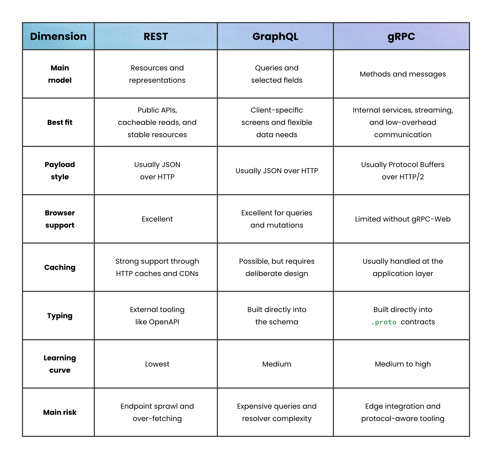

# REST vs GraphQL vs gRPC

## Key Takeaways

- REST, GraphQL, and gRPC are not interchangeable — each is built around a different mental model (**resources, queries, methods**) and excels in a different layer of the system
- REST suits stable, resource-shaped public APIs; GraphQL suits diverse clients needing flexible data shapes; gRPC suits high-performance internal service-to-service traffic
- The most common production pattern is **hybrid**: REST or GraphQL at the edge (browsers, mobile, third parties) with gRPC behind the scenes for service-to-service calls
- Each style has a clear anti-pattern: REST struggles with cross-resource joins, GraphQL is overkill for small stable APIs, gRPC is poor for browser-facing or third-party consumption
- The common failure mode isn't picking the "wrong" one — it's picking one and **applying it uniformly across the whole system**

## The Core Mental Model



| Style | Mental model | Verb |
|---|---|---|
| **REST** | Resources identified by URLs | HTTP verbs (GET, POST, PUT, DELETE) |
| **GraphQL** | Queries — client describes shape of data wanted | One endpoint (POST query) |
| **gRPC** | Methods — typed procedure calls | RPC method names |

This framing is the basis for matching each style to the right problem.

## REST — The Default for Clear Resources and Public APIs



**Strong for:**

- Stable domain entities (Users, Orders, Products)
- HTTP-native caching (Cache-Control, ETag, CDN-friendly)
- Browser-friendliness (no client library needed)
- Debuggability (curl, browser, Postman all work)
- Third-party / public APIs (every dev knows HTTP)

**Weak for:**

- Cross-resource fetches → over-fetching or endpoint sprawl
- Complex client-driven data shapes (need to design every endpoint server-side)
- Realtime / streaming (limited to SSE workarounds)

## GraphQL — The Choice for Client-Shaped Data



**Strong for:**

- Multiple client types (web, mobile, admin dashboard) needing different slices of the same data
- One typed schema as the contract — clients pick exact fields
- Single endpoint reduces server-side endpoint explosion

**Weak for:**

- Tiny, stable APIs (overkill — typed schema is overhead)
- Authorization complexity (per-field, per-type rules get hairy)
- Resolver-driven N+1 query risks (need DataLoader-style batching)
- Native HTTP caching is harder; usually needs a custom layer
- Need depth/complexity controls to prevent denial-of-service

## gRPC — The Go-To for Efficient Service-to-Service Calls



**Strong for:**

- Internal microservice-to-microservice traffic
- Low-latency, high-throughput needs (binary Protocol Buffers + HTTP/2 multiplexing)
- Strict typed contracts across polyglot services (codegen for many languages)
- First-class streaming (unary, server-stream, client-stream, bidirectional)
- Deadline propagation, retry policies, health checks built-in

**Weak for:**

- Browser-facing APIs (needs gRPC-Web proxy)
- Public / third-party APIs (everyone has to install your codegen)
- Quick debugging (binary payloads, not curl-able)

## Side-by-Side Comparison



| Dimension | REST | GraphQL | gRPC |
|---|---|---|---|
| Mental model | Resources (URLs + verbs) | Queries (field selection) | Methods (typed RPC) |
| Transport | HTTP/1.1 | HTTP/1.1 or 2 | HTTP/2, binary (Protobuf) |
| Schema | Optional (OpenAPI) | Required (typed schema) | Required (.proto + codegen) |
| Data fetching | Fixed-shape endpoints | Client picks fields | Strongly typed procedures |
| Streaming | Limited (SSE) | Subscriptions (variable) | First-class (unary/server/client/bidi) |
| Caching | Native HTTP | Limited, needs custom | Minimal |
| Browser | Native | Native | Requires gRPC-Web proxy |
| Ideal context | Public, stable resources | Multi-client systems | Internal microservices |

## When Not to Use Each



| Style | Avoid when |
|---|---|
| REST | Heavy cross-resource joins; clients with wildly varying data needs |
| GraphQL | Small, stable APIs; team unfamiliar with resolver discipline |
| gRPC | Public APIs; browser-facing without a proxy; third-party consumers |

## The Pattern Most Systems End Up Using



```
   Browser / Mobile / Third Party
              │
              ▼
   ┌──────────────────────┐
   │  REST or GraphQL     │   ← Edge / API Gateway
   │  (HTTP-friendly)     │
   └──────────────────────┘
              │
              ▼  (gRPC internally)
   ┌──────────────────────────────────┐
   │   Service A ↔ B ↔ C ↔ D ...      │
   │   typed contracts, streaming,    │
   │   low latency, codegen           │
   └──────────────────────────────────┘
```

REST or GraphQL at the **edge** for browsers, mobile, and third parties.
gRPC **internally** for service-to-service calls behind the gateway.

## Decision Quick-Reference

| Situation | Pick |
|---|---|
| Public API, third-party consumers, stable resources, HTTP caching matters | **REST** |
| Multiple client types (web/mobile/admin) need varying slices of the same data | **GraphQL** |
| Internal microservices, low-latency, polyglot, streaming or deadline propagation | **gRPC** |
| Real systems at scale | **Hybrid** (REST/GraphQL edge + gRPC internal) |

> "The trap isn't choosing the wrong one. It's choosing one and using it everywhere."

## See Also

- [api-concepts.md](api-concepts.md) — broader API foundations (reliability, security, evolution)
- [real-time-communication.md](real-time-communication.md) — WebSockets, SSE, long-polling for realtime
- [retries.md](retries.md) — retry strategies that apply across all three styles

---

**Source:** https://blog.levelupcoding.com/p/rest-vs-graphql-vs-grpc
**Date:** 2026-06-01
**Tags:** api, rest, graphql, grpc, api-design, system-design, microservices, http2, protocol-buffers
