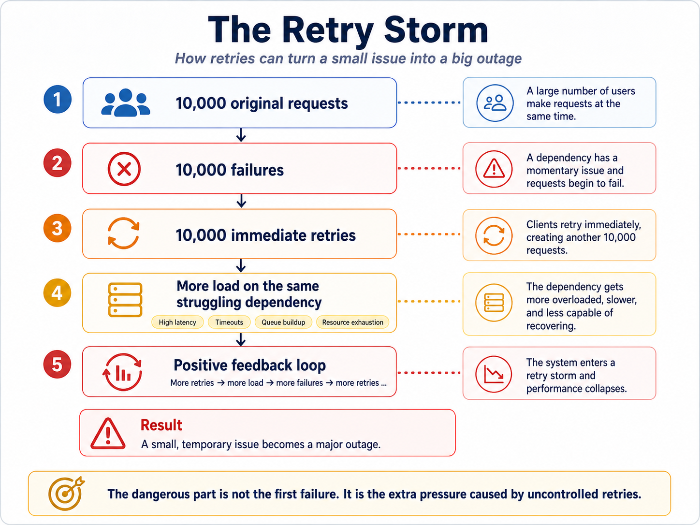
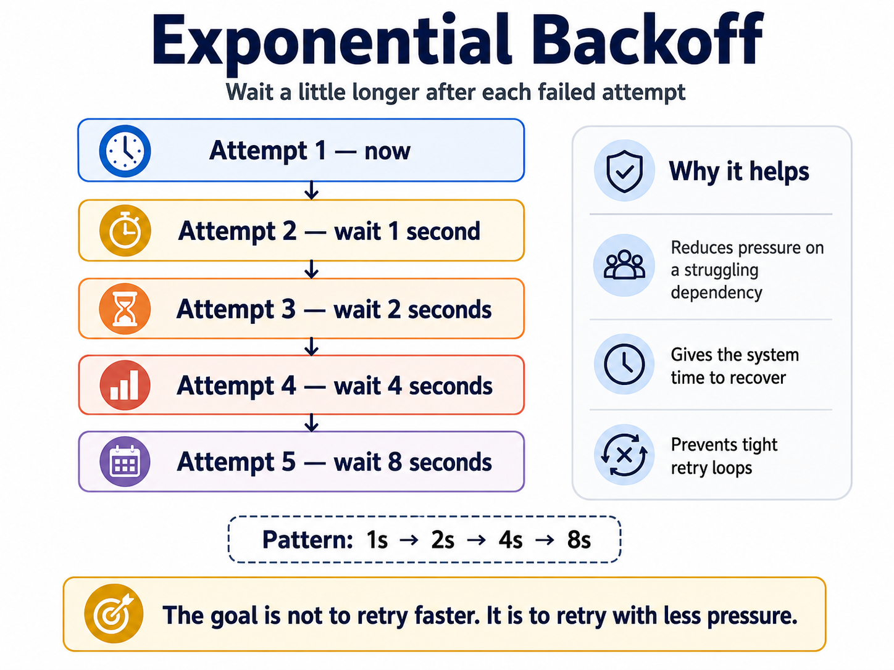
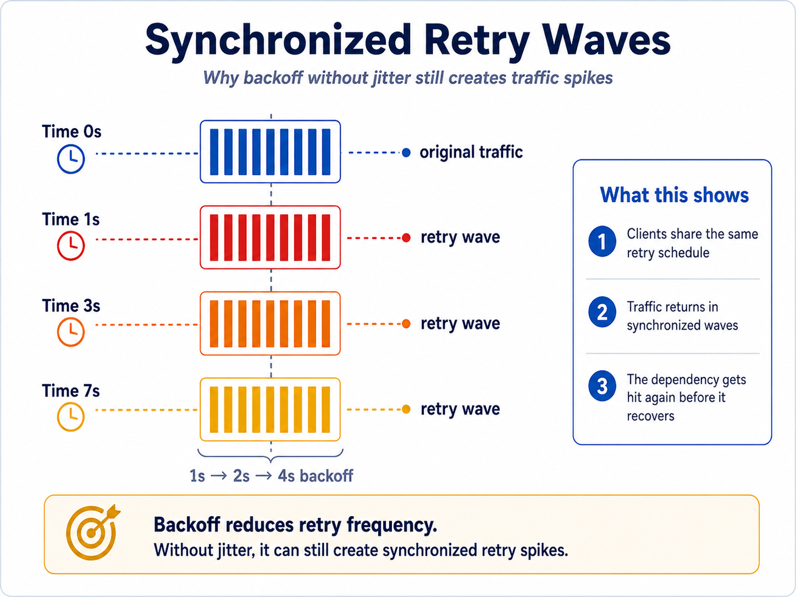
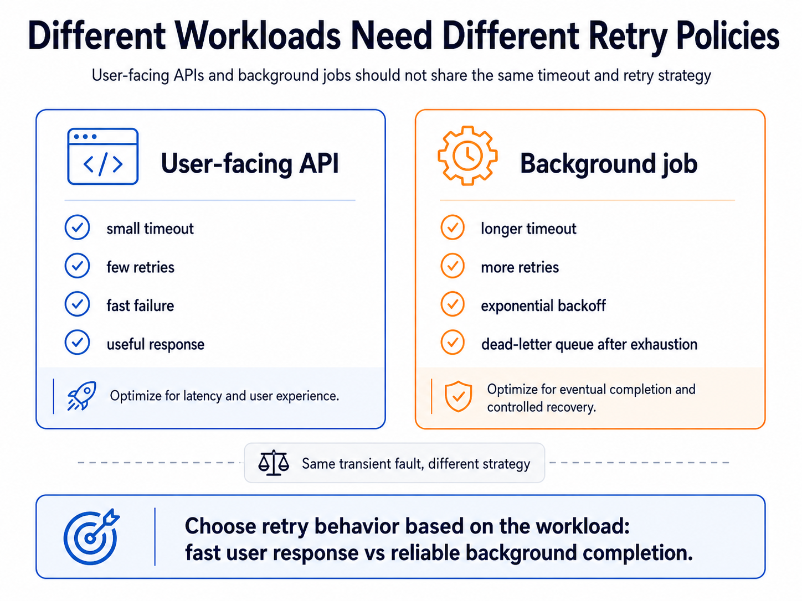
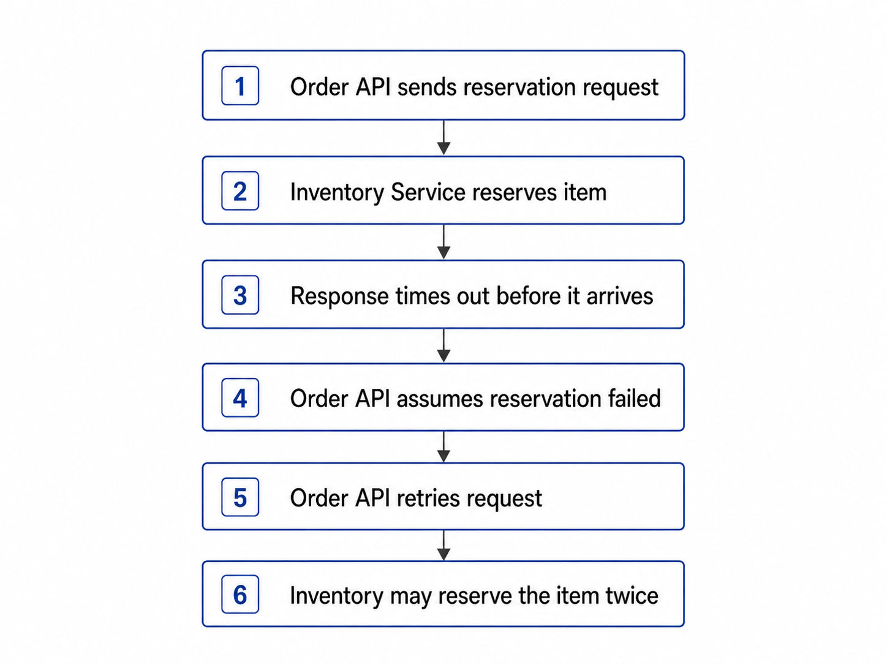
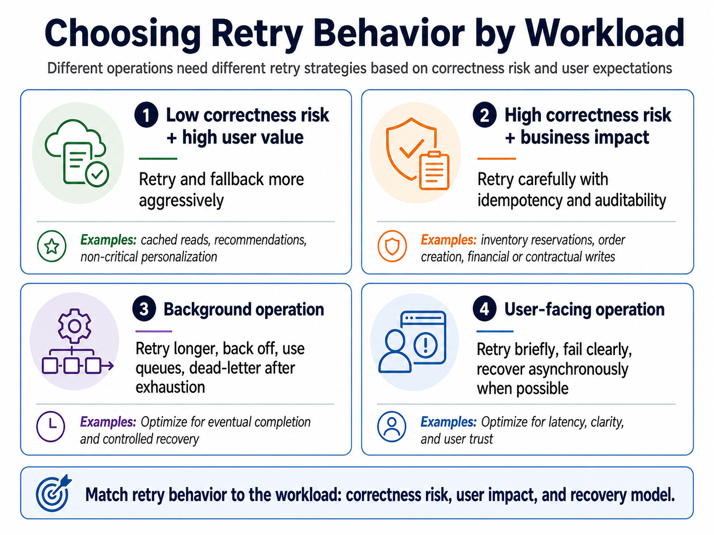
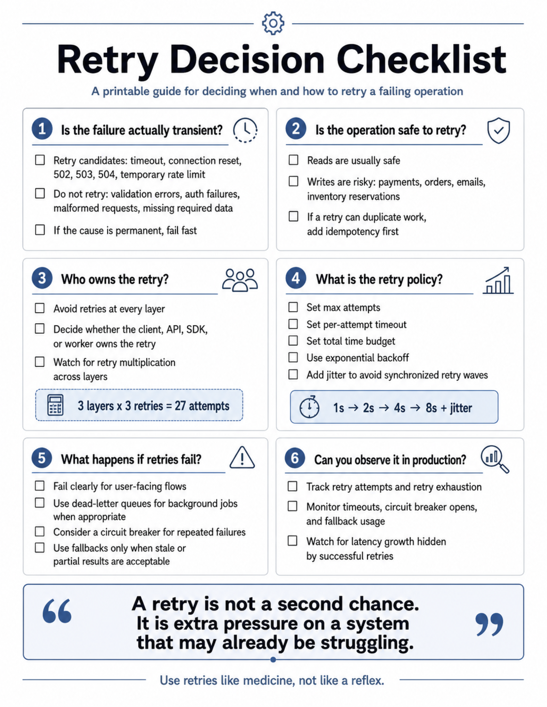
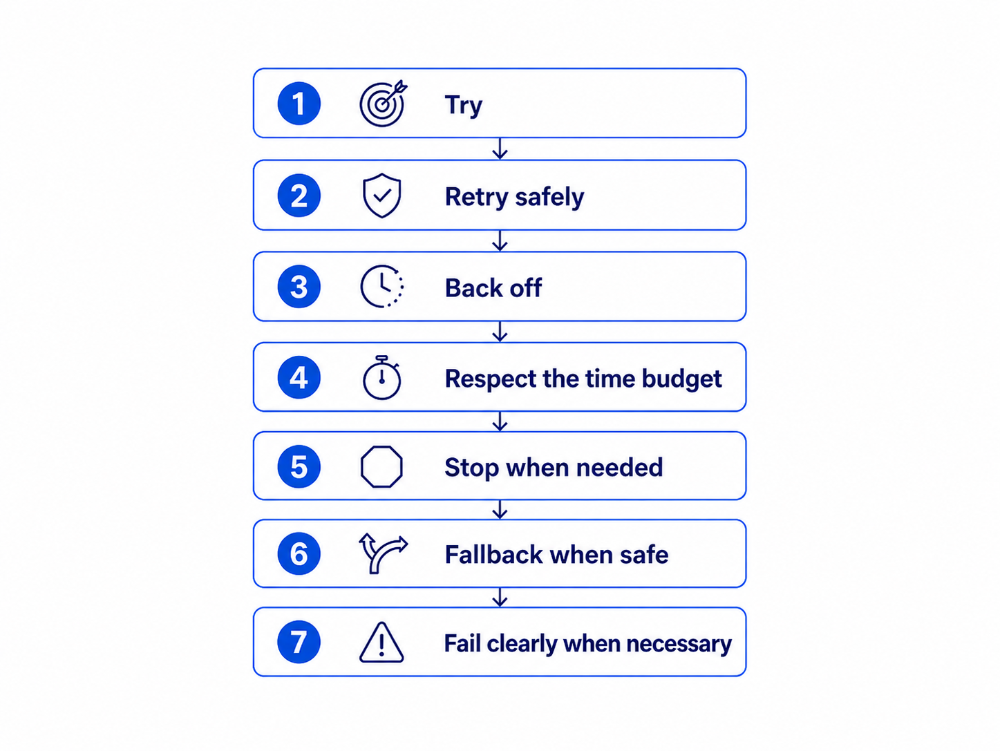

# Retries

## Key Takeaways

- Retries do not remove failure -- they move pressure around. Blind retries amplify failure into retry storms that can take down healthy systems.
- Use exponential backoff + jitter to spread retry pressure over time and prevent synchronized traffic waves.
- Set retry budgets (max attempts, per-attempt timeout, total time budget) and watch for hidden retry multiplication across layers (3 layers x 3 retries = 27 attempts).
- Never retry writes without idempotency keys -- the caller cannot know whether the service failed before or after completing the operation.
- Combine retries with circuit breakers and fallbacks: retries handle transient faults, circuit breakers stop repeated failures, and fallbacks provide graceful degradation.

## Transient Faults

Transient faults are temporary failures that resolve on their own:

- Timeouts and dropped connections
- Latency spikes
- Busy dependencies
- Gateway errors (500, 502, 503, 504)

These rarely start as dramatic outages. They begin as small disruptions that bad recovery logic escalates into systemic failures.

## Retry Storms

When a dependency slows down and multiple clients retry simultaneously, a positive feedback loop forms:

1. Original requests timeout
2. Clients retry immediately, doubling the load
3. Dependency gets more overloaded and less capable of recovering
4. Failed retries trigger more retries
5. System enters a feedback loop and collapses



> "The dangerous part is not the first failure. It is the extra pressure caused by uncontrolled retries."

## Exponential Backoff

Immediate retries are dangerous because they don't give dependencies time to recover. Exponential backoff increases wait time after each failure:

```
1s -> 2s -> 4s -> 8s
```

This protects the downstream service by reducing hammering pressure and giving it breathing room to recover.



## Jitter

Even with exponential backoff, synchronized clients retry at the same intervals, creating traffic waves. Jitter adds randomness to spread retries over time:

```
1s + random -> 2s + random -> 4s + random -> 8s + random
```

Without jitter, all clients hit at 1s, 2s, 4s, etc. With jitter, pressure is distributed more evenly.



## Retry Budgets

A retry budget needs three limits:

- **Max attempts** -- how many retry attempts are allowed
- **Per-attempt timeout** -- how long each attempt can take
- **Total time budget** -- how long the entire operation can take

### Hidden Retry Multiplication

One of the most common retry mistakes: "The frontend may retry. The API may retry. The SDK may retry." Each layer retries independently, so 3 layers x 3 retries = 27 total attempts. Pick one layer to own the retry.



## Idempotency for Safe Write Retries

Retrying reads is safe. Retrying writes without idempotency creates duplicates: duplicate orders, duplicate reservations, incorrect stock counts.

The core problem: the caller does not know whether the service failed before or after completing the operation.

**Solution:** Use stable idempotency keys (e.g., `order_123_line_1_reservation`):

- First request creates the reservation and stores the result keyed by the idempotency key
- Retry with the same key returns the original result without duplicating the action



## Circuit Breakers and Fallbacks

When failures are sustained (not transient), circuit breakers stop making calls entirely:

- **Closed** -- normal operation, requests flow through
- **Open** -- stops calls to the failing dependency, giving it recovery time
- **Half-open** -- tests with limited requests to verify recovery

Fallback strategies provide graceful degradation:

- Inventory service slow -- show "limited availability" instead of exact stock
- Reservation temporarily fails -- keep order "pending inventory confirmation"
- Warehouse integration down -- queue fulfillment for later
- Product read fails -- show cached data if freshness rules allow

The key question: "What happens if the fallback returns old, partial, delayed, or approximate data?"

## Choosing the Right Failure Behavior

Different operations require different retry policies based on correctness risk and user urgency:

| Operation | Strategy |
|-----------|----------|
| Product availability reads | Retry briefly or use cached data |
| Inventory reservations | Need idempotency and auditability |
| Warehouse fulfillment tasks | Can retry longer with dead-letter queues |
| Order confirmations | Fail clearly or stay pending |



## Retry Decision Checklist

Before implementing retry logic, answer these six questions:

1. **Is the failure actually transient?** -- Retry candidates: timeout, connection reset, 502/503/504. Do not retry: validation errors, auth failures, malformed requests.
2. **Is the operation safe to retry?** -- Reads are usually safe. Writes are risky -- add idempotency if a retry can duplicate work.
3. **Who owns the retry?** -- Avoid retries at every layer. Pick one layer (client, API, SDK, or worker) to own it.
4. **What is the retry policy?** -- Set max attempts, per-attempt timeout, total time budget. Use exponential backoff + jitter.
5. **What happens if retries fail?** -- Fail clearly for user-facing flows. Use dead-letter queues for background jobs. Consider circuit breakers.
6. **Can you observe it in production?** -- Track retry attempts, exhaustion, timeouts, circuit breaker opens, and fallback usage.



## Observability Metrics

Track these to understand whether retries are helping or becoming the normal path:

- `retry_attempts_total` / `retry_exhausted_total`
- `dependency_timeout_total`
- `circuit_breaker_open_total`
- `fallback_used_total`
- `idempotency_key_reused_total`
- `dead_letter_messages_total`

## Graceful Degradation

The goal is not to eliminate failures but to handle them gracefully. A reliable system absorbs small failures without turning them into permanent user frustration.



> "A retry is not a second chance. It is extra pressure on a system that may already be struggling. Use it like medicine, not like a reflex."

## See Also

- [api-concepts.md](api-concepts.md) — the broader API design index (this file expands the Reliability & Performance section)
- [rest-vs-graphql-vs-grpc.md](rest-vs-graphql-vs-grpc.md) — retry policies apply across all three styles
- [real-time-communication.md](real-time-communication.md) — sibling deep-dive on server-update patterns
- [../circuit-breakers.md](../circuit-breakers.md) — when sustained failure is not transient
- [../rate-limiting.md](../rate-limiting.md) — the producer-side counterpart (preventing the load that triggers retry storms)
- [../distributed-system-failure-modes.md](../distributed-system-failure-modes.md) — the amplification loop pattern this file mitigates

---

**Source:** https://newsletter.systemdesignclassroom.com/p/bad-retries-can-break-good-systems
**Date:** 2026-05-09
**Tags:** retries, resilience, exponential-backoff, jitter, idempotency, circuit-breakers, system-design
