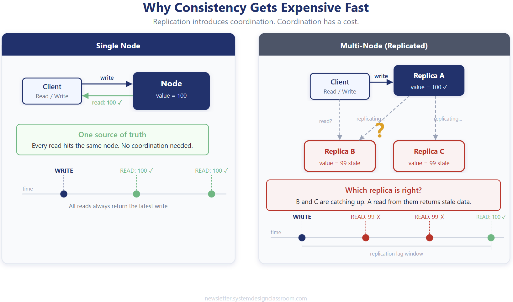
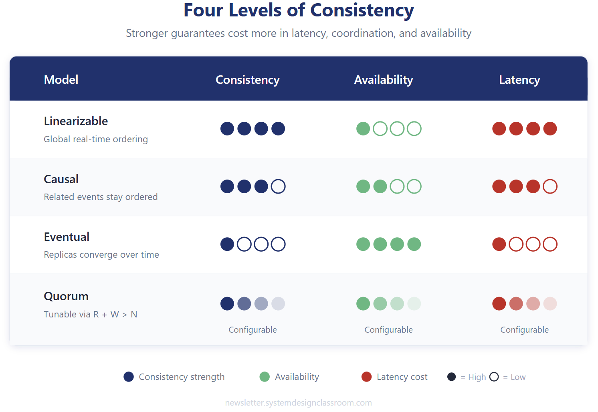
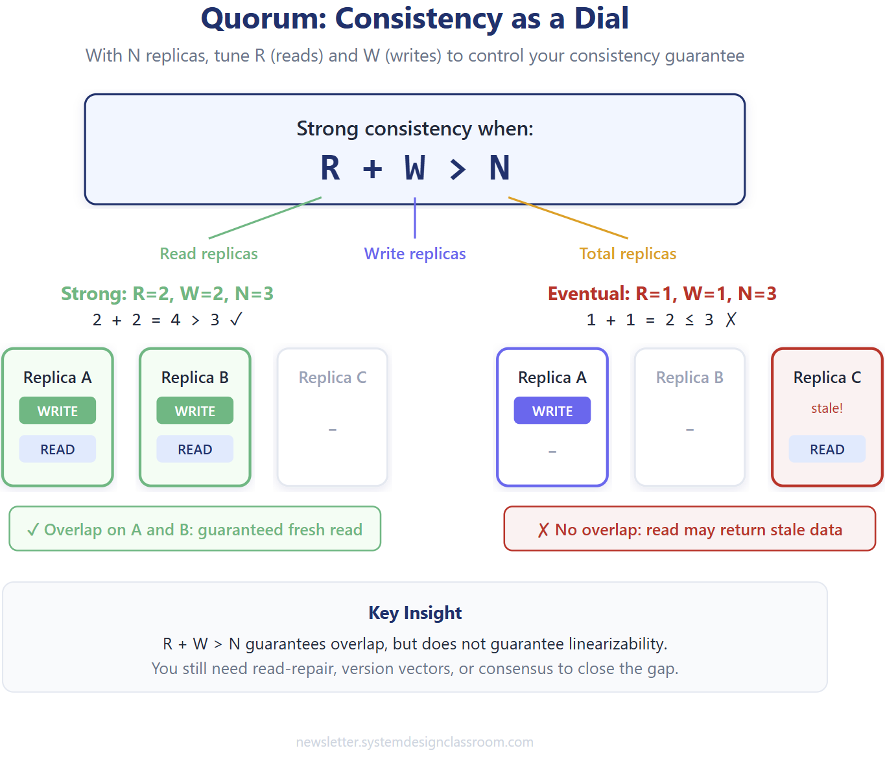
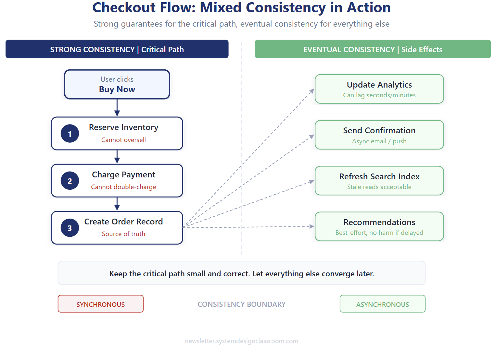
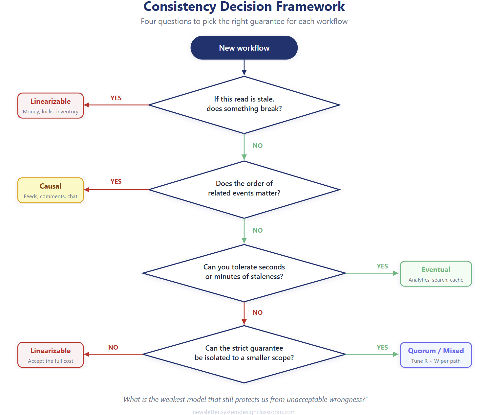

# Consistency Models in Distributed Systems

## Key Takeaways

- Consistency is not binary -- it is a spectrum from linearizable (strongest) to eventual (weakest), and the right choice depends on what breaks if a read is stale
- Quorum-based consistency (R + W > N) provides a tunable dial rather than a fixed guarantee, letting you mix models per workflow
- Isolate strong consistency to the critical path (payments, inventory) and let derived data (analytics, search indexes, recommendations) converge asynchronously
- Three common mistakes: over-provisioning consistency everywhere, under-designing for staleness, and treating consistency as a platform-wide property instead of a per-workflow decision

## Why Consistency Gets Expensive

In a single-node system, every read hits the same node -- no coordination needed. Once you replicate data across multiple nodes, coordination is required to keep replicas in sync, and that coordination costs latency.

During the replication lag window, reads from stale replicas return outdated values. The fundamental question becomes: how much staleness can each workflow tolerate?

## Four Levels of Consistency

### Linearizable

The strongest guarantee. After a write completes, every subsequent read -- from any client, on any node -- must return that value or a newer one. The system behaves as if there is a single copy of the data.

- **Use when:** A stale read causes real damage -- financial ledgers, inventory counts, distributed locks
- **Cost:** High latency, low availability (requires coordination across all replicas before acknowledging)

### Causal

Preserves ordering for causally related operations while allowing unrelated events to proceed independently. If User A posts a message and User B replies, every observer sees the post before the reply -- but unrelated posts can appear in any order.

- **Use when:** Context and ordering matter but global real-time ordering is overkill -- social feeds, messaging, collaborative editing
- **Cost:** Moderate latency; tracks causal dependencies (vector clocks, version vectors)

### Eventual

Replicas may diverge temporarily but will converge to the same value given enough time. No ordering guarantees during the convergence window.

- **Use when:** Brief staleness is harmless -- analytics dashboards, view counters, recommendation engines, caches
- **Cost:** Lowest latency, highest availability; must design for temporary inconsistency

### Quorum-Based (Tunable)

Rather than picking a fixed model, quorum systems let you tune consistency per operation by controlling how many replicas participate in reads (R) and writes (W) out of N total replicas.

- **Strong consistency:** R + W > N (read and write sets must overlap, guaranteeing the read sees the latest write)
- **Eventual consistency:** R + W <= N (no guaranteed overlap, reads may return stale data)
- **Key insight:** R + W > N guarantees overlap but does not guarantee linearizability. You still need read-repair, version vectors, or consensus to close the gap.

## Mixed Consistency in Practice: Checkout Flow

Real systems don't use one consistency model everywhere. A checkout flow illustrates the split:

**Critical path (strong consistency, synchronous):**

1. Reserve inventory -- cannot oversell
2. Charge payment -- cannot double-charge
3. Create order record -- source of truth

**Side effects (eventual consistency, asynchronous):**

- Update analytics (can lag seconds/minutes)
- Send confirmation email (brief delay acceptable)
- Refresh search index (stale data is acceptable)
- Update recommendations (best-effort, no harm if delayed)

The rule: keep the critical path small and correct. Let everything else converge later.

## Consistency Decision Framework

Use these four questions to pick the right guarantee for each workflow:

1. **If this read is stale, does something break?** Yes --> Linearizable. No --> continue.
2. **Does the order of related events matter?** Yes --> Causal. No --> continue.
3. **Can you tolerate seconds or minutes of staleness?** Yes --> Eventual. No --> continue.
4. **Can the strict guarantee be isolated to a smaller scope?** Yes --> Quorum/Mixed. No --> Linearizable on the full path.

The guiding principle: *"What is the weakest model that still protects us from unacceptable wrongness?"*

## Common Mistakes

| Mistake | Problem | Fix |
|---------|---------|-----|
| Over-provisioning consistency | Applying linearizable reads globally adds latency to every request | Isolate strong consistency to business-critical boundaries only |
| Under-designing for staleness | Assuming eventual consistency "just works" without handling conflicts | Define explicit staleness windows; implement conflict resolution |
| Treating consistency as platform-wide | One global setting instead of per-workflow tuning | Make consistency a per-workflow decision at the data layer |

---

**Source:** https://newsletter.systemdesignclassroom.com/p/consistency-is-negotiable-but
**Date:** 2026-05-31
**Tags:** consistency, distributed-systems, cap-theorem, quorum, linearizability, eventual-consistency, system-design
