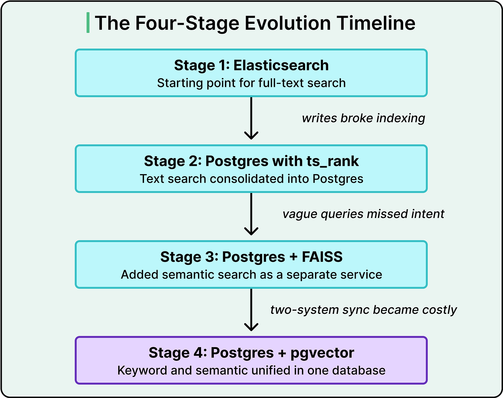
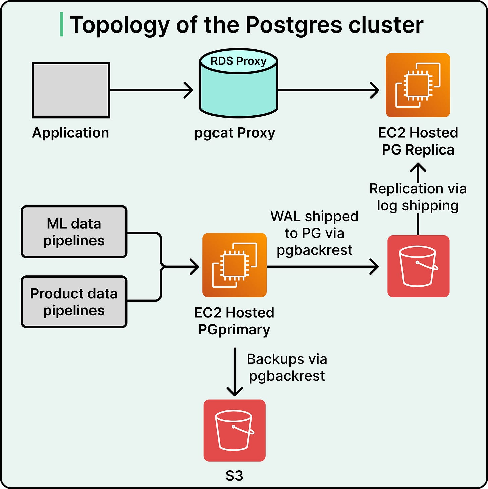
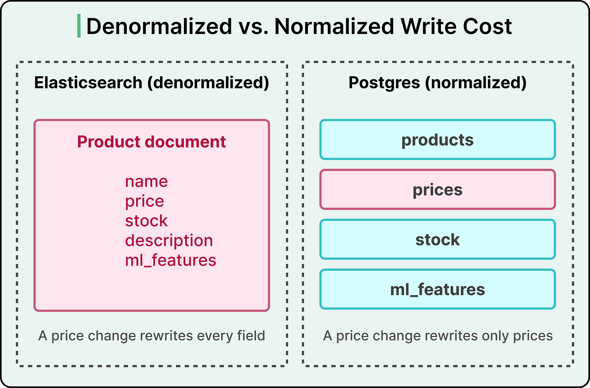
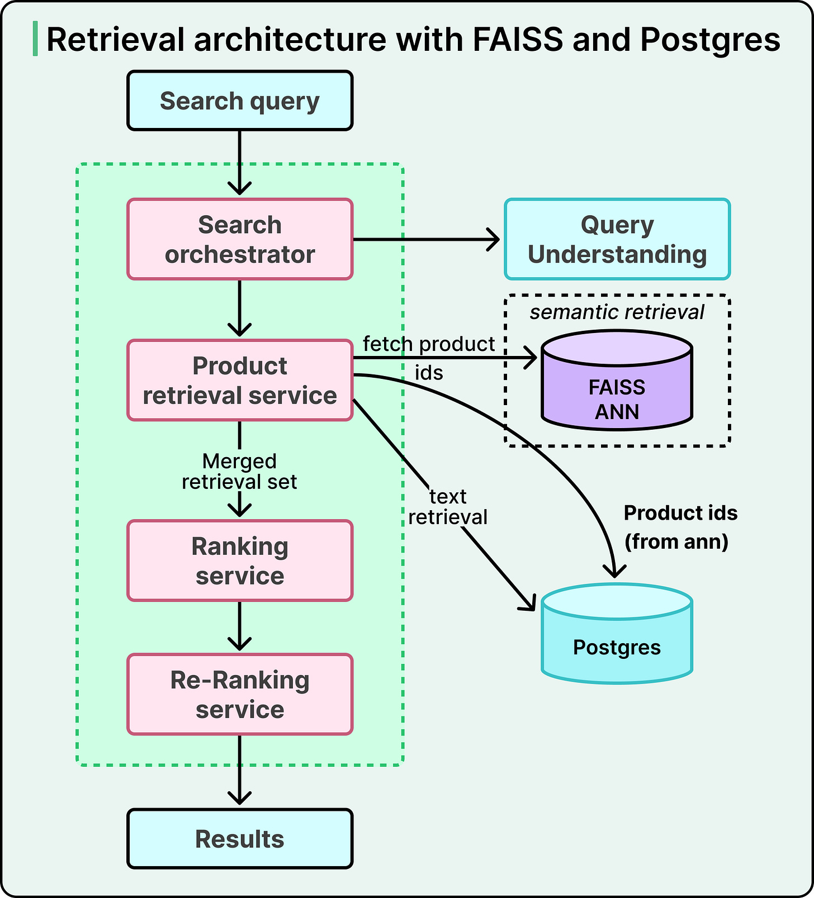
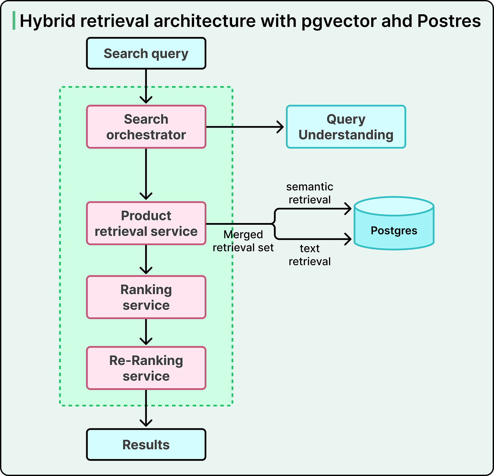
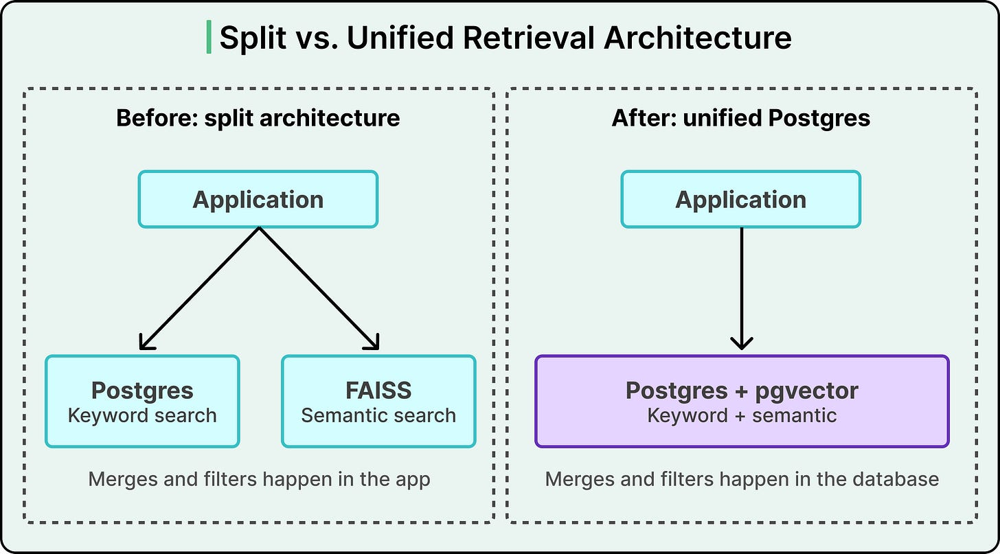

# How Instacart Built Search for Billions of Products

## Key Takeaways

- Instacart migrated from Elasticsearch to PostgreSQL for keyword search because ES's denormalized documents made write-heavy workloads (billions of writes/day) unsustainable -- Postgres normalized data cut write load by 10x.
- Running keyword search (Postgres) and semantic search (FAISS) as parallel systems created sync overhead, limited filtering, and blocked sophisticated signal combination.
- Unifying both into Postgres + pgvector eliminated network round-trips (2x latency improvement) and reduced zero-result searches by 6% via real-time inventory filtering before retrieval.
- pgvector works well up to ~50-100M vectors per index; beyond that, purpose-built vector databases scale more gracefully.
- The key architectural insight: when application-layer code joins data from multiple services, it signals that compute should move closer to the data store.

## The Shape of Search at Instacart

Instacart's catalog spans billions of items across thousands of retailers, handling millions of daily queries. The defining characteristic is a **write-heavy workload** -- billions of writes per day from pricing updates, inventory changes, and catalog modifications.

Users exhibit two distinct search patterns:
- **Specific queries** ("pesto pasta sauce 8oz") -- need precise keyword matching
- **Vague queries** ("healthy foods") -- need semantic understanding

## Stage 1: Leaving Elasticsearch Behind

Elasticsearch requires **denormalized documents** -- any single field change triggers a full document rewrite. For a catalog with constant inventory and pricing updates, the indexing load became crushing.

The team made a counterintuitive move: they migrated search to **PostgreSQL**, leveraging its normalized data model. Isolated field changes no longer required full document re-indexing, reducing write workload by ~10x. They also benefited from existing operational expertise with Postgres.

## Stage 2: The Two-System Problem (Postgres + FAISS)

By 2021, Instacart added semantic search using **FAISS** (Meta's vector search library) alongside keyword search in Postgres. Running two retrieval systems in parallel created three problems:

1. **Limited filtering** -- FAISS had weak filtering capabilities, forcing overfetch-then-filter
2. **Operational overhead** -- maintaining separate services for keyword and semantic search
3. **Constrained signal combination** -- the architecture prevented sophisticated blending of retrieval signals

## Stage 3: Unification with pgvector

Instacart selected **pgvector** -- a PostgreSQL extension for vector similarity search -- to unify both retrieval paths into a single database. Pre-production testing confirmed it could meet throughput and latency requirements.

### Results

- **6% reduction** in zero-result searches (measured via A/B test), directly improving retention and revenue
- **~2x latency improvement** by eliminating multiple network round-trips
- Real-time inventory filtering applied **before** semantic search, not after

### Bring the Compute to the Data

Previously, the application layer made separate calls to Elasticsearch, availability services, and other systems, then performed in-memory joining. The new architecture executes all operations within PostgreSQL -- filters, joins, and ranking happen before results leave the database.

## Limits and Tradeoffs

- pgvector works well at **~50-100M vectors per index**; beyond that, purpose-built vector databases are better
- The strategy leverages Instacart's specific context: existing Postgres infrastructure, normalized data, deep operational expertise
- Consolidation creates potential **noisy-neighbor problems** when analytical queries, search queries, and transactional writes compete for shared cluster resources

## Architecture Lessons

- **Measure the true cost** of maintaining synchronized parallel systems before accepting complexity
- **Application-layer data joining** is a signal that compute should move closer to the data
- The right architecture depends on the moment -- Instacart's four stages were each appropriate for their era
- Consolidation is not always the answer, but when you already have deep expertise in one system (Postgres), building on it can outperform adding specialized infrastructure

---

**Source:** https://blog.bytebytego.com/p/how-instacart-built-a-search-for
**Date:** 2026-05-28
**Tags:** search, postgresql, pgvector, elasticsearch, vector-search, instacart, system-design
