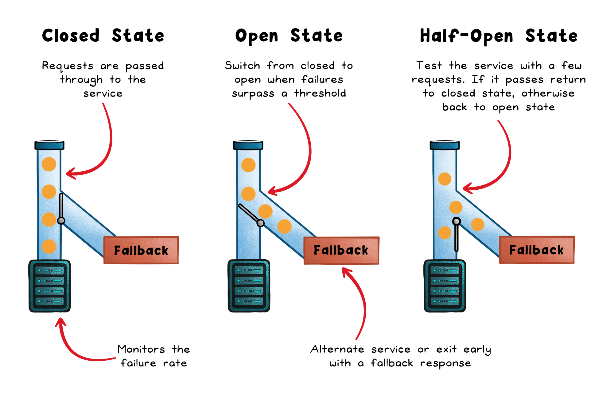
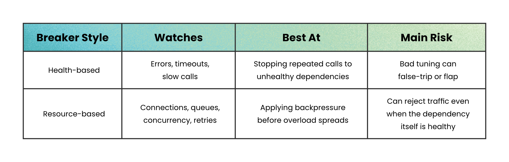
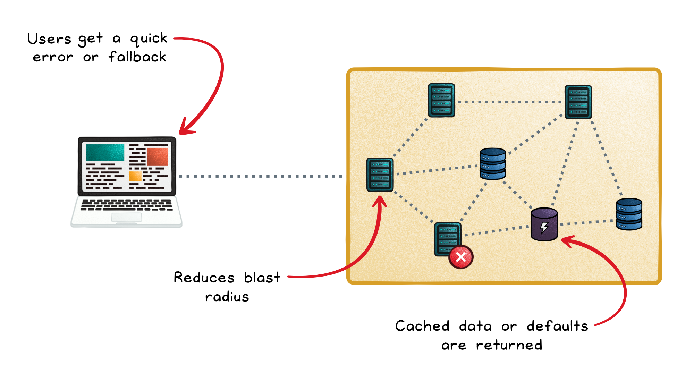

# Circuit Breakers

## Key Takeaways

- Circuit breakers act as proxies between your code and dependencies — they prevent cascading failures by failing fast instead of letting threads pile up on an unhealthy service
- Three states: Closed (normal, monitoring), Open (requests rejected immediately), Half-Open (limited trial calls test recovery)
- Two styles: health-based (watches errors/timeouts/slow calls) and resource-based (watches connections/queues/concurrency) — each has different failure modes
- Circuit breakers are not substitutes for timeouts, and should not be shared across independent shards

## Three-State Machine

- **Closed** — requests flow normally; breaker monitors failure rate, timeouts, slow responses
- **Open** — requests fail immediately without touching the dependency; returns fallback or quick error
- **Half-Open** — limited trial calls test whether the dependency recovered; success → Closed, failure → Open

## Trip Triggers

- **Consecutive failure runs** — effective for low-traffic calls
- **Failure rate thresholds** — better for high-volume services, filters noise by measuring proportion
- **Slow-call rate** — detects when a dependency responds slowly enough to exhaust connection pools before returning errors
- **Capacity-based** — monitors active requests, pending requests, retries, and connections rather than health

## Breaker Styles

| Style | Watches | Best At | Main Risk |
|---|---|---|---|
| Health-based | Errors, timeouts, slow calls | Stopping repeated calls to unhealthy dependencies | Bad tuning can false-trip or flap |
| Resource-based | Connections, queues, concurrency, retries | Applying backpressure before overload spreads | Can reject traffic even when dependency is healthy |

## Benefits

- **Fail fast** — users get quick errors or fallbacks instead of extended timeouts
- **Capacity protection** — threads, sockets, and pools remain available for viable work
- **Blast radius reduction** — one failing service is less likely to degrade healthy ones
- **Graceful degradation** — return cached data, defaults, or partial results

## Monitoring

- Track state transitions (Closed ↔ Open ↔ Half-Open)
- Track failure rate, slow-call rate, not-permitted calls, overflow counters
- Alert on sustained transitions correlated with service-level impact, not isolated blips

## Anti-Patterns

- Using circuit breakers as substitutes for enforced timeouts
- Conflating retries with circuit breakers (different failure patterns)
- Adding breakers indiscriminately to every dependency
- Sharing breakers across independent shards (failures in one block traffic to healthy ones)

---

**Source:** https://blog.levelupcoding.com/p/circuit-breakers-explained
**Date:** 2026-05-29
**Tags:** circuit-breaker, resilience, fault-tolerance, cascading-failure, distributed-systems
