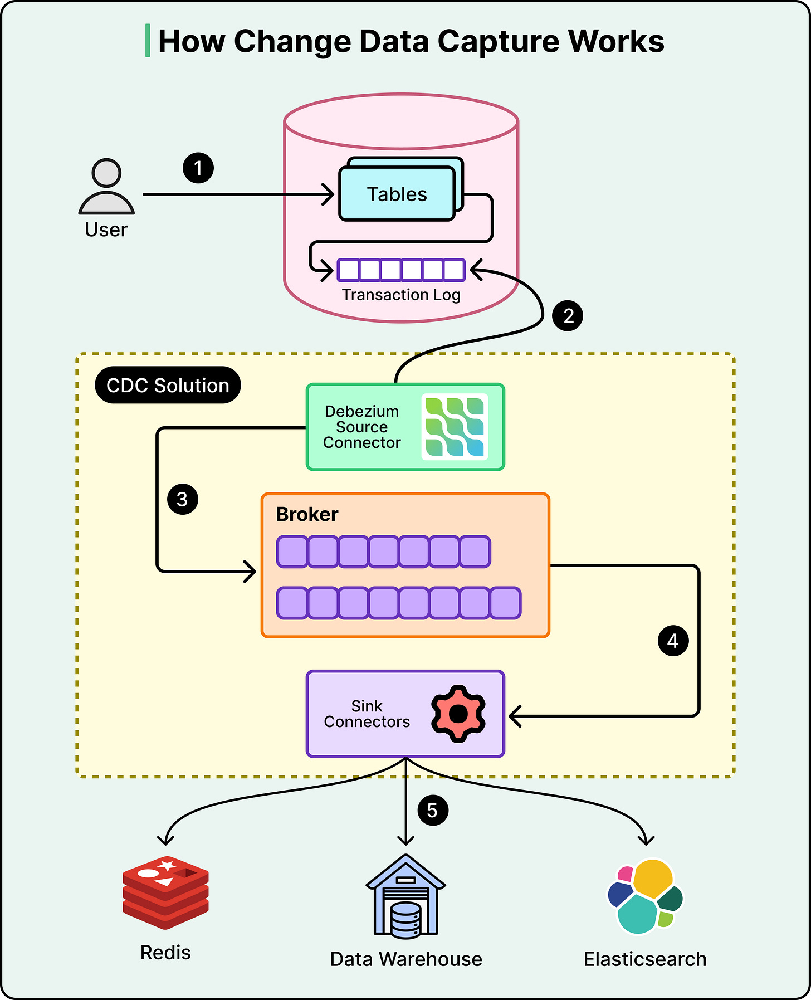
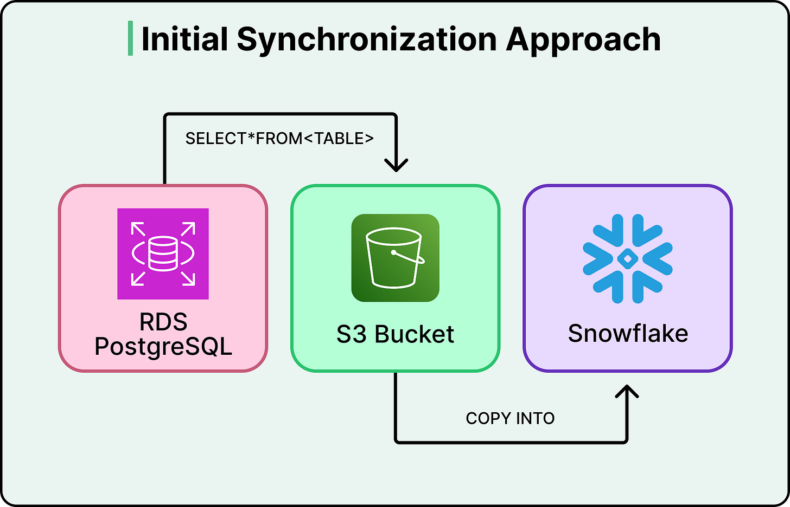
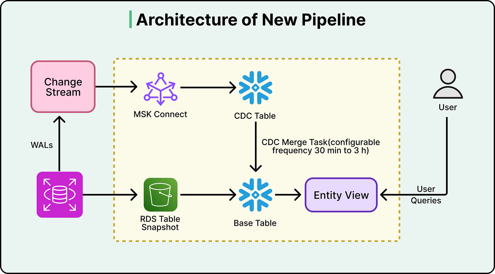
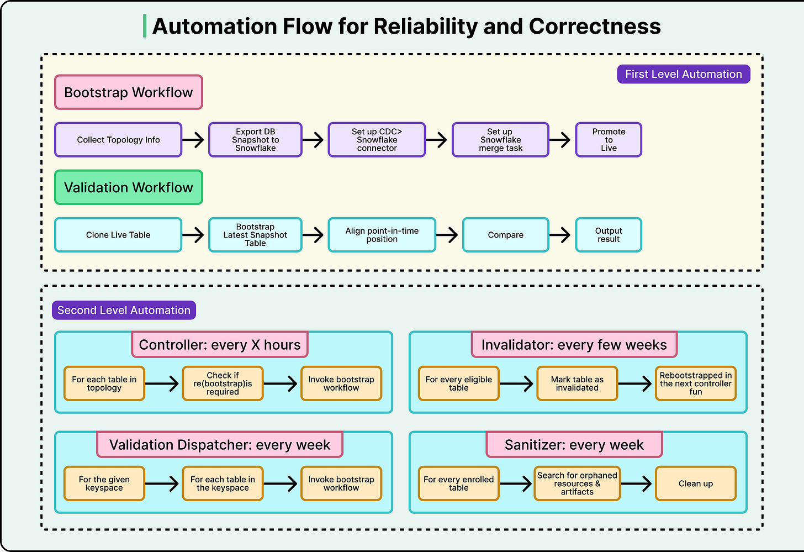

# Change Data Capture (CDC)

## Key Takeaways

- CDC reads database transaction logs and converts them into a stream of change events — zero overhead on the database since it piggybacks on existing bookkeeping
- Shifts the question from "what does the table look like now?" to "what changed since last time?" — moves only modified records instead of full table copies
- Figma cut data freshness from 30+ hours to under 3 hours (configurable to minutes) and saved millions annually by eliminating dedicated export replicas
- Key tradeoff: CDC pipelines are complex and require aggressive automation and validation — worth it at scale, overkill for smaller systems

## How CDC Works

1. Application writes to database tables, generating transaction log entries (WAL)
2. CDC connector (e.g., Debezium) reads the transaction log
3. Change events published to a message broker (Kafka)
4. Sink connectors deliver changes to downstream systems (data warehouse, Redis, Elasticsearch)

## Figma Case Study: Daily Cron to Real-Time CDC

### Before: Full-Sync Model

- Cron job queried every row from each table daily, dumped to S3, loaded into Snowflake
- By 2023: daily sync took ~6 hours, largest tables took days
- Data freshness lag exceeded 30 hours
- Dedicated export replicas cost millions/year

### After: Incremental CDC Pipeline

- CDC captures changes from PostgreSQL WAL → Kafka topics (one per table)
- Snowflake consumes at its own pace via configurable merge cycles (default 3h, billing runs 30min)
- Bootstrap process: full snapshot to S3, then CDC stream overlaps to prevent data gaps
- Production database fully decoupled from analytics

### Validation Strategy

- Independent re-bootstrap into temporary schema weekly
- Cell-by-cell comparison against live table at aligned point-in-time
- Two-tier automation: execution layer (bootstrap/validation tasks) + decision layer (controller checks for new tables every few hours, dispatcher triggers weekly validation)

### Results

| Metric | Before | After |
|---|---|---|
| Data freshness | 30+ hours | < 3 hours (configurable to minutes) |
| Table capacity | Limited | 10x larger |
| Export replica cost | Millions/year | Eliminated |

---

## The Three Capture Methods

Worth knowing which method any CDC system uses — they have very different operational profiles:

| Method | How | Pros | Cons |
|---|---|---|---|
| **Timestamp polling** | Periodically `SELECT WHERE updated_at > last_poll` | Simple; no DB-side changes | Latency gaps; **misses hard deletes** (no row to scan); polling overhead |
| **Database triggers** | Trigger on insert/update/delete writes to a CDC table | Immediate capture; works with any consumer | Adds write overhead to every change; trigger logic can hide bugs |
| **Log-based capture** | Read the WAL / binlog / redo log | Low latency; minimally invasive; preserves write order exactly | Requires privileged DB access; tool/version-specific; security implications |

**Log-based is the modern standard** — Debezium, Maxwell, AWS DMS all read transaction logs. Triggers and timestamp polling persist mostly in legacy systems or where log access isn't available.

**Common gaps that "vanilla" CDC doesn't solve:**
- Schema evolution breaks downstream consumers (mitigate: schema registry — see [Datadog's pattern](case-studies/datadog-data-replication.md))
- No business context — events are row-level, not domain-event-level (mitigate: enrichment layer between CDC and consumers)
- Requires privileged DB access — security concern (mitigate: audit, least-privilege CDC user)

---

**Source:** https://blog.bytebytego.com/p/how-figma-upgraded-data-pipeline
**Source:** https://blog.levelupcoding.com/p/change-data-capture-cdc
**Date:** 2026-05-24 (initial), 2026-06-05 (added 3 capture methods + common gaps)
**Tags:** cdc, data-pipeline, system-design, kafka, snowflake, figma, debezium, log-based-capture
