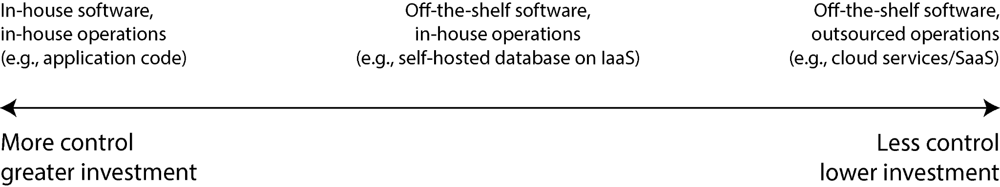

# Cloud-Native Data Architecture

## Key Takeaways

- Cloud-native data systems are defined by three properties: **layering of specialized services** (Snowflake on S3), **storage/compute disaggregation** (local disk is cache, not primary storage), and **multitenancy** with strong isolation
- Build-vs-buy is a spectrum from bespoke in-house code → self-hosted OSS → IaaS VMs → modified OSS → fully managed SaaS — **keep core competencies in-house, outsource the routine**
- Cloud advantages (fast provisioning, instance variety, autoscaling, metered billing) come paired with hard trade-offs (vendor lock-in, opaque debugging, helplessness during provider outages)
- The traditional DBA/sysadmin role is **bifurcating**: infrastructure providers optimize for service reliability; cloud customers focus on selection, integration, migration, and FinOps (cost optimization replaces capacity planning)
- Modern data architectures expand DDIA's original scope to cover AI systems (vector DBs, DataFrames for training, batch inference), local-first software, formal methods for validating AI-generated code, and GDPR-style regulation

## The Build-vs-Buy Spectrum



Five points along a spectrum from maximum control + cost to maximum convenience + opacity:

| Approach | Example | Control | Operational cost |
|---|---|---|---|
| **Bespoke in-house** | A purpose-built storage engine | Total | High — build *and* operate |
| **Self-hosted OSS on own hardware** | Postgres on bare metal | High | Medium-high |
| **IaaS VMs running OSS** | Postgres on EC2 | Medium | Medium |
| **Modified OSS** | A vendor's "managed Postgres" fork | Medium-low | Low-medium |
| **Fully managed SaaS** | Snowflake, BigQuery, Aurora Serverless | Low | Low |

> "Things that are a core competency or competitive advantage should be done in-house, whereas non-core, routine items should be outsourced."

For most teams: managed services for everything that isn't your differentiator.

## Cloud-Native Properties

### 1. Layering of Specialized Services

```
   ┌────── Snowflake ──────┐
   │   query, optimizer    │
   │   metadata, security  │
   └──────────┬────────────┘
              │ stores data on
              ▼
   ┌─────────── S3 ───────────┐
   │  durable object storage  │
   └──────────────────────────┘
```

Higher-level systems compose on top of lower-level primitives. Snowflake doesn't run its own storage cluster — it uses S3. Data warehouses, vector DBs, streaming systems all increasingly look like "compute layer on top of object storage."

### 2. Separation of Storage and Compute

| Era | Storage = Compute |
|---|---|
| Traditional DB | Same machine; local disk is primary storage; scale by buying bigger box |
| Cloud-native | Separated; compute scales independently from storage; local disk is **ephemeral cache** |

Implications:
- **Virtual block storage** (EBS, GCP Persistent Disk, Azure Managed Disk) — durable but latency-sensitive across the network
- **Dedicated storage services** — S3, GCS, R2 — workload-optimized, eleven-nines durable, infinite-ish capacity
- **Compute is disposable** — VMs come and go; state lives elsewhere
- **Scale dimensions decouple** — pay for compute and storage independently; idle a compute cluster overnight without losing data

### 3. Multitenancy

Shared hardware serving many customers requires careful isolation engineering: noisy-neighbor protection, per-tenant quotas, encryption-at-rest with separate keys, network isolation, audit trails. The vendor takes on what was previously every customer's individual operational burden.

## Cloud Trade-offs

| Cloud advantage | Cost |
|---|---|
| Fast provisioning (minutes, not weeks) | No control over the provider's feature/bug timeline |
| Wide instance variety (CPU, memory, GPU, networking) | Lock-in via incompatible APIs |
| Operator expertise embedded in the service | Helplessness during provider outages |
| Autoscaling for variable analytical workloads | Limited metrics/logs access for debugging |
| Metered billing replaces capacity planning | Sanctions risk (provider can suspend your account) |
| Multi-region, multi-AZ availability built-in | Data-security depends entirely on provider trust |

The pattern: **convenience and reliability go up; visibility and control go down**.

## Ops Role Evolution

Two distinct trajectories emerged:

### Traditional DBA / sysadmin
- Capacity planning (forecasting hardware needs months out)
- Provisioning physical or virtual servers
- Patching individual machines
- Long-lived, hand-tuned systems

### Modern DevOps / SRE
- Automation (Terraform, Ansible, GitOps)
- Ephemeral VMs and containers
- Frequent deploys (blue-green, canary)
- Incident learning and runbook preservation
- Observability-driven debugging

### The Bifurcation

```
              ┌─── Infrastructure provider ───┐
              │  - service reliability        │
              │  - hardware ops               │
              │  - cost engineering           │
              │  - regional resilience        │
              └───────────────────────────────┘
                          provides
              ┌───────────────────────────────┐
              │  - SaaS data systems          │
              │  - managed databases          │
              │  - object storage             │
              └───────────────┬───────────────┘
                              │
              ┌───── Cloud customer ──────────┐
              │  - service selection          │
              │  - integration & migration    │
              │  - FinOps (cost optimization) │
              │  - cross-service architecture │
              │  - data modeling              │
              └───────────────────────────────┘
```

Customer-side ops now looks more like **financial planning** (RIs, savings plans, autoscaling tuning, right-sizing) than capacity planning. The hardware-level work moved to the provider; what's left is selection, composition, and cost.

## What DDIA 2nd Edition Adds

The first edition (2017) predated several major shifts. The 2nd edition expands coverage to:

- **Cloud-first architecture** — the storage/compute separation and service layering above
- **AI systems** — vector databases, DataFrames (Pandas, Polars, Arrow) as training-data substrate, batch inference pipelines
- **Local-first / decentralized software** — CRDTs, sync engines (Replicache, Yjs), edge databases
- **Formal methods for AI-generated code** — verification, property tests, contract enforcement as guardrails against confidently-wrong code
- **Regulation** — GDPR, right-to-be-forgotten, data residency requirements

See also: [predictive analytics and ethics](../../ai-ml-ds/ethics/predictive-analytics-and-ethics.md) for the 2nd edition's expanded engineering-ethics chapter.

## Related

- [Replication and sharding](replication-and-sharding.md) — what scales the storage layer
- [CDC](cdc.md) — bridge between operational stores and cloud data warehouses
- [Data warehouse vs lake vs mesh](data-warehouse-vs-data-lake-vs-data-mesh.md) — analytical compositions on top of object storage
- [Distributed system failure modes](../distributed-system-failure-modes.md) — the layering above hides but doesn't remove these
- [Scaling fundamentals](../scaling-fundamentals.md) — autoscaling tradeoffs

---

**Source:** https://newsletter.pragmaticengineer.com/p/designing-data-intensive-applications-book-excerpt
**Date:** 2026-06-04
**Tags:** ddia, cloud-native, storage-compute-separation, multitenancy, build-vs-buy, devops, sre, finops, object-storage, database, system-design
