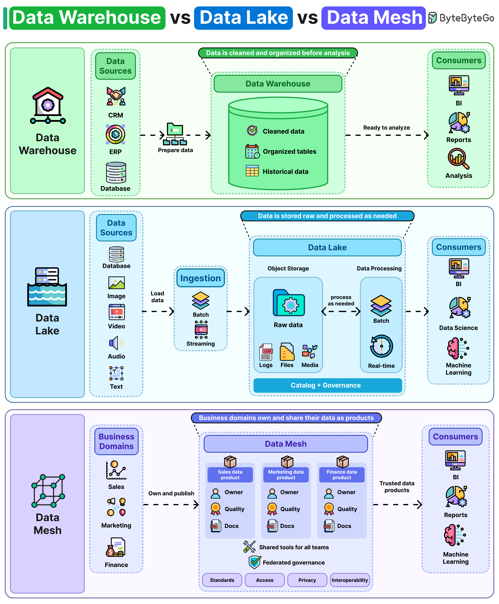

# Data Warehouse vs Data Lake vs Data Mesh

## Key Takeaways

- **Data Warehouse** cleans and structures data before storage, optimizing for fast queries and consistent reporting, but adding new sources requires schema conformance upfront.
- **Data Lake** stores raw data from diverse sources (databases, logs, images, video) and processes on demand, offering flexibility at the risk of becoming a "data swamp" without governance.
- **Data Mesh** decentralizes data ownership to business domains (e.g., sales owns sales data), with federated governance ensuring cross-team compatibility.
- Most organizations use a combination: warehouses for analytics, lakes for ML workloads, and mesh principles as the org scales.

## Overview

Storing data is the easy part. Deciding where and how to organize it is the real challenge. These three approaches represent an evolution in how organizations think about data architecture.

## Data Warehouse

A traditional approach where data is **cleaned and organized before storage**.

- Data from sources (CRM, ERP, databases) is prepared and loaded into structured tables.
- Contains cleaned data, organized tables, and historical data.
- Consumers get ready-to-analyze data for BI, reports, and analysis.
- **Strength:** Fast query performance and consistent reporting.
- **Weakness:** Incorporating new data sources requires significant effort because all data must conform to the existing schema first.

## Data Lake

Takes the opposite direction: **data is stored raw and processed as needed**.

- Ingests data from diverse sources (databases, images, video, audio, text) via batch or streaming.
- Stores raw data as logs, files, and media in object storage.
- Data processing happens on demand -- batch or real-time.
- Requires a catalog and governance layer to stay manageable.
- **Strength:** Flexibility to handle any data type; supports BI, data science, and ML.
- **Weakness:** Without proper governance (naming conventions, formatting standards, ownership), organizations accumulate duplicate, obsolete, and poorly documented data.

## Data Mesh

A paradigm where **business domains own and share their data as products**.

- Each domain (sales, marketing, finance) owns, publishes, and maintains its own data.
- Each domain data product has an owner, quality standards, and documentation.
- Federated governance provides shared tools and standards for access, privacy, and interoperability.
- Consumers receive trusted data products for BI, reports, and ML.
- **Strength:** Scales with organizational complexity; domain teams have the deepest context on their data.
- **Weakness:** Demands that each team has sufficient expertise and processes for maintaining data quality, documentation, and access controls.

## When to Use What

| Approach | Best For | Watch Out For |
|---|---|---|
| Warehouse | Structured analytics, BI reporting | Schema rigidity, slow onboarding of new sources |
| Lake | ML workloads, diverse data types | "Data swamp" risk without governance |
| Mesh | Large orgs with autonomous teams | Requires mature data culture in every team |

Many companies use all three simultaneously -- warehouses for analytics and reporting, lakes for machine learning, and mesh principles as scale increases.

---

**Source:** https://blog.bytebytego.com/i/195380781/data-warehouse-vs-data-lake-vs-data-mesh
**Date:** 2026-05-31
**Tags:** data-architecture, data-warehouse, data-lake, data-mesh, system-design
