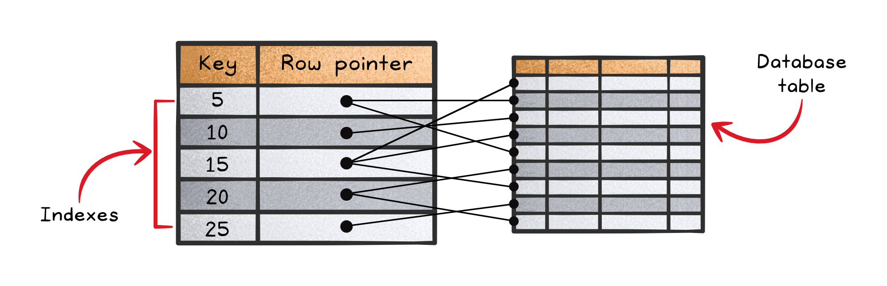
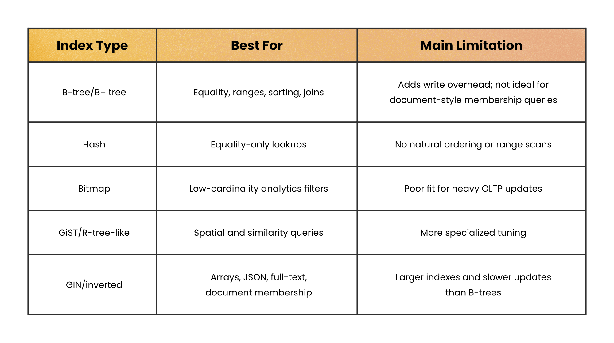
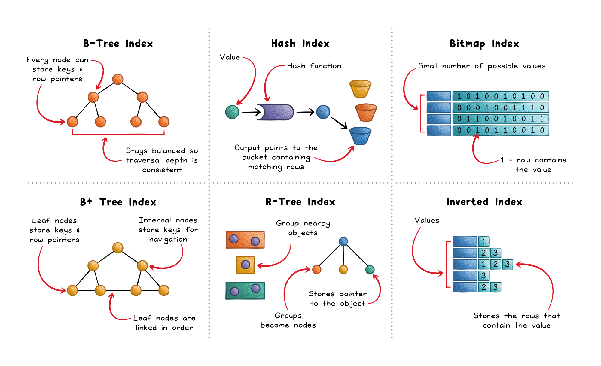

# Database Indexing

## Key Takeaways

- An index maps search keys to row locations — you trade extra write work so reads can skip unnecessary scanning
- B-tree/B+ tree is the default for most OLTP workloads; switch to specialized indexes (hash, bitmap, GIN, GiST) only when data characteristics clearly demand it
- The query optimizer uses cost modeling with statistics (row counts, selectivity, histograms) to decide whether an index is cheaper than a full scan — stale statistics break this decision
- Every INSERT/UPDATE/DELETE must also update indexes; more indexes = slower writes, fragmentation, and bloat over time

## How Indexes Work

An index maps search keys to row pointers, enabling the engine to jump directly to matching rows instead of scanning the entire table.

**Common use cases:**

- **Point lookups** — exact matches (`WHERE id = 42`) skip full table scans
- **Range queries** — `BETWEEN`, `<`, `>` work efficiently when keys maintain order
- **Joins** — indexes on join keys accelerate row matching
- **Ordering** — tree-based indexes return sorted rows without an extra sort step
- **Uniqueness** — unique indexes enforce single occurrence of values

## Index Types

| Index Type | Best For | Main Limitation |
|---|---|---|
| B-tree/B+ tree | Equality, ranges, sorting, joins | Write overhead; not ideal for document membership |
| Hash | Equality-only lookups | No ordering or range scans |
| Bitmap | Low-cardinality analytics filters | Poor fit for heavy OLTP updates |
| GiST/R-tree | Spatial and similarity queries | More specialized tuning |
| GIN/Inverted | Arrays, JSON, full-text, document membership | Larger indexes, slower updates |

## Query Optimizer Decision

The optimizer evaluates whether using an index costs less than full table access based on:

- Row counts and value distribution
- Selectivity metrics and histograms
- PostgreSQL: `ANALYZE` populates `pg_statistic`; tune `random_page_cost` vs `seq_page_cost`
- MySQL: `ANALYZE TABLE` manages histograms

**Stale statistics → suboptimal plans** even when good indexes exist.

## When Not to Index

- **Rarely queried columns** — unused indexes still degrade writes
- **Duplicate coverage** — overlapping leading columns create redundancy
- **Low selectivity** — if most rows match, full scan may be cheaper
- **Write-heavy workloads** — each index adds maintenance overhead per mutation
- **Function-wrapped columns** — `WHERE UPPER(name) = 'X'` can't use a plain index; needs an expression index

## Strategy

- Start with query patterns — index what you filter, join, and sort on
- Default to B-trees; switch only with clear justification
- Keep statistics fresh
- Favor fewer, well-targeted indexes with measurable value
- Re-evaluate periodically — workload changes can turn useful indexes into write penalties

---

**Source:** https://blog.levelupcoding.com/p/database-indexing-clearly-explained
**Date:** 2026-05-28
**Tags:** database, indexing, b-tree, query-optimizer, postgresql, mysql, performance
