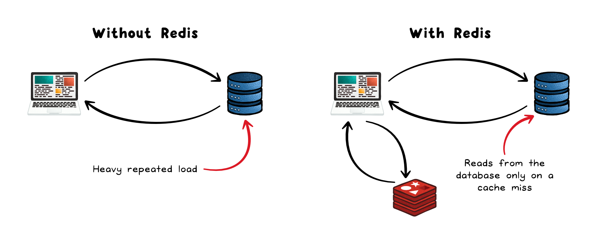
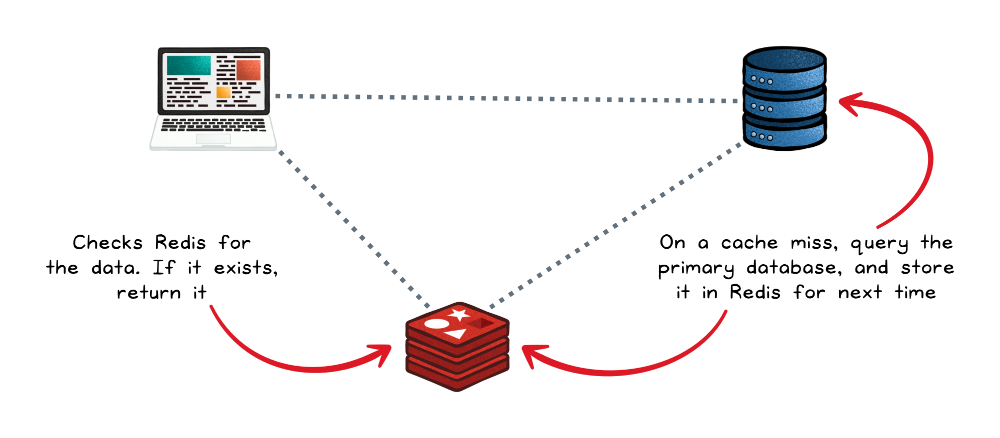
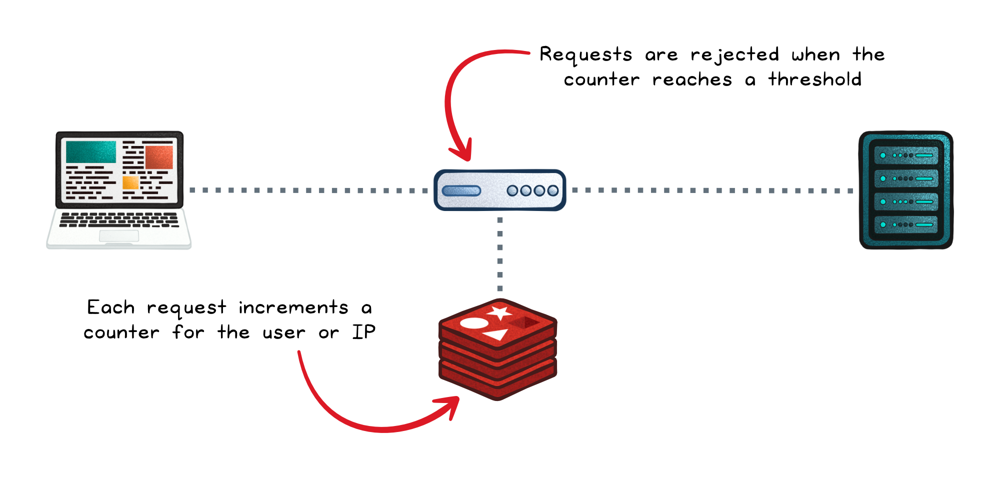

# Redis

## Key Takeaways

- Redis is an in-memory data store that serves as a **performance multiplier**, not a database replacement -- it complements primary databases for hot-path reads and transient state
- Its **single-threaded event loop** guarantees atomic operations without locks, making it ideal for counters, rate limiting, and session management
- Redis supports rich data structures (strings, hashes, lists, sets, sorted sets, streams) natively, enabling use cases far beyond simple key-value caching
- Persistence is optional via **RDB snapshots** (periodic full dumps) or **AOF logs** (append-only operation replay), each trading durability for performance
- Redis is a poor fit for large cold datasets, complex queries requiring joins, or workloads that demand strict ACID durability

## How Redis Works

Without Redis, every client request hits the primary database directly, creating heavy repeated load. With Redis sitting between the client and the database, most reads are served from memory in microseconds; the database is only queried on a cache miss.

### Execution Model

Redis uses a **single-threaded event loop**. All commands execute sequentially on one thread, which means:

- **No locking** -- operations are inherently atomic
- **No race conditions** -- one command finishes before the next starts
- **Predictable latency** -- no thread contention overhead

This design is why `INCR`, `SETNX`, and other atomic operations are safe without external synchronization.

### Data Structures

Redis is not just a key-value store. It provides native support for:

| Structure | Use Cases |
|-----------|-----------|
| **Strings** | Counters, flags, cached query results |
| **Hashes** | User profiles, session data |
| **Lists** | Queues, activity feeds |
| **Sets** | Tag systems, unique visitors |
| **Sorted Sets** | Leaderboards, priority queues |
| **Streams** | Event sourcing, message logs |

### Persistence

Persistence is optional but important for recovery:

- **RDB (Redis Database)** -- periodic point-in-time snapshots. Fast restores, but you lose data since the last snapshot.
- **AOF (Append-Only File)** -- logs every write operation. Higher durability, but larger files and slower restarts.
- **Both** -- commonly combined: AOF for durability, RDB for fast bootstrap.

## Where Redis Shines

### Caching

The most common use case. Redis sits in front of expensive database queries and serves repeated reads from memory.

The **cache-aside** (lazy-loading) pattern:

1. Application checks Redis for the data
2. On a **cache hit**, return immediately
3. On a **cache miss**, query the primary database, store the result in Redis with a TTL, then return

### Session Storage

Session data needs fast reads/writes and automatic expiration -- exactly what Redis provides. Set a key with `EX` (expire) and Redis handles cleanup.

### Rate Limiting

Redis atomic counters make rate limiting straightforward. Each request increments a per-user/IP counter with a TTL window. When the counter exceeds the threshold, requests are rejected.

### Pub/Sub and Queues

Redis supports publish/subscribe messaging and list-based FIFO queues for real-time communication between services.

## Benefits vs Trade-offs

| Dimension | What You Gain | What You Give Up |
|-----------|--------------|-----------------|
| **Performance** | Sub-millisecond reads; millions of ops/sec per node | -- |
| **Memory Model** | Extremely fast in-memory access | RAM is the ceiling; not suited for cold or archival data |
| **Data Model** | Native support for strings, sets, lists, sorted sets, streams with atomic ops | No relational model, no joins |
| **Query Flexibility** | -- | Cannot filter/query by non-key fields without redesign |
| **Operational Simplicity** | Minimal setup, no schema, broad client support | Requires manual tuning (TTL, eviction policies, memory limits) |
| **Availability** | Built-in replication, Sentinel, and Cluster support | Async replication can lead to data loss during failover |

## When Not to Use Redis

- **Large, infrequently-accessed datasets** -- RAM cost is prohibitive for cold storage
- **Complex queries** -- no joins, no scanning, no ad-hoc filtering by non-key fields
- **Maximum durability / ACID** -- async replication and optional persistence mean data loss is possible
- **Stateless systems** -- if nothing needs caching or transient state, Redis adds unnecessary complexity

---

**Source:** https://blog.levelupcoding.com/p/redis-clearly-explained
**Date:** 2026-05-31
**Tags:** redis, caching, in-memory, rate-limiting, session-storage, system-design, database
