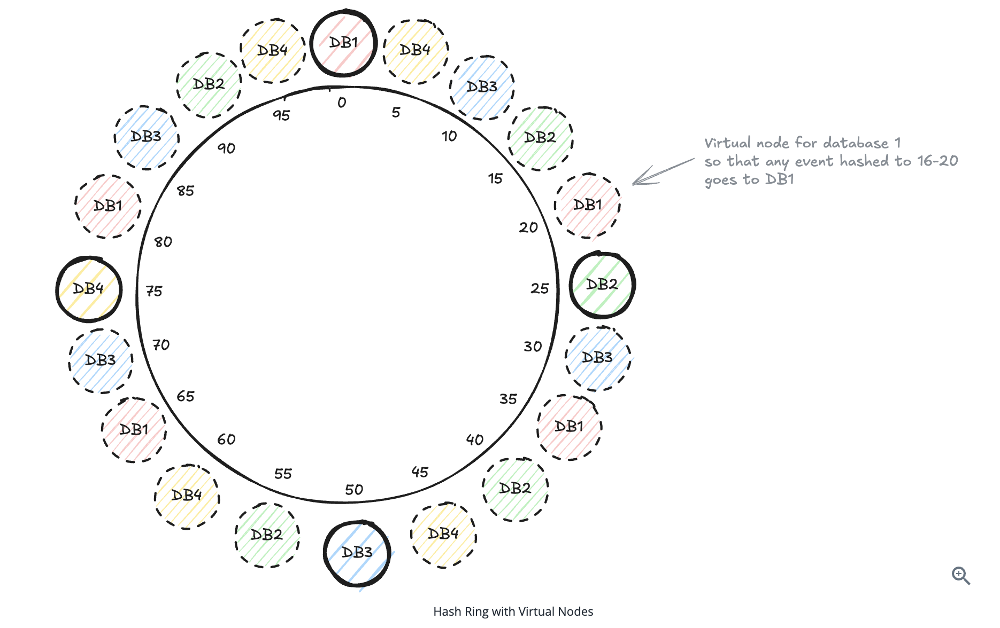

# Database Replication and Sharding

## Key Takeaways

- **Replication scales reads, sharding scales writes** — they solve different problems and are usually combined
- **Primary-Replica** is the default replication topology: one writer, N readers; trade-off is replication lag and stale reads
- **Sharding** splits data across nodes by a key; the choice of shard key is the single hardest decision because resharding is painful
- **Consistent hashing** minimizes key reshuffling when nodes join/leave — essential for distributed caches and shard maps
- **Write-Ahead Log (WAL)** is the durability mechanism underneath replication, point-in-time recovery, and change data capture

## Primary-Replica (Leader-Follower) Replication

```
            write
client ──────────────> Primary
                         │
                         │ async / semi-sync replication
                         ↓
                       Replica₁ ←── client read
                       Replica₂ ←── client read
```

- **Writes:** primary only
- **Reads:** any replica (or primary, for read-your-writes)
- **Replication mode:** async (fastest, lossy on failover) / semi-sync (waits for ≥1 replica) / sync (slow, safest)
- **Failover:** promote a replica to primary when primary fails; new replicas catch up from WAL

**Use when:** read traffic >> write traffic (social feeds, product catalogs, dashboards).

**Trade-off:** replication lag → stale reads. See [distributed-system-failure-modes.md](distributed-system-failure-modes.md) for routing reads by freshness need.

## Sharding (Horizontal Partitioning)

Split rows across N database servers using a **shard key**.

| Sharding scheme | How | Pros | Cons |
|---|---|---|---|
| **Range-based** | `user_id 0-1M → shard 0`, `1M-2M → shard 1` | Range queries efficient | Hotspots if data skewed |
| **Hash-based** | `shard = hash(user_id) % N` | Even distribution | Range queries hit all shards; resharding shuffles everything |
| **Directory-based** | Lookup service maps key → shard | Flexible | Lookup is a SPOF; extra hop |
| **Consistent hashing** | Hash key onto a ring; key goes to nearest node clockwise | Adding/removing nodes shuffles only ~1/N of keys | More complex; needs virtual nodes for balance |

### Picking a Shard Key

Bad keys (avoid):
- **Timestamp** — all new writes hit the latest shard (hotspot)
- **Auto-increment ID** — sequential writes hit one shard
- **Low-cardinality fields** — `country_code` for a US-heavy app

Good keys:
- **High cardinality** + **even distribution** of access (e.g., `user_id`, `tenant_id`)
- **Aligns with query patterns** — keep "queries by user" on one shard to avoid scatter-gather

### Pain Points

- **Cross-shard joins** — expensive scatter-gather; denormalize or duplicate
- **Cross-shard transactions** — usually require [distributed transactions](../distributed-transactions.md) (2PC or Saga)
- **Resharding** — adding a shard with hash mod N rebalances *everything*; consistent hashing or lookup-directory schemes avoid this

## Consistent Hashing

Used by Cassandra, DynamoDB, memcached clients, CDN routing, distributed caches.

```
hash space: 0 ────────────────────────── 2^32
                ●A         ●B    ●C
                 \          \    /
                  keys go    keys to
                  clockwise  the next
                  to A       node clockwise
```

Adding node `D` between `A` and `B`:
- Only keys that previously routed to `B` and now fall to `D` move
- ~`K/N` keys reshuffle, not all `K` keys
- **Virtual nodes** (each physical node placed at multiple ring positions) smooth out load imbalance and node-failure recovery

## Write-Ahead Log (WAL)

Every write is appended to a sequential log *before* the in-place update.

```
1. client: UPDATE accounts SET balance = 100 WHERE id = 42
2. DB:     append (txn=99, page=7, old=80, new=100) to WAL
3. DB:     fsync WAL
4. DB:     apply update to page 7 in memory
5. DB:     (async) flush page 7 to disk
```

If the DB crashes between 4 and 5, recovery replays the WAL from the last checkpoint to restore consistency.

**Why WAL matters beyond durability:**
- **Replication** — streaming the WAL to replicas is how primary→replica sync works
- **Point-in-time recovery** — replay the WAL up to a chosen timestamp
- **Change data capture** — tail the WAL to publish row-level changes as events (see [cdc.md](cdc.md))

**Trade-off:** every write becomes two writes (log + page). Log requires periodic checkpointing/compaction.

## Putting It Together

A typical large-scale stack:

```
          ┌─────────── Shard 0 ───────────┐
          │  Primary → Replica₁, Replica₂  │
          │  WAL → CDC → Kafka             │
          └────────────────────────────────┘
          ┌─────────── Shard 1 ───────────┐
          │  Primary → Replica₁, Replica₂  │
client →  │  WAL → CDC → Kafka             │  → app shards by user_id
          └────────────────────────────────┘
          ┌─────────── Shard N ───────────┐
          │  Primary → Replica₁, Replica₂  │
          │  WAL → CDC → Kafka             │
          └────────────────────────────────┘
```

Each shard internally uses primary-replica for read scaling; the shard map (often consistent-hashing-based) decides which shard. WAL underpins durability, replication, and CDC.

## Related

- [CDC](cdc.md) — change data capture built on WAL tailing
- [Distributed transactions](../distributed-transactions.md) — when writes must span shards
- [CAP](../cap.md) — consistency models for replicas
- [Distributed system failure modes](../distributed-system-failure-modes.md) — read-write splitting, replication lag

## Consistent Hashing with Virtual Nodes (Visual)

Virtual nodes solve the **uneven distribution** problem of naive consistent hashing — each physical database gets *multiple* hash-ring positions, so when a server is added or removed, the load redistributes smoothly across remaining servers instead of dumping all of one node's range onto its single neighbor.



## Sharding Strategies — Full Reference

The full menu of sharding strategies, with their tradeoffs:

| Strategy | One-Liner | Cardinality | Hotspot Risk | Range Queries | Rebalancing Cost | Typical Use Cases |
|---|---|---|---|---|---|---|
| **Range-Based** | Ordered key ranges (e.g., user_id 1–1M, 1M–2M) | Medium–High | High | Excellent | High | OLTP, ordered scans, analytics |
| **Hash-Based (Key-Based)** | `hash(key) % N` → shard | High | Low | Poor | High | High-throughput read/write, sessions |
| **Consistent Hashing** | Hash ring to minimize data movement | High | Low | Poor | Low | Distributed caches, elastic DBs |
| **Directory-Based** | Central directory maps key → shard dynamically | Any | Low | Depends | Low | Hot-key mitigation, multi-tenant |
| **Composite / Multi-Key** | Multiple dimensions (e.g., tenant_id + user_id) | Very High | Medium | Good (within primary key) | Medium | SaaS platforms, tenant isolation |
| **Time-Based** | By time windows (daily/monthly partitions) | Low–Medium per shard | Very High | Excellent | Medium | Logs, metrics, event streams |
| **Geo / Location-Based** | By geographic region (US, EU, APAC) | Low–Medium | Medium | Good (per region) | High | Global SaaS, data residency |
| **Tenant-Based** | Tenant or tenant group → dedicated shard | High | Medium | Good (per tenant) | Medium | Enterprise SaaS, compliance |
| **Entity-Group / Aggregate** | Co-locate related entities (order + items) | Medium–High | Medium | Poor | High | OLTP with strong consistency needs |
| **Two-Level / Hierarchical** | Coarse first, then sub-shard (region → hash(user_id)) | Very High | Low | Good (coarse level) | Medium | Planet-scale systems |
| **Hot / Cold (Tiered)** | Separate frequently-accessed from cold historical | Any | Low | Depends | Medium | Cost-optimized storage |
| **Functional / Vertical** | By domain or function (users, orders, payments) | N/A | Low | N/A | Low | Microservices, DDD |

### Good Sharding Key Properties

A sharding key should be evaluated on three axes:

- **Cardinality** — enough distinct values to spread across all shards (low cardinality = forced co-location)
- **Frequency** — relatively even access distribution (some skew is fine; orders-of-magnitude skew is a hotspot)
- **Monotonic change** — *avoid* monotonic keys for write-heavy workloads (e.g., timestamp or sequential ID as shard key) — newest shard gets all writes

### Horizontal vs Vertical Partitioning (Refresher)

- **Horizontal partitioning** — split *rows* across partitions (same columns, fewer rows per partition). e.g., one partition per year of orders. This is what most people mean by "sharding"
- **Vertical partitioning** — split *columns* across partitions (same rows, fewer columns per partition). e.g., frequently-accessed columns in one partition, large/rarely-used columns in another

---

**Source:** https://designgurus.substack.com/p/50-system-design-patterns-every-engineer
**Source:** https://www.hellointerview.com/learn/system-design/core-concepts/sharding
**Source:** /Users/vimittal/Downloads/prep/prep.html (sharding strategies table, virtual nodes image, sharding key properties, horizontal/vertical partitioning)
**Date:** 2026-06-04, updated 2026-06-13
**Tags:** database, replication, sharding, consistent-hashing, virtual-nodes, wal, partitioning, primary-replica, system-design, range-sharding, hash-sharding, directory-sharding, geo-sharding
