# Distributed System Failure Modes

## Key Takeaways

- Production failures rarely live inside the boxes of an architecture diagram — they hide in the *gaps between them*, where one operation succeeds and a coupled one fails silently
- Data persistence and event publishing are not atomic — treat them as one business fact (transactional outbox) or design explicitly for the gap
- Scaling reads via replicas introduces consistency decisions — classify queries by freshness need; don't treat all reads the same
- Queues defer load, they don't remove it — monitor **oldest-message age** alongside depth, and use backpressure before backlog becomes an incident
- Data contracts break when shape *or meaning* drift — use expand/contract migrations, contract tests, and version only when behavior must change
- **Foundational failure modes** (network partition, split-brain, partial/gray failures, amplification, cascade) are properties of distributed topology itself — independent of architectural choices
- **Gray failures** are the most insidious — self-checks pass while real work silently fails; never trust a node's opinion of its own health

> "Architecture diagrams show how systems connect. Production shows how they disagree."

## 1. The Dual-Write Problem

A single business action updates two independent systems. The naive code works for months — until it doesn't.

```
saveOrder(order);
publishEvent(order); // ← broker hiccups, this fails silently
```

DB commit succeeds. Publish fails. API returns 200. The order exists in one place but is invisible to inventory, email, shipping, analytics.

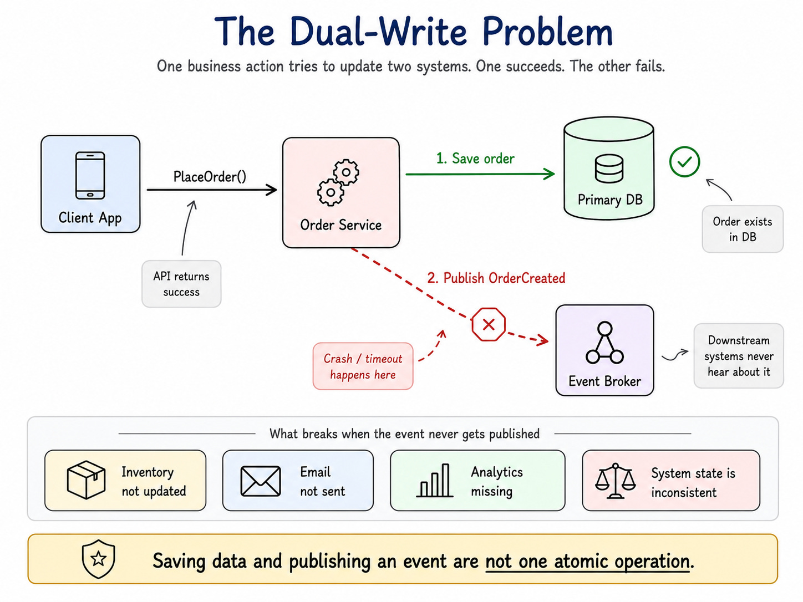

### Transactional Outbox Pattern

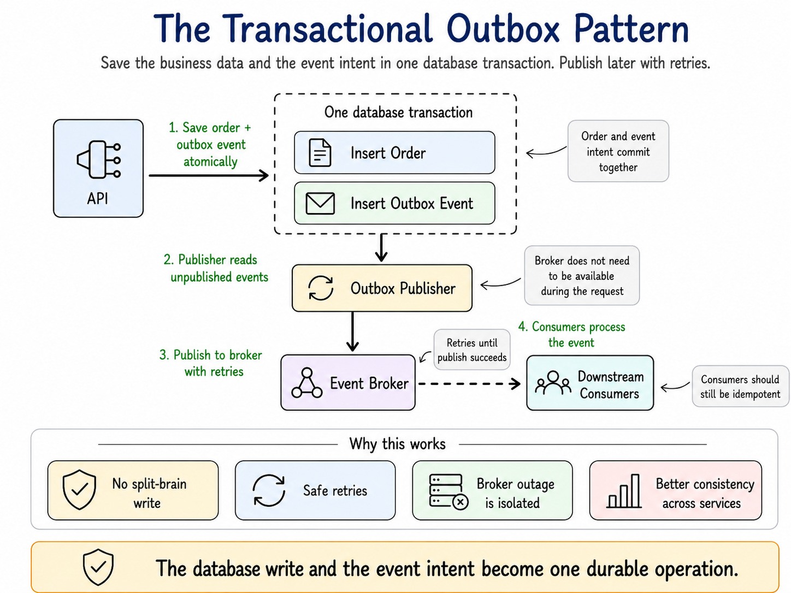

1. Within the same DB transaction, save the order AND insert an event row into an `outbox` table
2. A background relay reads the outbox and publishes events
3. Failures retry from durable state

**Caveats:**

- Publisher can crash *after* publishing but *before* marking the row sent → duplicates
- Consumers must be **idempotent** (use idempotency keys)
- Outbox guarantees **at-least-once**, not exactly-once
- Monitor outbox table growth — a swelling table signals a slow or stalled publisher

## 2. Read-Write Splitting

Reads scale via replicas, caches, and materialized views. Writes don't, because of truth ownership, conflicts, and sync delay.

### Replication Lag Timeline

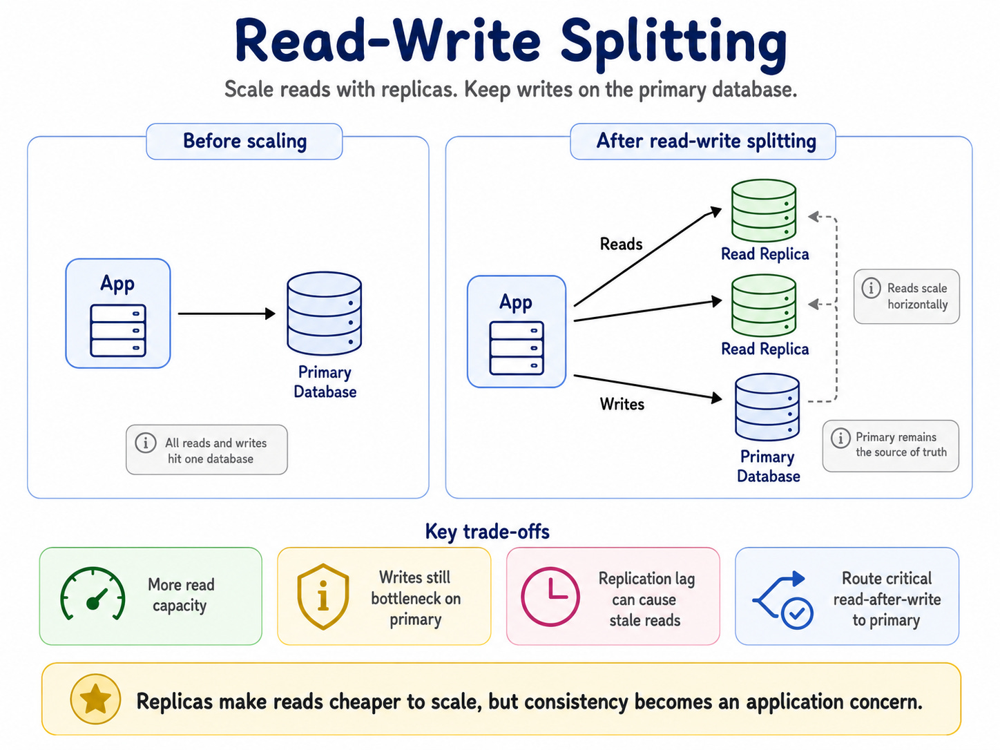

| Time | Event |
|---|---|
| T0 | User submits write |
| T1 | Primary commits |
| T2 | User refreshes page, query lands on replica (returns stale data) |
| T3 | Replica catches up |

Between T1 and T3 the system shows contradictory state.

### Classify Reads by Freshness Need

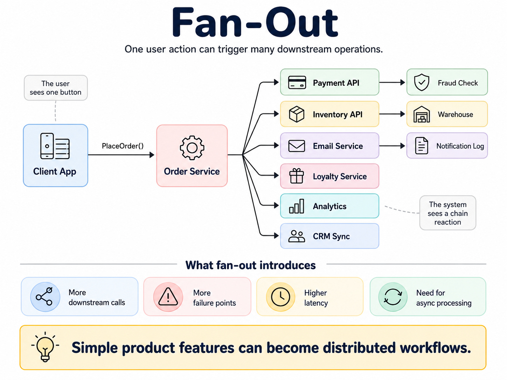

| Query | Where to route |
|---|---|
| "Show me the order I just placed" | Primary |
| "Did my payment succeed?" | Primary |
| "What is my account balance?" | Primary |
| "Can I withdraw this amount?" | Primary |
| Recommendations, trending, search | Replica / cache |
| Dashboards, analytics | Replica / cache |
| Recently viewed | Replica / cache |

### Read-Your-Writes

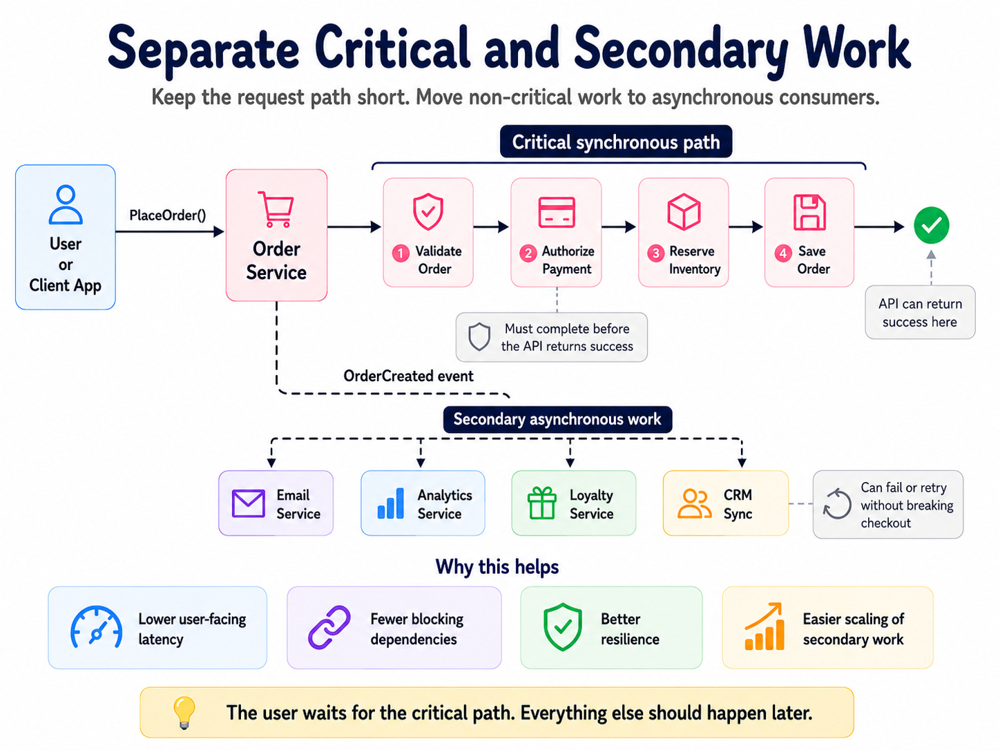

After a user writes, **pin their next reads to the primary for a short window** so they see their own changes. Avoids forcing all traffic to the primary while still preventing the "I just submitted this, where did it go?" experience.

**Practical step:** pick 3 critical queries (balance, latest order, payment result), verify whether they currently read from replicas, add routing logic if needed.

## 3. Fan-Out

One click → many downstream operations: payment auth, inventory reservation, shipment creation, confirmation email, loyalty points, analytics, fraud detection, CRM sync, recommendations.

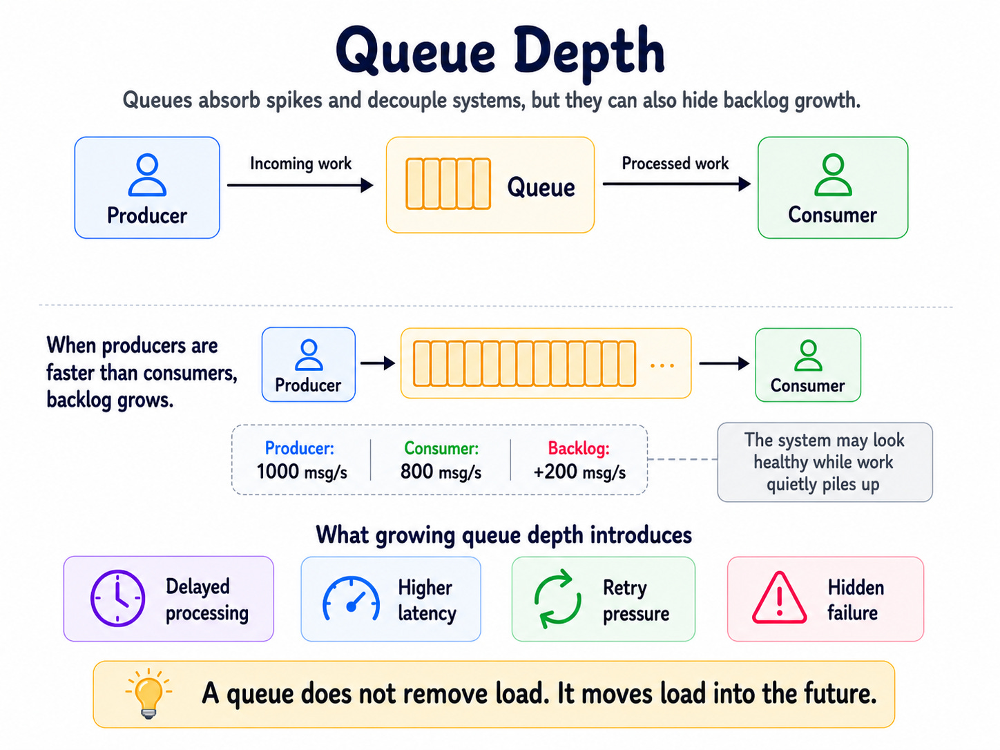

Partial failures create ambiguous states that support can't explain: payment OK / inventory fail, inventory OK / email fail, fraud timeout while order ships anyway.

### Critical Path Separation

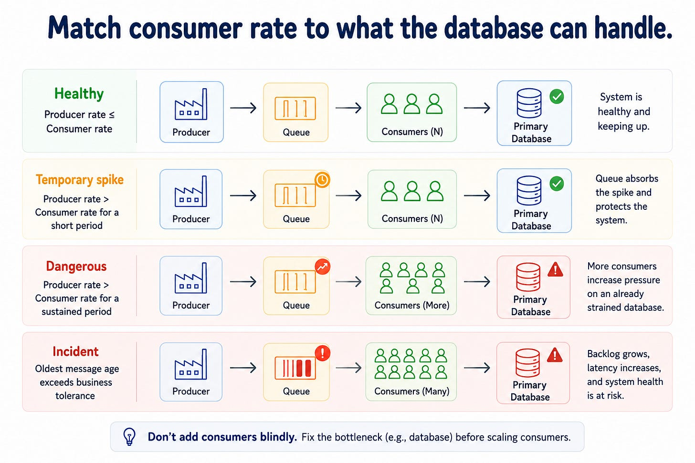

- **Critical (sync, must complete before returning success):** validate order → authorize payment → reserve inventory → save order
- **Secondary (async via events):** email, loyalty, analytics, CRM, recommendations

Checkout no longer fails because the email provider is down.

**Once async, you need:**

- Duplicate event handling (idempotency keys)
- Retry + Dead Letter Queues
- **Correlation IDs** for tracing distributed workflows — without these, debugging is guesswork
- Distributed observability

## 4. Queue Depth

Queues defer load. They don't remove it. They absorb spikes and decouple producers from consumers — but they can also hide failure.

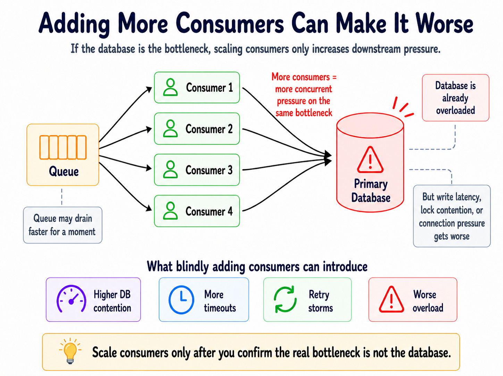

**Concrete arithmetic:**

| Rate | Result |
|---|---|
| Producer 1,000 msg/s, consumer 800 msg/s | Falling behind 200/s |
| 10 minutes | 120K excess messages |
| 1 hour | 720K excess messages |

Nothing crashes. Dashboards stay green. Users feel late emails, stale inventory, lagging analytics.

### Measure Together, Not in Isolation

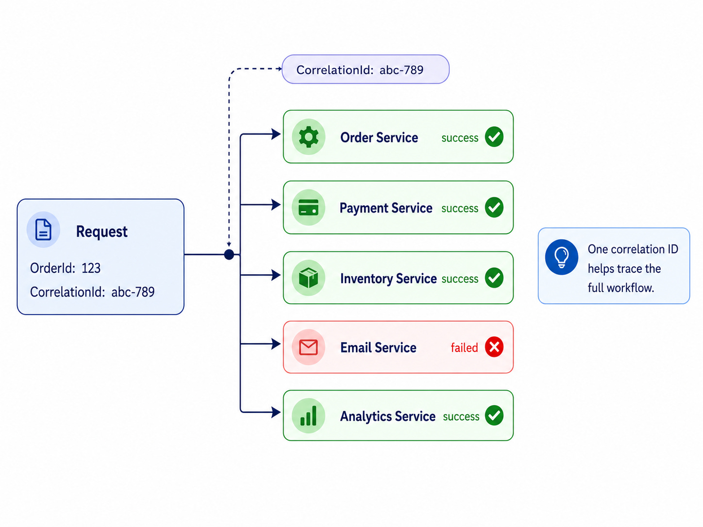

Track these *together*: queue depth, **oldest-message age**, producer rate, consumer rate, retry count, DLQ count, consumer error rate.

> **Oldest-message age often matters more than depth.** 100K messages draining fast is healthy. 500 messages where the oldest is 6 hours old is broken.

### Response Options (In Order)

1. **Add consumers** — only if consumer CPU is the bottleneck
2. **Apply producer backpressure** — slow down the source
3. **Shed non-critical work** — drop or defer low-priority messages
4. **Split workloads** into separate queues — isolate fast paths from slow ones
5. **Optimize consumer logic** — fix N+1 queries, batching, etc.
6. **Fix downstream bottlenecks** — the real issue may be DB locks, connection pool exhaustion, rate limits

**Critical mistake:** blindly adding consumers when the bottleneck is downstream — more consumers just amplify pressure.

**Backpressure mechanisms:** reject non-critical work, disable expensive features, prioritize critical workloads.

**Practical step:** pick one production queue, add two alerts — depth > threshold AND oldest-message age > 5 minutes.

## 5. Schema Evolution

Every data dependency (APIs, events, tables, files) is a contract. Field renames break consumers. Semantic drift corrupts data silently.

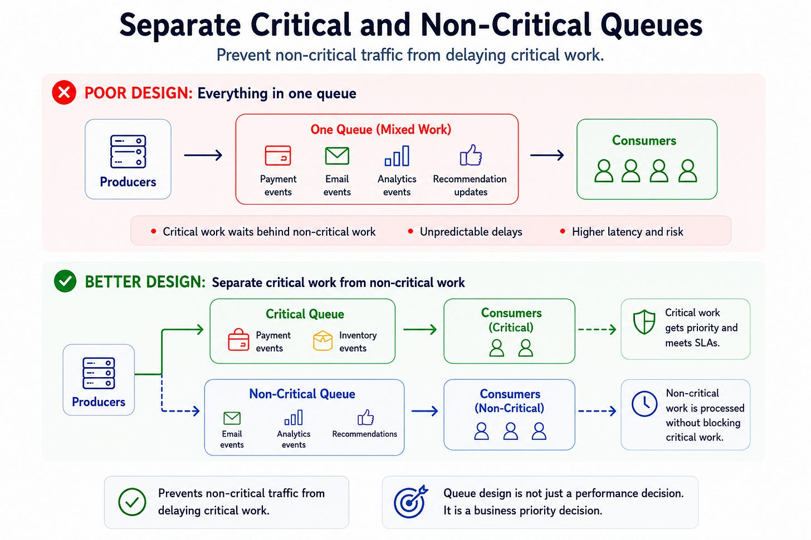

**Silent failure mode:** producer works, deploy succeeds, tests pass — but consumers read `null`, skip calculations, write incorrect data, generate wrong metrics. Silent data corruption is harder to detect than broken requests.

### Expand/Contract Pattern

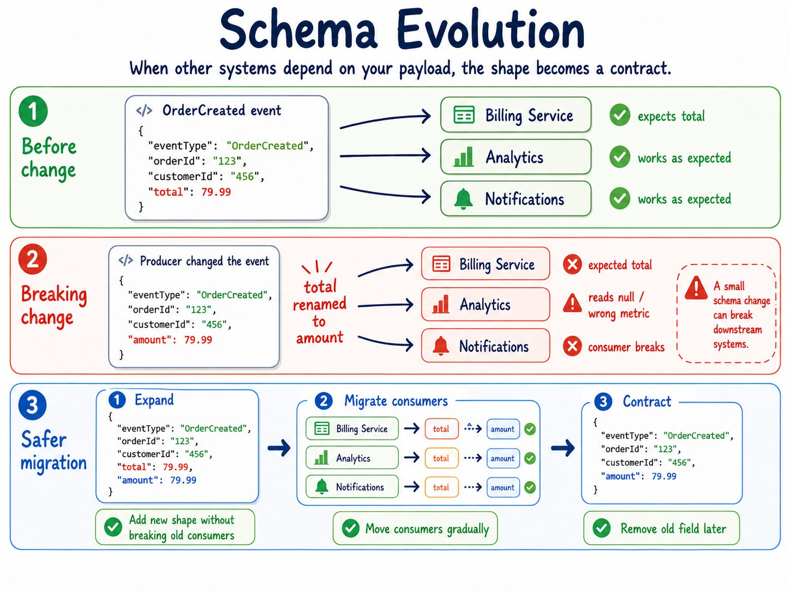

1. **Expand:** producer emits both old and new fields
2. **Migrate:** consumers move to new field one by one
3. **Monitor:** track old-field usage until it hits zero
4. **Contract:** producer removes old field

Avoids coordinated multi-team deploys.

### Semantic Breaking Changes

A field named `active` can mean:

- account-created
- email-verified
- subscription-active
- logged-in-within-30-days

Name and type are unchanged. Meaning has drifted. Requires clear ownership, documentation, contract tests, explicit event definitions.

### Versioning Discipline

> "If existing consumers continue working unchanged, you probably don't need a new version. If any must change behavior to remain correct, you do."

- Add fields freely
- Bump version when meaning changes

## Foundational Failure Topology

The five patterns above are *implementation-level* failures specific to how services talk to each other. Below them sit six **foundational failure modes** that are properties of distributed topology itself — they show up regardless of architectural choices.

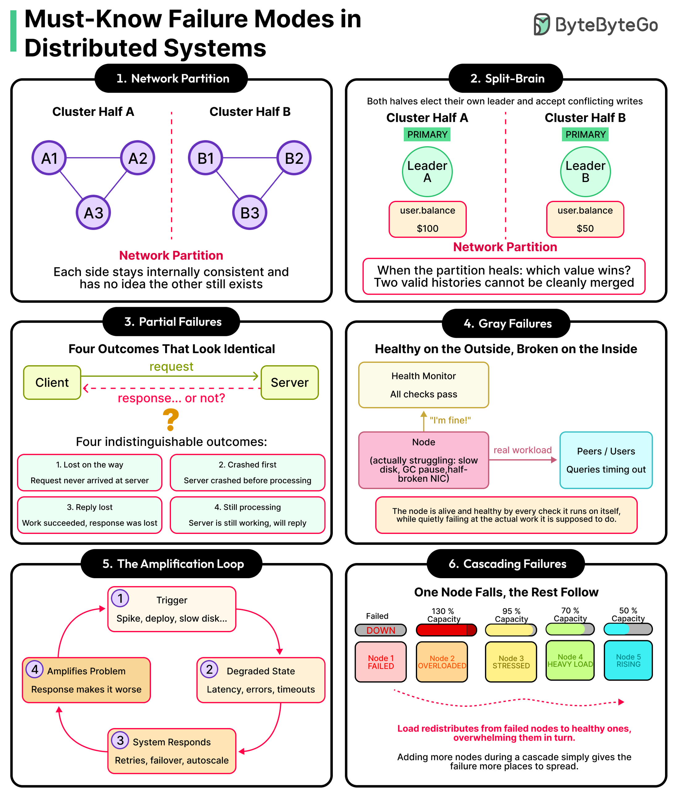

### 6. Network Partition

A subset of nodes loses connectivity to the rest. Each side stays internally consistent and has **no idea the other still exists**. This is the foundational issue behind CAP theorem — once communication breaks, you must choose between consistency and availability.

### 7. Split-Brain

When a partition occurs, both halves can elect their own leader and accept conflicting writes:

- Side A: `user.balance = $100`
- Side B: `user.balance = $50`

When the partition heals, *which value wins?* Two valid histories cannot be cleanly merged.

**Prevention:** quorum-based leader election (majority required), fencing tokens to invalidate stale leaders, prefer CP over AP for state that can't safely diverge.

### 8. Partial Failures

When a request times out, four outcomes are indistinguishable from the client's perspective:

| # | Outcome | What actually happened |
|---|---|---|
| 1 | Lost on the way | Request never arrived at server |
| 2 | Crashed first | Server crashed before processing |
| 3 | Reply lost | Work succeeded, response was lost in transit |
| 4 | Still processing | Server is still working, will reply eventually |

The client cannot tell which. This is **why retries need idempotency** — outcome 3 and 4 mean the work already happened or is happening. See [retries.md](api/retries.md).

### 9. Gray Failures

> "The node is alive and healthy by every check it runs on itself, while quietly failing at the actual work it is supposed to do."

A node says "I'm fine" to the health monitor — but real workload (queries from peers/users) is timing out. Cause: slow disk, GC pause, half-broken NIC, full connection pool. Self-checks pass because they don't exercise the failing path.

**Mitigation:**

- Monitor from the **user's perspective** (synthetic transactions, end-to-end probes), not the node's
- Track tail latencies, not averages
- Cross-check node health against peer observations — a node that everyone else thinks is slow probably is

### 10. The Amplification Loop

A negative feedback loop where the system's response to a problem makes the problem worse:

```
1. Trigger (spike, deploy, slow disk)
   ↓
2. Degraded state (latency, errors, timeouts)
   ↓
3. System responds (retries, failover, autoscale)
   ↓
4. Amplifies problem (more load on degraded system)
   ↓
   back to 1
```

**Mitigation:** circuit breakers, retry budgets, exponential backoff + jitter, backpressure, load shedding. See [retries.md](api/retries.md) and [circuit-breakers.md](circuit-breakers.md).

### 11. Cascading Failures

One node fails → its load redistributes to remaining nodes → they're overwhelmed at 130% capacity → they fail → load redistributes again → next tier fails. Each step looks like normal failover; the cumulative effect is total collapse.

> "Adding more nodes during a cascade simply gives the failure more places to spread."

**Mitigation:**

- **Capacity headroom** — never run nodes at >50–60% steady state so survivors can absorb load
- **Load shedding** — drop non-critical work before saturating
- **Blast-radius isolation** — cells, shards, bulkheads so failure can't escape its zone
- **Brownout before blackout** — degrade service gracefully (slow path, cached data) rather than crash

## How These Connect

The 11 patterns split into two layers:

**Implementation-level** (1–5) — *how your services disagree with each other*:

| Pattern | Production question it explains |
|---|---|
| Dual-write | Did the DB commit *and* the event publish? |
| Read-write splitting | Did the replica catch up before the user refreshed? |
| Fan-out | Which downstream succeeded? Which need retry? |
| Queue depth | Is the queue draining or just absorbing? |
| Schema evolution | Did the consumer parse what the producer sent? |

**Topology-level** (6–11) — *how distributed systems fail by their nature*:

| Pattern | Production question it explains |
|---|---|
| Network partition | Can these nodes still talk? |
| Split-brain | After partition heals, which history is real? |
| Partial failures | Did the request happen, or not? |
| Gray failures | Is this node actually healthy, or just lying? |
| Amplification | Is our recovery making things worse? |
| Cascade | Will losing this node take down the next one? |

**Cross-references:**

- [retries.md](api/retries.md) — idempotency for partial failures, retry budgets for amplification
- [event-driven.md](event-driven.md) — outbox, fan-out, event sourcing
- [database/cdc.md](database/cdc.md) — change data capture as an outbox alternative
- [circuit-breakers.md](circuit-breakers.md) — breaking amplification loops and isolating cascades

---

**Source:** https://newsletter.systemdesignclassroom.com/p/most-system-design-mistakes-hide--between-the-boxes
**Source:** ByteByteGo infographic — Must-Know Failure Modes in Distributed Systems
**Date:** 2026-06-01
**Tags:** system-design, distributed-systems, dual-write, outbox-pattern, read-replicas, replication-lag, fan-out, queues, backpressure, schema-evolution, idempotency, event-driven, reliability, network-partition, split-brain, partial-failures, gray-failures, cascading-failures, cap-theorem
