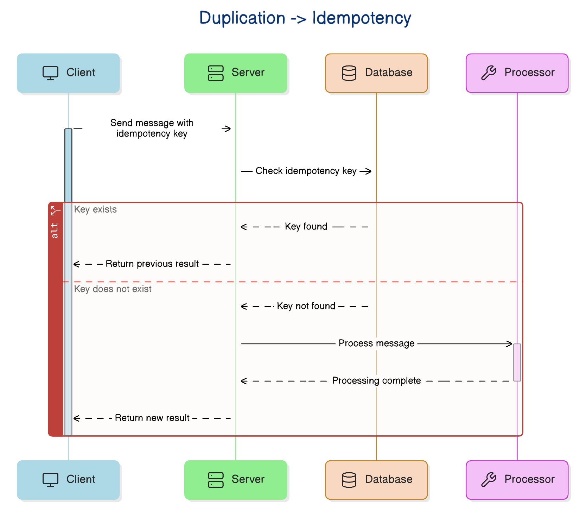
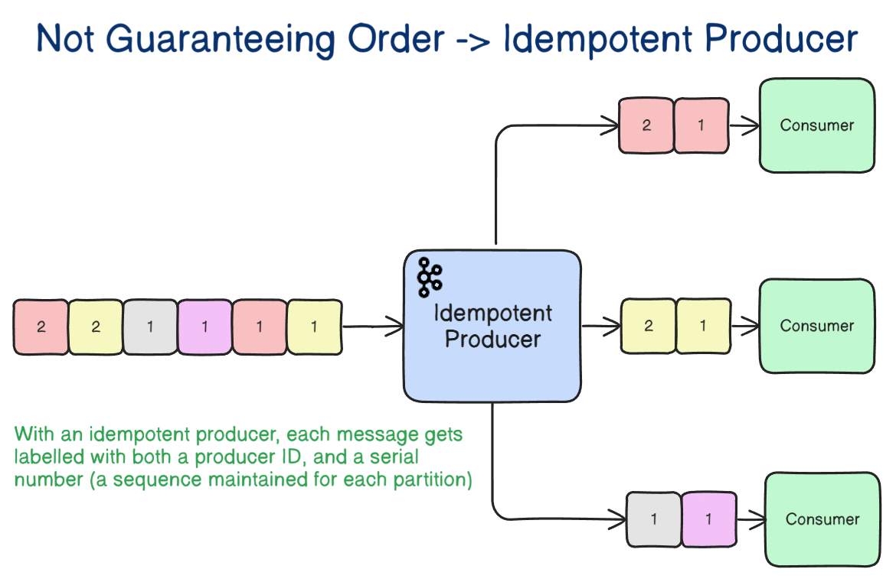
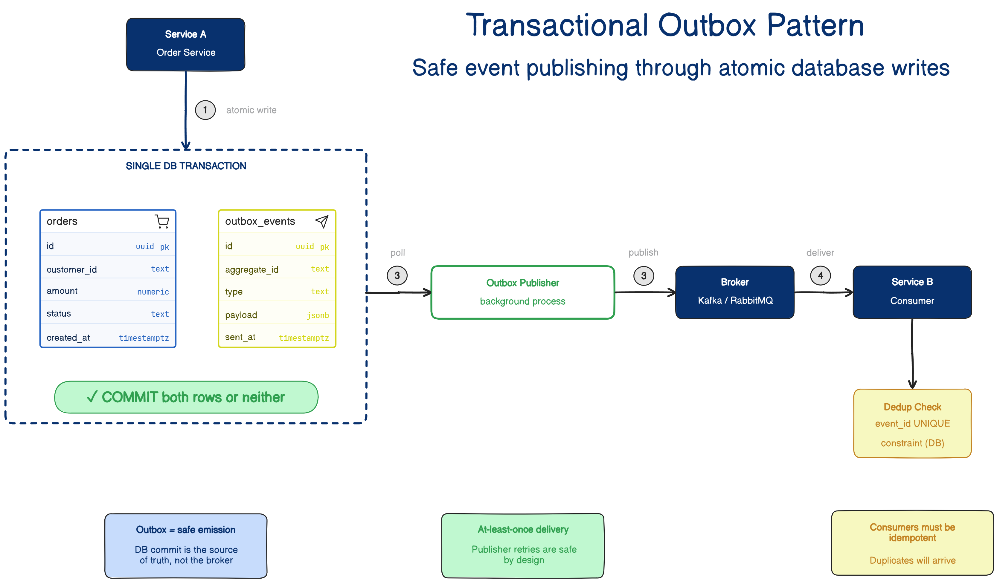
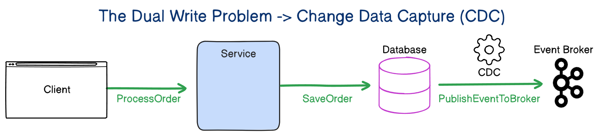
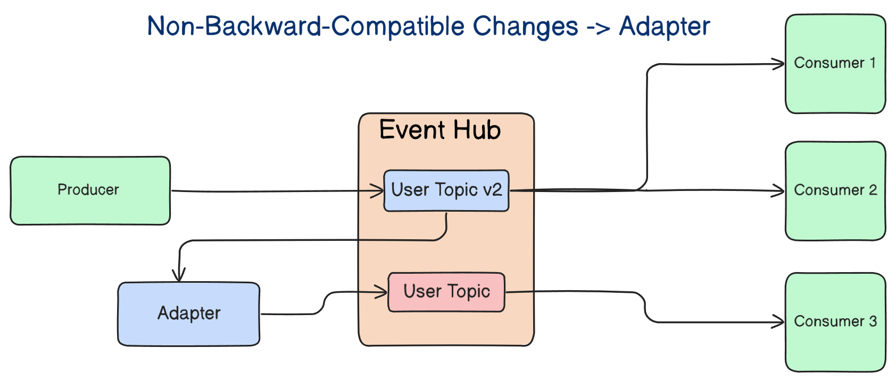

# Event-Driven Systems: Easy to Build, Hard to Keep Correct

## Key Takeaways

- Event-driven failures manifest as **correctness bugs** (duplicate charges, out-of-order refunds, missing notifications), not availability outages -- green dashboards coexist with broken business logic
- **Idempotency is non-negotiable**: duplicate delivery is normal in distributed systems; consumers must deduplicate atomically with business updates using stable event IDs
- **Ordering guarantees are local, not global**: partition by business entity (e.g., all events for `order-123` in one partition) rather than depending on system-wide ordering
- The **dual-write problem** (DB write + event publish without a shared transaction) causes silent divergence; the transactional outbox pattern is the strong default
- **Schema changes are contract changes**: enforce backward compatibility via registries, CI checks, and adapters -- treat events with the same seriousness as a public API

## Duplication Breaks Correctness

Duplicate event delivery is not a bug -- it is the normal operating mode of distributed messaging. Duplicates arise from consumer crashes before acknowledgment, producer timeout retries, and broker redelivery during failover.

**Business impact of unhandled duplicates:**

- `PaymentCaptured` processed twice = duplicate charges
- `InventoryReserved` twice = inventory overshooting
- `OrderConfirmed` twice = duplicate shipments and emails

**Solution -- idempotency:**

- Events carry stable, unique IDs
- Consumers check for prior processing before applying effects
- The deduplication record and business update happen **atomically** (e.g., a unique constraint on `event_id` in the database)
- For external services (email, payment gateways), pass idempotency keys that those systems understand

> The safest versions of this pattern make the business update and the deduplication record happen atomically. A unique constraint on `event_id` in a database table can go a long way.

**Trade-offs:** Extra storage, retention decisions, and consumer complexity are predictable costs. Duplicate side-effect costs are not.

## Ordering Assumptions Collapse

Local test environments are "too polite" -- sequential delivery, fast consumers, no retries. Production introduces out-of-order delivery through network delays, retries reintroducing older events, and parallel consumers finishing in different sequences.

**Business consequences:**

- Refunds processing before payments
- Accounts closing before final balance adjustments
- Shipments marked delivered before shipping event arrives

**"Kafka preserves order" is incomplete.** Broker-level ordering within a single partition differs from global ordering across the system.

**Practical approach -- partition by entity:**

Partition by the entity whose timeline must remain consistent. All events for `order-123` land in the same partition, giving a realistic path to local ordering where it matters.

**Design safeguards:**

- Sequence numbers and aggregate versions on events
- State-machine validation (reject impossible transitions)
- Detection of stale events
- Reduce dependence on strict ordering -- it is expensive, fragile, and easy to lose at scale

## The Dual Write Problem

When a service performs two separate operations -- save to database, then publish to broker -- either can succeed while the other fails. There is no shared transaction boundary.

**Failure scenarios:**

| Scenario | Result |
|---|---|
| DB succeeds, publish fails | Order exists but downstream (billing, shipping, analytics) never learns about it |
| Publish succeeds, DB fails | Downstream reacts to a phantom order that does not exist in the source of truth |

> The dual write problem is so dangerous. It does not usually create a loud outage. It creates silent divergence.

### Solution: Transactional Outbox Pattern

1. Service writes **two records in one local database transaction**: the business change + an outbox row representing the event
2. A separate **outbox publisher** process polls the outbox table and sends events to the broker
3. The atomic boundary moves to the database, which you already control

**Remaining considerations:**

- The publisher can still retry, so consumers still need idempotency
- The publisher needs ordering discipline to avoid reintroducing ordering bugs

### Alternative: Change Data Capture (CDC)

CDC captures committed database changes from transaction logs and converts them to events. It works well for database-driven integration but adds operational complexity (connectors, lag, replay, schema mapping, debugging).

## Schema Changes Break Systems Quietly

A producer changes a schema, deploys cleanly, and trouble begins downstream because **events are contracts, not implementation details**.

**Breaking changes that look harmless:**

- Required fields removed
- Fields renamed (looks local, breaks consumers)
- Field semantics change (technically compatible, business meaning breaks)
- Nested objects restructured

### Contract Evolution Rules

| Change Type | Safety |
|---|---|
| Adding optional fields | Usually safe |
| Removing required fields | Usually breaking |
| Renaming fields | Breaking |
| Changing field semantics | Most dangerous |

**Enforcement mechanisms:**

- **Versioning** makes change visible
- **Schema-aware formats** (Avro, Protobuf) force compatibility thinking
- **CI compatibility checks** catch breaking changes pre-deployment
- **Schema registries** enforce rules before events reach consumers

### Adapter Pattern for Migration

An adapter translates a new event shape into an older one so legacy consumers keep working while the system migrates gradually. This eliminates synchronized deployments and avoids forcing multiple teams into a single rollout window.

> Schema evolution is not just a serialization concern. It is a coordination concern. It tests whether teams understand that shared events create shared responsibility.

## Design Beyond the Happy Path

Teams design the happy path in detail (event existence, publishers, subscribers, nominal workflow) while treating failure behavior as cleanup. The result: systems that are elegant in diagrams and messy in production.

**Evaluate your event-driven system by what happens when:**

- The same message arrives twice
- Event 8 arrives before event 7
- The broker is healthy but publish fails
- Teams change contracts without understanding dependents

### Core Assumptions for Production Systems

Design with these as **givens**, not possibilities:

1. **Duplicates will happen** -- require idempotency
2. **Order will break somewhere** -- validate state transitions
3. **Two-step writes will diverge** -- use the outbox pattern
4. **Schemas will change before everyone is ready** -- enforce compatibility

> Event-driven architecture does not remove complexity. It moves it into retries, consistency boundaries, replay, and contracts. You still pay the bill. You just pay it in different places.

---

**Source:** https://newsletter.systemdesignclassroom.com/p/event-driven-systems-are-easy-to-build-but-hard-to-keep-correct
**Date:** 2026-04-25
**Tags:** event-driven, distributed-systems, idempotency, outbox-pattern, cdc, schema-evolution, system-design
