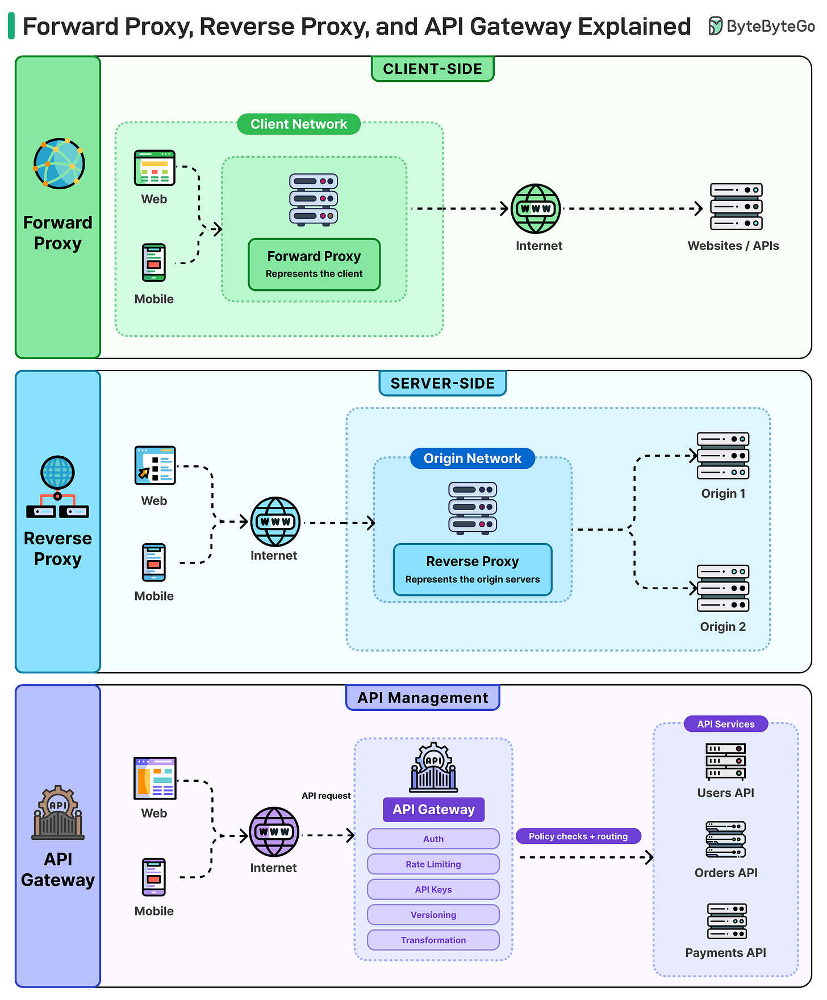

# Forward Proxy, Reverse Proxy, and API Gateway Explained

## Key Takeaways

- Forward proxy sits client-side — hides client identity, enforces outbound policies
- Reverse proxy sits server-side — hides backend topology, terminates TLS, load balances
- API gateway is a reverse proxy with superpowers — auth, rate limiting, API keys, versioning, transformation
- In production, all three often operate together at different layers

## Forward Proxy (Client-Side)

The proxy forwards requests on behalf of the client. The destination never sees the client's real IP.

- Enforces network policies and restricts access to certain websites
- Optimizes bandwidth through traffic caching
- Represents the client to the outside world

## Reverse Proxy (Server-Side)

Sits in front of backend servers, masking infrastructure complexity from clients.

- Client has no idea how many machines are behind it
- Proxy decides who handles the request, terminates TLS, and keeps backends off the public internet
- Common tools: NGINX, HAProxy
- Typically works alongside load balancers

## API Gateway (API Management)

A reverse proxy with extended capabilities. Essential when multiple services need consistent policy enforcement.

- Authentication
- Rate limiting
- API key validation
- Versioning
- Request/response transformation

Becomes critical when ten services need the same auth and rate limiting rules applied consistently.

## In Production

All three operate in tandem across different layers:
- **Forward proxies** filter outbound traffic
- **Reverse proxies** protect application servers
- **API gateways** enforce consistent policies before requests reach backend services

---

**Source:** https://blog.bytebytego.com/i/198874402/forward-proxy-reverse-proxy-and-api-gateway-explained
**Date:** 2026-05-23
**Tags:** proxy, api-gateway, networking, system-design
