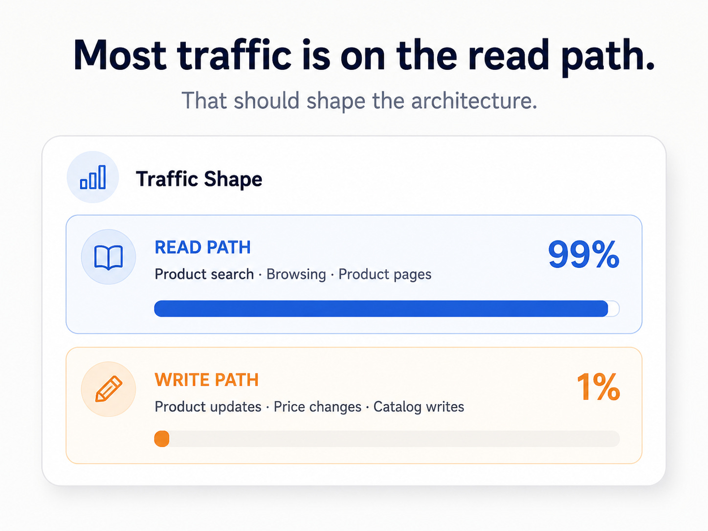
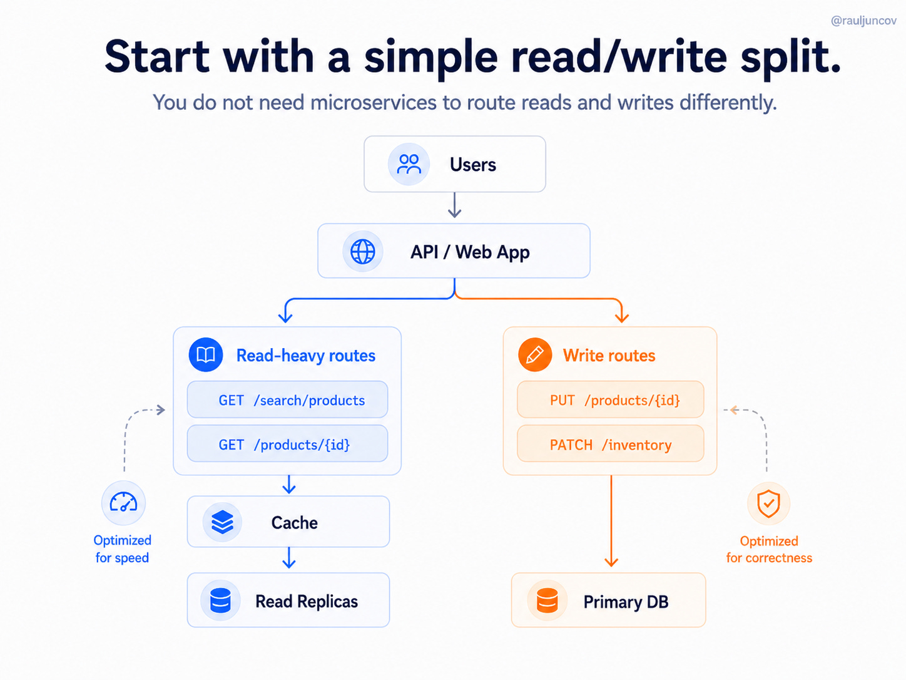

# Hot-Path-First System Design

A design discipline: before reaching for caches, replicas, or new services, **identify which parts of the system are actually hot** — the endpoints under real pressure — and scale *those*. The opposite (uniform scaling, tool-collecting) wastes effort and adds complexity without addressing the real bottleneck.

## Key Takeaways

- **"You don't scale the whole system. You scale what is hot."** Production traffic is uneven by default — typically ~99% reads, ~1% writes in catalog-style workloads. Treating them uniformly over-engineers writes and under-serves reads
- **Reads need speed; writes want correctness.** They belong on different paths with different storage, different freshness budgets, and different optimization targets
- **Distinguish three traffic classes**, not two: **display reads** (can tolerate brief staleness), **decision reads** (need current data — checkout prices, inventory, payment status), and **writes** (correctness-bound)
- **Measure before architecting.** Which endpoints get most traffic? Which queries consume most DB time? Which flows degrade during spikes? Which reads can accept eventual consistency? Without these, "the system feels slow" becomes the requirement document
- **Caching has a bill.** Short TTLs increase DB load; long TTLs widen the stale-data window. Replicas introduce lag. Effective design names the bill explicitly instead of hiding it

## The Traffic Reality

Most production systems are **dramatically read-heavy** — and the architecture should follow.

For e-commerce, browsing vastly outnumbers catalog updates. For a chat app, message reads outnumber message writes. For an analytics tool, dashboard views outnumber data ingestion events. **The ratio is rarely close to 50/50** — and architectures that assume balance over-protect writes while leaving reads contended.

## The Simple Read/Write Split

The first architectural move — before microservices, before queues, before any specialization — is **route reads and writes through different paths**:

- **Read-heavy routes** (e.g., `GET /search/products`, `GET /products/{id}`) → cache → read replicas. **Optimized for speed**
- **Write routes** (e.g., `PUT /products/{id}`, `PATCH /inventory`) → primary DB. **Optimized for correctness**
- **No microservices needed** to do this — the same monolith can route reads and writes differently

This single split unlocks most of the read-scaling benefit without any of the operational cost of going to microservices.

## The Three Traffic Classes (Not Two)

| Class | Examples | Tolerates staleness? | Where it goes |
|---|---|---|---|
| **Display reads** | Product page, search results, recommendations, home feed | Yes (seconds to minutes) | Cache → read replicas |
| **Decision reads** | Checkout price, inventory check, payment status, balance | **No** — must be current | Primary DB (or dedicated consistency path) |
| **Writes** | Place order, update inventory, change price | N/A (the source of truth) | Primary DB |

The trap is collapsing decision reads into display reads — then a user sees `In stock` on the product page, clicks Buy, and hits a stale read at checkout that says it's still available. The order goes through, you can't fulfill it, and you've created a customer support problem and an inventory inconsistency that's now harder to reconcile.

## The Methodology — Measure First

Before any architectural change, produce four answers from production signals:

1. **Which endpoints receive most traffic?** (RPS by route)
2. **Which queries consume most database time?** (slow query log, DB CPU per query)
3. **Which flows degrade during spikes?** (p95/p99 latency by flow, correlated with traffic events)
4. **Which reads can accept eventual consistency?** (per-endpoint decision — not a system-wide property)

### The Endpoint Classification Table

Turn the above into a single table — this is the artifact that converts "the system feels slow" into concrete design guidance:

| Endpoint | RPS | Freshness need | Strategy |
|---|---|---|---|
| `GET /search/products` | 12K | ~minutes OK | Cache (TTL 60s) + read replica fallback |
| `GET /products/{id}` | 8K | ~seconds OK | Cache (TTL 30s) + invalidate on price change |
| `POST /checkout` | 200 | Real-time required | Primary DB, no cache |
| `GET /inventory/{sku}` (checkout) | 200 | Real-time required | Primary DB |
| `GET /inventory/{sku}` (display) | 5K | ~minutes OK | Cache (TTL 60s) |
| `PUT /products/{id}` | 50 | N/A (write) | Primary DB + emit invalidation event |

Note that the *same query* (`/inventory/{sku}`) appears twice with different strategies depending on whether it's called from the display path or the decision path.

## The Three Key Techniques

### 1. Cache with Invalidation Strategy

Cache works when the same data is requested repeatedly. But **TTL-only invalidation** quietly serves stale data — fine for display, dangerous for decisions.

For correctness-sensitive cached data:

- Use the **outbox pattern** — write to DB and emit an invalidation event in the **same transaction** (see [event-driven.md](event-driven.md))
- Cache consumers must be **idempotent** — duplicate invalidation events are normal in distributed systems
- TTL becomes a **safety net**, not the primary mechanism

### 2. Replica Routing Rules

Use replicas for reads tolerating staleness — but route **critical operations** (checkout confirmation, payment verification, balance check) through the **primary** or a dedicated consistency path.

The discipline is **per-endpoint routing**, not "everything goes to replicas" or "everything goes to primary." Most middleware doesn't ship with this granularity by default — you have to build it.

### 3. Write Path Correctness

For each write:
- Update the primary DB
- Emit the invalidation/event in the same transaction (outbox)
- Cache consumers process the event idempotently
- Failed event processing should not silently corrupt cache state

## The Anti-Pattern: Tool-Collecting

The bad version of this looks like:

> *"Let's add Redis."*

The good version looks like:

> *"Product browsing tolerates brief staleness, so we'll cache search results with a 60-second TTL plus invalidation on price changes. Checkout reads inventory directly from primary because we cannot afford to confirm an order against stale stock."*

The difference isn't the tool. It's whether the architect can name **what is hot, what is cold, what tolerates staleness, and what doesn't.**

## See Also

- [scaling-fundamentals.md](scaling-fundamentals.md) — the *tactical* layer: horizontal/vertical scaling, auto-scaling, connection pooling, scale-trigger reference numbers
- [caching-strategies.md](caching-strategies.md) — cache patterns, invalidation policies, eviction strategies
- [database/replication-and-sharding.md](database/replication-and-sharding.md) — read replicas, replication lag, sharding strategies
- [event-driven.md](event-driven.md) — the outbox pattern and the dual-write problem
- [cap.md](cap.md) — consistency-vs-availability tradeoffs per workflow
- [latency-throughput-bandwidth.md](latency-throughput-bandwidth.md) — why latency budgets matter on the hot path

---

**Source:** https://newsletter.systemdesignclassroom.com/p/a-good-system-design-tackles-down-the-hot-path-first
**Date:** 2026-06-14
**Tags:** system-design, hot-path, read-write-split, scaling-methodology, caching, read-replicas, outbox-pattern, freshness, endpoint-classification, traffic-shape
