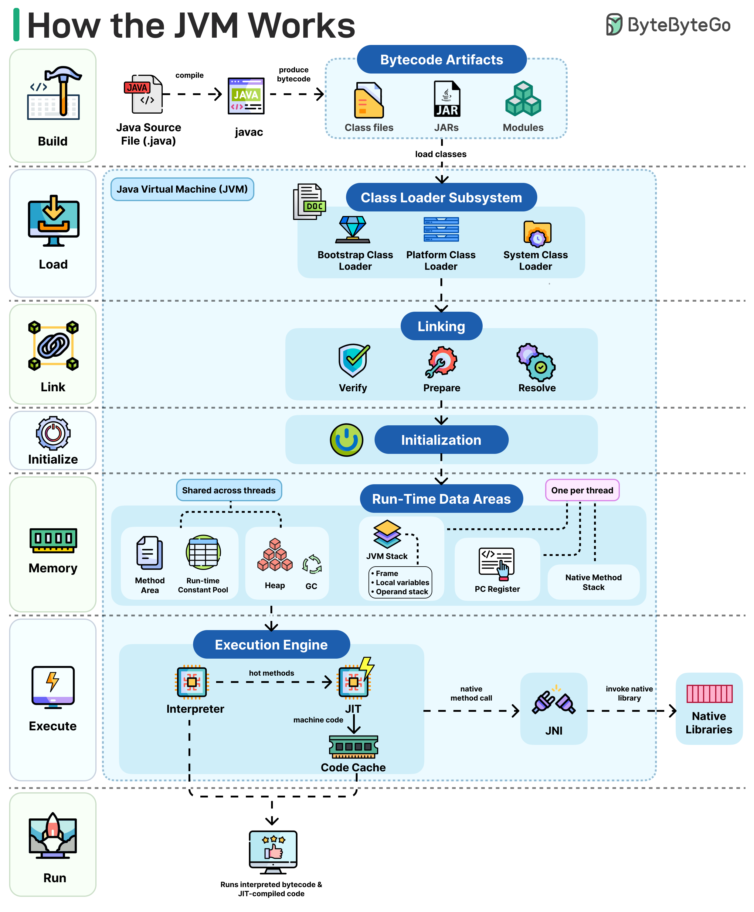

# How the JVM Works

## Key Takeaways

- The JVM transforms Java source code through a seven-stage pipeline: Build, Load, Link, Initialize, Memory allocation, Execute, and Run.
- Class loading uses parent delegation across three loaders (Bootstrap, Platform, System), ensuring core JDK classes are loaded before application code.
- The linking phase enforces bytecode safety (verify), allocates static fields (prepare), and resolves symbolic references to direct memory addresses (resolve).
- Runtime memory is split into shared areas (Heap, Method Area) and per-thread areas (JVM Stack, PC Register, Native Method Stack), with garbage collection reclaiming unused heap.
- The execution engine blends interpretation for fast startup with JIT compilation of hot methods for peak steady-state performance.

## Architecture Overview

## Build

The `javac` compiler converts `.java` source files into platform-independent bytecode. The output is stored as `.class` files, JARs, or modules -- these are the portable artifacts the JVM consumes.

## Load

The **Class Loader Subsystem** imports classes on demand using parent delegation:

- **Bootstrap Class Loader** -- core JDK classes (`java.lang`, `java.util`, etc.)
- **Platform Class Loader** -- extension and platform modules
- **System Class Loader** -- application classpath code

A child loader always delegates to its parent first, preventing duplicate or rogue class definitions.

## Link

Linking has three sub-steps:

1. **Verify** -- checks bytecode structure and type safety so malformed classes never reach execution.
2. **Prepare** -- allocates memory for static fields and assigns default values (zero, null).
3. **Resolve** -- converts symbolic references (class/method names in the constant pool) into direct memory addresses.

## Initialize

Static variables receive their programmer-assigned values, and `static {}` initializer blocks execute. This happens lazily -- only when a class is first actively used (instantiation, static method call, etc.).

## Memory (Run-Time Data Areas)

| Area | Scope | Purpose |
|------|-------|---------|
| Method Area | Shared | Class metadata, constant pool, method bytecode |
| Run-time Constant Pool | Shared | Resolved literals and symbolic references |
| Heap | Shared | All object instances; managed by the garbage collector |
| JVM Stack | Per-thread | Frames holding local variables and operand stacks |
| PC Register | Per-thread | Address of the current bytecode instruction |
| Native Method Stack | Per-thread | Frames for native (C/C++) method calls |

The **garbage collector** reclaims unreachable heap objects automatically.

## Execute (Execution Engine)

- **Interpreter** -- reads and executes bytecode instruction-by-instruction. Provides fast startup but slower steady-state throughput.
- **JIT Compiler** -- detects "hot" methods (high invocation count) and compiles them to optimized native machine code, stored in the **Code Cache**.
- **JNI (Java Native Interface)** -- bridge to native C/C++ libraries when platform-specific operations are needed.

At runtime the program executes a mix of interpreted bytecode and JIT-compiled native code, giving fast startup with increasing performance over time.

---

**Source:** https://blog.bytebytego.com/i/194493928/how-the-jvm-works
**Date:** 2026-05-31
**Tags:** jvm, java, bytecode, class-loading, jit, garbage-collection, system-design
