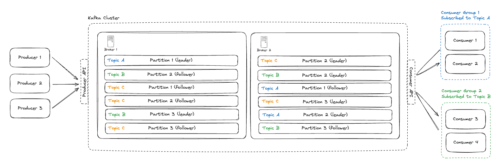

# Kafka

Distributed log-structured message broker. The backbone for streaming, async processing, and event-sourcing at scale.

## Key Takeaways

- Kafka is a **distributed append-only log** organized into **topics** (named streams), split into **partitions** (parallelism + ordering unit), stored on **brokers** (servers), and consumed by **consumer groups** (parallelism + at-least-once delivery)
- **Ordering is per-partition, not per-topic** — the partition key decides which partition a message lands in, and that's the only ordering guarantee you get
- The two critical settings are **`acks`** (durability vs latency) and **replication factor** (durability vs cost). `acks=all` + replication=3 is the safe default
- One broker handles ~**1TB data + ~10K msgs/sec**; scale by adding brokers and rebalancing partitions
- **Hot partitions** are the #1 production pain — solve with a better key, compound key (e.g. `adId:userId`), or producer-side backpressure

## Anatomy

| Concept | What it is |
|---|---|
| **Topic** | Named stream of messages (e.g. `orders.created`) |
| **Partition** | Append-only log slice within a topic — the unit of parallelism and ordering |
| **Broker** | A Kafka server hosting some partitions |
| **Producer** | Client that publishes messages, picks the partition (via key or round-robin) |
| **Consumer** | Client that reads from one or more partitions |
| **Consumer Group** | Set of consumers that *share* the topic's partitions — each partition goes to exactly one consumer in the group |
| **Leader / Follower** | One replica per partition is leader (handles all reads/writes); others are followers (replicate for durability) |

## Guardrails

- **Message size:** no hard Kafka limit, but aim for **< 1 MB per message**. Larger payloads → store in S3 and pass the URL
- **Throughput per broker:** ~1 TB storage, ~10K msgs/sec — scale by adding brokers
- **Scaling levers:** (1) more brokers, (2) better partition key, (3) more partitions per topic
- **Hot partition handling:**
  - Drop the key (round-robin) if ordering isn't needed
  - Compound key (e.g. `adId:userId`) to spread a hot single key
  - Backpressure — slow down the producer instead of overloading the broker

## Settings That Matter

### `acks` (producer)

Controls **durability vs latency** at write time:

- `acks=0` — fire-and-forget, fastest, can lose data
- `acks=1` — leader writes, then acks. Survives broker crashes that aren't leader. Default tradeoff
- `acks=all` (or `-1`) — leader waits for all in-sync replicas. **Maximum durability**. The right default for anything that matters

### Replication Factor (topic)

- Higher replication = more durability + more storage cost + slower acks
- Lower replication = faster acks but you lose data when brokers die
- **3 is the standard production default** (tolerates 1 broker failure with `acks=all` + `min.insync.replicas=2`)

### Retention Policy (topic)

- **`retention.ms`** — keep messages for this long (default **7 days**)
- **`retention.bytes`** — keep at most this much total log size (default **16 GB**)
- Whichever limit hits first triggers deletion (or compaction for compacted topics)

## Common Patterns

- **One partition per ordering key** (e.g., one partition per `order_id`) — guarantees order for that key, parallelism across keys
- **Consumer groups for parallelism** — N consumers in a group will pull from N partitions of the topic. Adding consumers beyond partition count is wasted
- **Transactional outbox + Kafka** — write the business state and an outbox row in one DB transaction; a relayer publishes the outbox to Kafka

## See Also

- [event-driven.md](event-driven.md) — patterns built on top of Kafka (idempotency, ordering, dual-write problem)
- [database/cdc.md](database/cdc.md) — Change Data Capture often flows DB → Kafka
- [data-processing-patterns.md](data-processing-patterns.md) — stream processing (Flink, Spark Streaming, Kafka Streams) consumes from Kafka

---

**Source:** /Users/vimittal/Downloads/prep/prep.html
**Date:** 2026-06-13
**Tags:** kafka, message-broker, distributed-log, partitions, consumer-groups, producer-acks, replication, streaming
