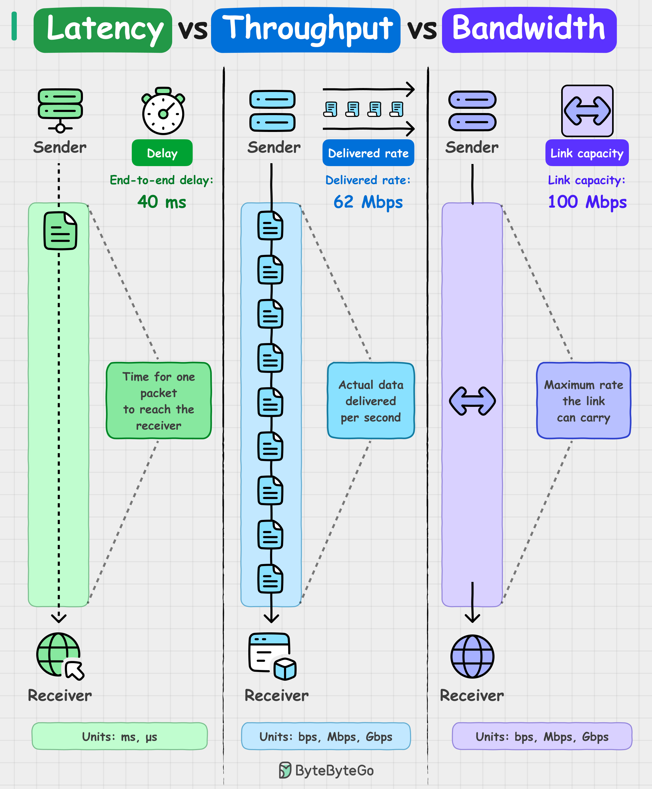

# Latency vs Throughput vs Bandwidth

The three network-performance metrics that get conflated — distinguishing them is the difference between debugging "why is this slow" correctly versus throwing more bandwidth at a latency problem.

## Key Takeaways

- **Latency** — delay for a single packet to travel sender → receiver (e.g., 40ms RTT). The wait time
- **Throughput** — actual data successfully transferred per unit of time (e.g., 62 Mbps measured download). The flow rate
- **Bandwidth** — maximum capacity of the link under ideal conditions (e.g., 100 Mbps connection upper limit). The pipe size
- **Throughput ≤ Bandwidth always.** Congestion, packet loss, and protocol overhead prevent achieving the max
- **Low latency ≠ high throughput.** A fast-responding endpoint with small payloads / single connections / tight TCP windows can have great latency and poor throughput simultaneously

## The Highway Analogy

> "Bandwidth is the highway width. Throughput is the traffic flow. Latency is how long it takes a car to go from A to B."

- **Bandwidth** = how many lanes the highway has (theoretical max throughput)
- **Throughput** = how many cars actually arrive per hour (actual flow)
- **Latency** = how long one car takes to drive from A to B (one-way trip)

A 10-lane highway with bumper-to-bumper traffic has high *bandwidth* but low *throughput* (few cars get through) and high *latency* (each car takes forever). A 2-lane highway at midnight has low bandwidth, low throughput (no cars), but low latency (the one car gets there fast).

## At-a-Glance Comparison

| | Latency | Throughput | Bandwidth |
|---|---|---|---|
| **What it measures** | Delay per packet | Actual data delivered / sec | Maximum link capacity |
| **Units** | ms (milliseconds) | Mbps, Gbps | Mbps, Gbps |
| **Example** | 40 ms RTT to a server | 62 Mbps measured download | 100 Mbps connection |
| **Affected by** | Distance, hops, congestion, processing | Bandwidth + losses + overhead | Hardware + provisioning |
| **You experience as** | "feels laggy" | "downloads slowly" | "what you pay for" |

## Why "Low Latency ≠ High Throughput"

Counter-intuitive but common in practice:

| Scenario | Latency | Throughput | Why |
|---|---|---|---|
| Ping to nearby server | **Low** | n/a | Single small packet, fast roundtrip |
| Single TCP stream over long-distance link | n/a | **Low** | TCP window limits = bandwidth-delay product caps throughput |
| Multiple parallel streams over long link | n/a | **High** | Each stream fills window; aggregated throughput approaches bandwidth |
| HTTP/2 with one slow request | per-request varies | overall low | Head-of-line blocking at app layer |

**The TCP window catch:** for a long-distance link (high RTT), a single TCP stream is bandwidth-delay-product limited regardless of how fat the pipe is. Want to use the full bandwidth? Open multiple streams, tune the TCP window, or use a higher-throughput protocol (QUIC, HTTP/3).

This is why "my connection is 1 Gbps but downloads run at 10 Mbps" happens. The pipe is fat; the protocol can't fill it with one stream.

## Why Throughput < Bandwidth in Practice

You almost never see throughput equal to advertised bandwidth. Causes:

- **Protocol overhead** — headers, ACKs, retransmissions eat capacity
- **Congestion** — shared link with other traffic
- **Packet loss** — TCP backs off on loss; UDP just loses data
- **Distance / RTT** — bandwidth-delay product limits per-stream throughput
- **Endpoint limits** — server CPU, disk I/O, or app logic capping output
- **Encryption / compression** — TLS, gzip add CPU + bytes

A common rule of thumb: real-world throughput is **60-80% of bandwidth** on a well-tuned link, much less on congested or long-distance links.

## Which Metric Matters For Which Problem

| Problem | Look at |
|---|---|
| "Page feels slow to load" | Latency (TTFB), then throughput (asset download) |
| "Video keeps buffering" | Throughput, then bandwidth |
| "Game is laggy" | Latency (RTT, jitter) |
| "Large file download is slow" | Throughput |
| "Some users get slow, others don't" | Latency (geographic distance, ISP routing) |
| "Burst traffic times out" | Throughput vs bandwidth ceiling |
| "Database query takes 200ms but app is slow" | Latency upstream (cumulative hops) |

The wrong diagnosis: "we need more bandwidth." Often the real issue is latency (geographic distance, slow upstream services) or throughput-limited-by-protocol (single TCP stream, head-of-line blocking).

## Latency in Distributed Systems

For multi-service systems, **latency stacks across hops**. A user request that touches 5 services with 10ms each isn't 10ms — it's 50ms plus serialization/deserialization overhead.

This is why:
- **Microservices have a latency tax** — every previously in-process call is now a network call ([microservices.md](microservices.md))
- **Async at the edge, sync behind** — return to the user fast, do downstream work without blocking ([sync-vs-async-communication.md](sync-vs-async-communication.md))
- **CDN reduces user-perceived latency** dramatically — geographic proximity matters more than bandwidth ([cdn.md](cdn.md))
- **Cumulative tail latency** — p99 of a system that hits 5 services is much worse than any individual service's p99 (multiplicative)

## Common Mistakes

1. **Throwing bandwidth at a latency problem.** A 10 Gbps uplink doesn't help if your DB query takes 300ms — you need to fix the query, not the pipe
2. **Optimizing throughput when users care about latency.** A 1 GB nightly batch transfer doesn't need optimization; a 100ms API call does
3. **Measuring bandwidth, not throughput.** Speedtest results tell you bandwidth; what your app actually achieves is throughput — they're not the same
4. **Ignoring jitter.** Average latency hides bursty performance; jitter (variance in latency) matters for real-time systems
5. **Forgetting protocol overhead.** TLS handshake, TCP slow-start, DNS lookup all add latency that "bandwidth tests" don't show

## Related

- [CDN](cdn.md) — the primary tool for reducing user-perceived latency (geographic proximity)
- [Load balancer](load-balancer.md) — distributes throughput across backends
- [Distributed system failure modes § amplification](distributed-system-failure-modes.md) — when retries turn a throughput problem into a cascading failure
- [Sync vs async communication](sync-vs-async-communication.md) — latency stacking in service chains
- [Microservices](microservices.md) — the latency tax of every-call-is-a-network-call
- [SLA vs SLO vs SLI](observability/sla-slo-sli.md) — latency is the most common SLI

## The Latency Pyramid (Order-of-Magnitude Reference)

A mental hierarchy of common operation latencies — each row is roughly **10× slower** than the previous. Use it to spot mistakes like "Postgres insert in 100 ns" (impossible — that's RAM-read speed).

| Scale | Operation |
|---|---|
| **1 ns** | L1 cache (on-die, hardware) |
| **10 ns** | L2 cache (on-die) |
| **100 ns** | RAM / memory read (e.g., Redis in-process) |
| **10 µs** | Send data over 1 Gbps network |
| **100 µs** | SSD read |
| **1 ms** | Postgres / DB insert |
| **10 ms** | HDD read |
| **100 ms** | Packet round-trip California ↔ Netherlands ↔ California |
| **1–2 s** | "Real-time" threshold for users |
| **6–7 s** | "Near real-time" (acceptable for non-interactive flows) |
| **10 s** | Retry / refresh interval |

**Why this matters:** when designing a system, the cost of a network call (10 µs at best, 100 ms at worst) dominates the cost of a memory access by 4–6 orders of magnitude. *That's* why caching and locality matter more than micro-optimizations.

---

**Source:** https://blog.bytebytego.com/p/ep217-latency-vs-throughput-vs-bandwidth
**Source:** /Users/vimittal/Downloads/prep/prep.html (latency pyramid)
**Date:** 2026-06-07, updated 2026-06-13
**Tags:** latency, throughput, bandwidth, network-performance, system-design, fundamentals, tcp, bandwidth-delay-product, latency-pyramid, mechanical-sympathy
