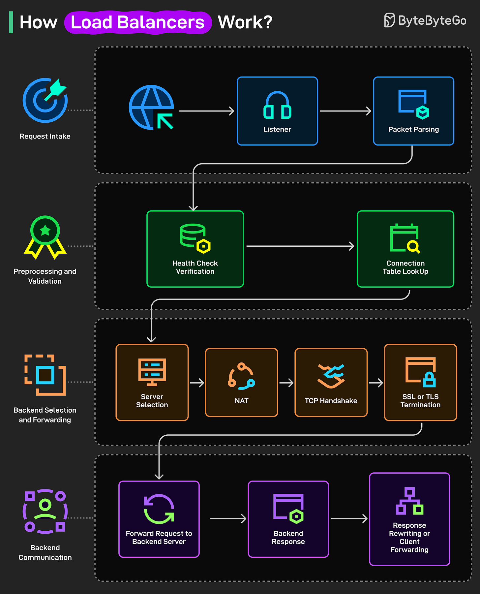
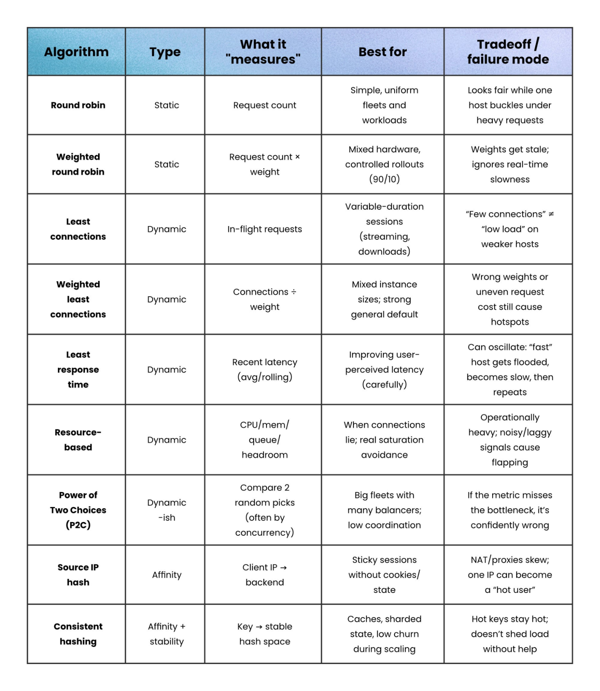

# How Load Balancers Work

## Key Takeaways

- A load balancer distributes incoming traffic across multiple backend servers so no single server is overwhelmed, improving reliability and throughput.
- The request lifecycle has four distinct phases: request intake, preprocessing/validation, backend selection/forwarding, and backend communication.
- Health checks and connection-table lookups happen before server selection, ensuring traffic only reaches healthy servers and existing sessions can be reused.
- NAT (Network Address Translation) rewrites packet addresses so the chosen backend server can receive the traffic transparently.
- SSL/TLS termination can be offloaded to the load balancer, relieving backends of encryption overhead.

## Request Lifecycle

### Phase 1 -- Request Intake

1. **Client request** -- The client sends a request to the load balancer's public IP.
2. **Listener** -- A listener component accepts the connection on the configured port and protocol (HTTP, HTTPS, TCP, etc.).
3. **Packet parsing** -- The load balancer inspects headers, URI, and other metadata to understand the request's intent.

### Phase 2 -- Preprocessing and Validation

4. **Health-check verification** -- The load balancer consults recent health-check results to determine which backend servers are currently healthy.
5. **Connection-table lookup** -- It checks a connection table for existing client-to-server mappings (session persistence / sticky sessions) so returning clients can be routed to the same backend.

### Phase 3 -- Backend Selection and Forwarding

6. **Server selection** -- Using configured rules and algorithms (round-robin, least connections, IP hash, weighted, etc.), the load balancer picks a healthy target server.
7. **NAT (Network Address Translation)** -- Packet addresses are rewritten so the request is directed to the selected backend server's internal IP.
8. **TCP handshake** -- A TCP connection is established (or reused from a connection pool) between the load balancer and the backend server.
9. **SSL/TLS termination** -- If the traffic is HTTPS, the load balancer either decrypts it (TLS termination) or passes it through (TLS passthrough) depending on configuration.

### Phase 4 -- Backend Communication

10. **Forward request** -- The request is forwarded to the selected backend server.
11. **Backend response** -- The backend processes the request and sends the response back to the load balancer.
12. **Response rewriting and client forwarding** -- The load balancer may adjust response headers (e.g., setting cookies for session affinity) and forwards the response to the original client.

## Algorithm Comparison (Full Reference)

The full menu of load-balancing algorithms, what they measure, and where each one breaks down:

### Selection Criteria

When picking an algorithm, you're trading off across:

- **Even spread** — distribute traffic uniformly
- **Concurrency** — send new requests to the server handling the least work *right now*
- **Latency** — pick the server responding fastest
- **Locality** — keep a user on the same server for state/cache reasons (session affinity)
- **Stability** — minimize how much traffic moves around when servers scale up/down

### Static vs Dynamic

- **Static** — fixed pattern (rotation or weights), ignores live load. Round Robin, Weighted Round Robin
- **Dynamic** — adapts based on runtime signals (active connections, response times). Least Connections, Least Response Time, P2C, Resource-based

### Quick Picker

- **Default for uniform stateless workloads** → Round Robin
- **Mixed hardware** → Weighted Round Robin
- **Variable session durations (streaming, downloads)** → Least Connections
- **User-perceived latency matters and metric is reliable** → Least Response Time
- **High operational visibility into CPU/memory/queue** → Resource-based
- **Big fleet, want low coordination overhead** → Power of Two Choices (P2C)
- **Sticky sessions, no cookies available** → Source IP Hash
- **Sharded state / caches that must survive scaling** → Consistent Hashing

### Tradeoffs You'll Live With

- **Round Robin** — looks fair until one host buckles under heavy requests
- **Least Connections** — "few connections" ≠ "low load" on weaker hosts
- **Least Response Time** — can oscillate as a "fast" host gets flooded, slows, then repeats
- **Resource-based** — operationally heavy; noisy signals cause flapping
- **P2C** — if the metric misses the actual bottleneck, it confidently routes wrong
- **Source IP Hash** — NAT/proxies skew distribution; one corporate IP becomes a hot spot
- **Consistent Hashing** — hot keys stay hot; doesn't shed load without help

---

**Source:** https://blog.bytebytego.com/i/194493928/how-load-balancers-work
**Source:** /Users/vimittal/Downloads/prep/prep.html (algorithm comparison + criteria + static/dynamic)
**Date:** 2026-05-31, updated 2026-06-13
**Tags:** load-balancer, system-design, networking, distributed-systems, round-robin, least-connections, consistent-hashing, p2c, weighted-round-robin
