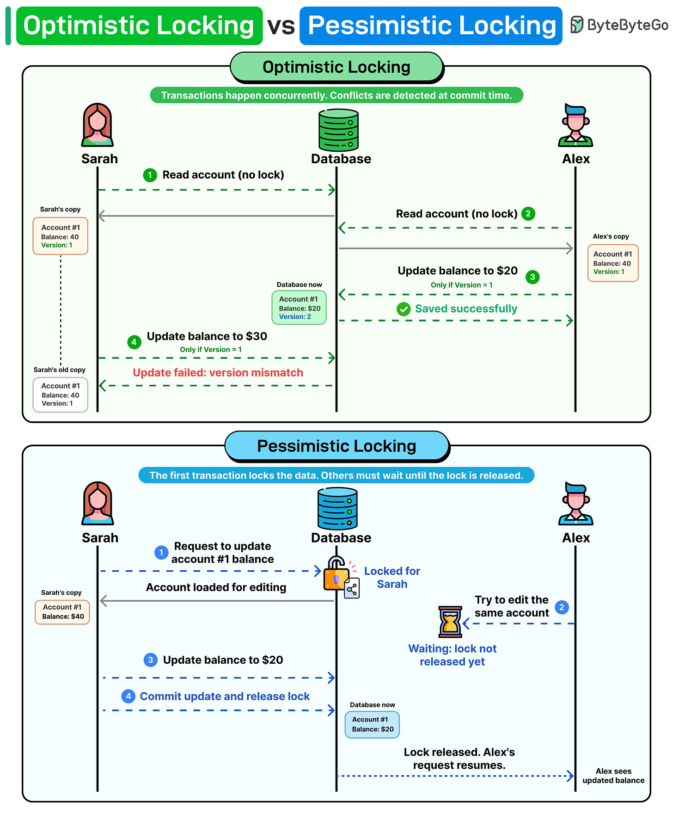

# Optimistic Locking vs Pessimistic Locking

## Key Takeaways

- **Optimistic locking** allows concurrent reads without locks, using a version number to detect conflicts at write time -- rejected updates must be retried
- **Pessimistic locking** acquires an exclusive lock on the row before any modification, forcing other transactions to wait until the lock is released
- Optimistic locking is best for **read-heavy** workloads where write conflicts are rare
- Pessimistic locking is best for **write-heavy** workloads where conflicts are frequent and the cost of retries is high
- The choice directly impacts throughput, latency, and user experience under contention

## How Optimistic Locking Works

Optimistic locking assumes conflicts are infrequent. No lock is acquired during reads.

1. Both users read the same row (e.g., account balance = $40, version = 1)
2. Alex submits an update: set balance to $20, only if version = 1
3. Database accepts -- balance is now $20, version incremented to 2
4. Sarah submits her update: set balance to $30, only if version = 1
5. Database rejects -- version is now 2, not 1 (version mismatch)

Sarah must re-read the current state and retry her operation.

**Implementation:** typically a `version` column (integer) or `updated_at` timestamp checked in the `WHERE` clause of the `UPDATE` statement.

## How Pessimistic Locking Works

Pessimistic locking assumes conflicts happen regularly. The first transaction locks the row immediately.

1. Sarah requests to update account #1 -- database locks the row for Sarah
2. Alex tries to edit the same account -- must wait (lock not released yet)
3. Sarah updates balance to $20
4. Sarah commits -- lock is released
5. Alex's request resumes with the updated data

**Implementation:** `SELECT ... FOR UPDATE` in SQL acquires an exclusive row-level lock.

## When to Use Each

| Criteria | Optimistic | Pessimistic |
|---|---|---|
| Conflict frequency | Low | High |
| Read/write ratio | Read-heavy | Write-heavy |
| Throughput under low contention | Higher | Lower (lock overhead) |
| Throughput under high contention | Lower (frequent retries) | Higher (orderly queuing) |
| Deadlock risk | None | Possible |
| Retry logic required | Yes | No |

## Common Use Cases

- **Optimistic:** wikis, CMS, shopping carts, configuration settings -- anything where concurrent edits to the same record are unlikely
- **Pessimistic:** financial transactions, inventory management, seat reservations -- anywhere a failed update is costly or hard to retry

---

**Source:** https://blog.bytebytego.com/i/194493928/optimistic-locking-vs-pessimistic-locking
**Date:** 2026-05-31
**Tags:** locking, concurrency, database, optimistic-locking, pessimistic-locking, system-design
